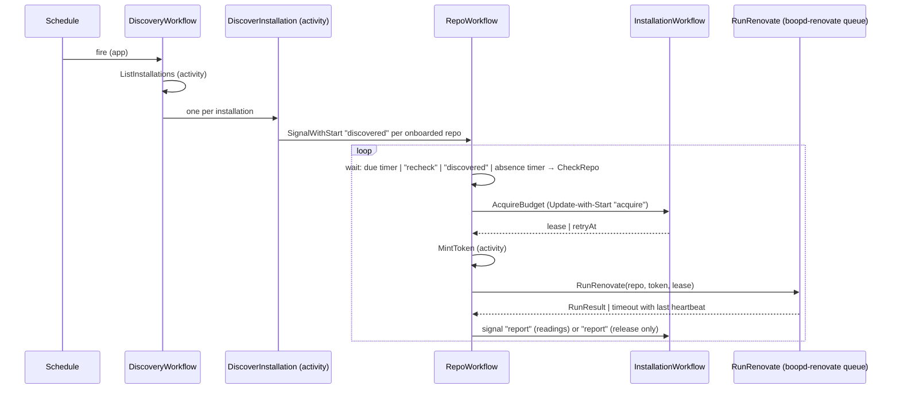

<!-- markdownlint-disable-file MD025 MD041 -->

# DESIGN-0001: boopd spike: workflows, RunRenovate activity and worker

<!--toc:start-->
- [Overview](#overview)
- [Goals and Non-Goals](#goals-and-non-goals)
  - [Goals](#goals)
  - [Non-Goals](#non-goals)
- [Background](#background)
- [Detailed Design](#detailed-design)
  - [Binary and packages](#binary-and-packages)
  - [Task queues and credentials](#task-queues-and-credentials)
  - [Workflows](#workflows)
    - [DiscoveryWorkflow](#discoveryworkflow)
    - [RepoWorkflow](#repoworkflow)
    - [InstallationWorkflow](#installationworkflow)
  - [RunRenovate activity](#runrenovate-activity)
  - [Process builder](#process-builder)
  - [Convergence and stall](#convergence-and-stall)
  - [Worker image](#worker-image)
  - [Observability](#observability)
- [API / Interface Changes](#api--interface-changes)
- [Data Model](#data-model)
- [Testing Strategy](#testing-strategy)
- [Migration / Rollout Plan](#migration--rollout-plan)
- [Open Questions](#open-questions)
- [References](#references)
<!--toc:end-->

## Overview

This is the build design for the `boopd` spike: the three workflows, the
`RunRenovate` activity and its process builder, the budget entity, and the
worker image, enough to run INV-0001's success criteria in the homelab. It
applies ADR-0001 to ADR-0005 and ADR-0008. The store and API (ADR-0006) and
the `x` extraction (ADR-0007) are out of scope. The v1 DESIGN, written after
the spike, replaces this document where they differ.

## Goals and Non-Goals

### Goals

- `boopd worker`, which runs `RepoWorkflow`, `InstallationWorkflow` and
  `DiscoveryWorkflow` and their short activities, and `boopd renovate`, which
  runs `RunRenovate` and nothing else. Both target GitHub with App auth.
  GitHub is the only platform (RFC-0001).
- A process builder that turns platform config and one repository into the
  Renovate environment, covered by the behaviour tests in INV-0001 § Renovate
  behaviours to reproduce *before* the activity exists.
- A `RunRenovate` activity that holds the isolation rules in ADR-0003 and
  returns a structured result: outcome, exit code, duration, report tuples,
  problems and progress.
- Convergence and stall handling for runs that outlive their token
  (INV-0001 Observation 10).
- A discovered, per-installation rate budget (REST and GraphQL) that caps
  concurrent runs, with no limit or plan in config (ADR-0008). Discovery
  itself stays inside that budget.
- The App private key never enters a pod that runs repository content.
- A worker image and chart changes to deploy all of this next to a Temporal
  cluster and Redis.
- Enough instrumentation to evaluate every success criterion without reading
  raw logs.

### Non-Goals

- Postgres store, HTTP API, UI (ADR-0006).
- Webhook ingest (INV-0001 OQ8).
- Extracting shared code into `donaldgifford/x` (ADR-0007).
- Evals, security findings, automerge.
- Autoscaling workers. The spike runs a fixed replica count. Budget
  discovery and admission *are* in scope. The scaling mechanism (KEDA
  trigger, Deployment or Job per run) is a fast follow (ADR-0008).
- GitHub Enterprise Server. The endpoint handling stays correct per
  renovate-operator INV-0004, but GHES is not tested.

## Background

- [INV-0001](../investigation/0001-temporal-as-the-renovate-control-plane.md)
  is the founding investigation. Observations 3, 4, 5, 10 and 11 and § Spike
  drive this design.
- `internal/platform` is already copied from renovate-operator `0183661`. It
  provides `Discover`, `HasRenovateConfig`, `MintAccessToken` (which returns
  the token and its `expiresAt`) and the `ErrTransient` / `ErrPermanent` /
  `ErrUnauthorized` / `RateLimitedError` classification. Its client is built
  per installation and carries a fixed client-side limiter
  (`defaultRateLimit`, 4,500/hr) with a `WithRateLimit` option.
- repo-guardian `v2` @ `278c7ec` provides the Temporal plumbing
  (`internal/temporal`) and the budget entity (`internal/workflows/installation.go`:
  `acquire` Update, `report` Signal, leases, sweep, ContinueAsNew drain), plus
  option presets (`options.go`).
- Temporal Server 1.31 or later (fairness keys, Update-with-Start,
  `NextRetryDelay`; ADR-0001) and Go SDK 1.49 or later.

## Detailed Design

### Binary and packages

One binary, `boopd`, with a role subcommand. The spike ships two roles:
`worker` (workflows and short activities) and `renovate` (`RunRenovate`
only).

| Package | Contents | Origin |
| ------- | -------- | ------ |
| `cmd/boopd` | flag parsing, role dispatch, signal handling | new (replaces `cmd/boop`) |
| `internal/config` | config file types, loading, validation | new |
| `internal/platform` | GitHub client: discovery, config probe, token minting, App-level (JWT) client for installations | copied (renovate-operator) + additions |
| `internal/temporal` | client config, mTLS/OIDC, dial, worker options, versioning, `EnsureSchedule`, `DescribeBacklog`, payload codec | copied (repo-guardian) + codec |
| `internal/renovate` | process builder (env, `RENOVATE_CONFIG`), process runner, report parser, log scanner | new |
| `internal/workflows` | `RepoWorkflow`, `InstallationWorkflow`, `DiscoveryWorkflow`, options | new + copied budget entity |
| `internal/activities` | `boopd` queue: `ListInstallations`, `DiscoverInstallation`, `CheckRepo`, `MintToken`, `ReadRateLimit`, `AcquireBudget`; `boopd-renovate` queue: `RunRenovate` | new |
| `internal/observability` | slog setup, Prometheus metrics, health endpoints | new, follows renovate-operator's pattern |

### Task queues and credentials

Two task queues, and a hard line on where the App private key may be:

| | `boopd-worker` Deployment | `boopd-renovate` Deployment |
| - | ------------------------- | --------------------------- |
| Polls | `boopd`: workflow tasks and the short activities | `boopd-renovate`: `RunRenovate` only, one activity slot (`MaxConcurrentActivityExecutionSize: 1`), no workflow tasks |
| Image | distroless | Renovate full image plus `boopd` (§ Worker image) |
| Runs repository content | never | yes, through package managers |
| Holds | App private key, Temporal client certs | per-run installation token (activity input), Redis URL, Temporal client certs |

**The App private key never enters the `boopd-renovate` pod.** A package
manager started by Renovate runs as the same UID as `boopd`, so it can read
any mounted Secret and `/proc/<pid>/environ` of the parent process.
`exposeAllEnv=false` filters only the environment a child inherits. The
one-hour installation token is the accepted residual risk from INV-0001
Observation 4; the long-lived key for every installation is not. So:

- `MintToken` runs on the `boopd` queue, in the worker role, and the token
  travels to `RunRenovate` as activity input.
- A **payload codec** (AES-GCM, key from a Secret, built on the SDK's
  `converter.NewCodecDataConverter`) is registered on the Temporal client in
  both roles, so the token is not plaintext in workflow history. The codec
  is new code; it follows the SDK's encryption sample.
- The `boopd-renovate` pod spec mounts no App key, and a spike test asserts
  it (§ Testing Strategy).

A separate queue also keeps a later scaler pointed at Renovate runs alone
(ADR-0008) and keeps the large image off the workflow pods.

### Workflows



#### DiscoveryWorkflow

- **One Temporal Schedule per configured GitHub App**, ID
  `discovery/<app name>`, created or updated at worker start from the config
  file (ADR-0004), with an interval spec from `discovery.every`. Overlap
  policy `Skip`. Each fire starts a workflow run with ID
  `discovery/<app name>/<scheduled time>`; ADR-0002's ID is that run, and
  the Schedule is a different object.
- **`ListInstallations` activity:** lists the App's installations
  (`GET /app/installations` with the App JWT through
  `ghinstallation.NewAppsTransport`), filtered by the optional
  `installations` allowlist in config. New code; the copied client is built
  per installation.
- **`DiscoverInstallation` activity, one per installation**, started in
  parallel from the workflow. It does the whole pass for one installation so
  that no repository list ever travels as a workflow payload (30,000
  repositories do not fit Temporal's 2 MB payload limit):
  1. Page `GET /installation/repositories` (100 per page; `Discover`,
     renovate-operator INV-0004) and apply `skipForks` / `skipArchived`.
  2. Probe each page for the config file (below).
  3. `SignalWithStart` `repo/github/<repo id>` with signal `discovered` for
     every repository that has it, carrying
     `{slug, defaultBranch, installationID, discoveryInterval}`.
  4. Heartbeat `{page, seen, onboarded}` after each page. A retry resumes
     from the last heartbeat's page.

  Each `Repository` gains a numeric `ID`, an addition to the copied package,
  because workflow IDs use it (ADR-0002).
- **Config probe.** Discovery is the one place `boopd` touches every
  repository the installation can see, so its cost is the fleet's cost:
  - Only one path is probed: `renovate.configPath` (default
    `renovate.json`), the file repo-guardian writes (ADR-0005). The copied
    `ConfigPaths` list of five becomes that single configured path, which
    cuts a non-onboarded repository from up to five REST calls to one.
  - The probe is **one GraphQL query per 100 repositories**:
    `nodes(ids: [...]) { ... on Repository { object(expression: "HEAD:<path>") { __typename } } }`.
    By GitHub's published cost formula that is about one point per query,
    against the `graphql` resource; a 15,000-repository installation costs
    about 150 points per pass instead of 15,000 REST calls. The spike
    measures the real cost.
  - Fallback, behind a config switch, is the REST contents call per
    repository for the one path.
  - Before each page, the activity reads `/rate_limit`; if either tracked
    resource is under the installation's reserve it sleeps until `reset`,
    heartbeating. Discovery takes no lease (it is not a run), but its spend
    shows in the next readings, so admission sees it.
- **Removal is decided by the repository, not by diffing.** Discovery keeps
  no list of previous results. A `RepoWorkflow` that discovery has not seen
  for `3 × discoveryInterval` runs `CheckRepo` (§ RepoWorkflow) and ends only
  if that confirms the repository is gone or has no config file. A discovery
  outage (rotated key, GitHub down, paused Schedule) therefore never ends
  the fleet.

#### RepoWorkflow

Input and ContinueAsNew state:

```go
type RepoState struct {
    Platform          string // "github"
    RepoID            int64
    Slug              string        // refreshed by every "discovered" signal
    DefaultBranch     string
    InstallationID    int64
    DiscoveryInterval time.Duration // from the "discovered" signal
    LastSeen          time.Time     // last "discovered"
    LastRun           *RunSummary
    NextDue           time.Time
    StallCount        int
    ConsecutiveReruns int
    Iterations        int
}
```

Loop:

1. **Wait.** Wait on a selector over:
   - a timer to `NextDue`;
   - a `recheck` signal, which runs now at `PriorityHigh`;
   - a `discovered` signal, which updates the slug and `LastSeen` and keeps
     waiting;
   - a timer to `LastSeen + 3 × DiscoveryInterval`, which runs the
     `CheckRepo` activity (repository visible to the installation, not
     archived, config file present on the default branch). Gone or no
     config: record `offboarded` and end the workflow. Still there: set
     `LastSeen = now`, increment `boopd_discovery_missed` and keep waiting.
     If `CheckRepo` itself fails (GitHub unreachable, bad credentials),
     keep waiting and try again after another `DiscoveryInterval`; an
     outage must never look like an offboarding.
2. **Acquire budget.** `AcquireBudget` activity, which does Update-with-Start
   on `installation/github/<id>` (repo-guardian pattern). The result is a
   lease, or a `retryAt` to sleep until before re-acquiring. `RunRenovate` is
   scheduled only after a lease is granted, so the `boopd-renovate` backlog
   holds admitted work only (ADR-0008).
3. **Mint the token.** `MintToken` activity on the `boopd` queue returns
   `{token, expiresAt}`. `ErrUnauthorized` / `ErrPermanent` here means the
   App or installation is broken: record `auth_failed`, release the lease,
   and wait for the next due time.
4. **Run.** Schedule `RunRenovate` on `boopd-renovate` (options under
   § RunRenovate activity). Four things can come back:
   - a `RunResult`;
   - a `ScheduleToStart` timeout: no worker picked the task up within
     10 minutes. Release the lease (a `report` with no readings), sleep
     `min(5 min × 2^n, 30 min)` and go back to step 2. This is the only way
     a lease can outlive the queue, and the lease TTL covers it;
   - a `StartToClose` or heartbeat timeout: the worker died or overran.
     Read the last heartbeat details from the timeout error and treat the
     attempt as `TimedOut` with that progress;
   - any other activity error (workspace, token nearly expired, Redis
     unreachable): release the lease and take the infrastructure row in
     § Convergence and stall.
5. **Report.** Signal `report{leaseID, before, after}` with the per-resource
   readings from the result to the installation. The report *is* the
   installation's rate reading; it triggers no extra `/rate_limit` call.
   When there is no result, the `report` carries no readings and only
   closes the lease.
6. **Decide the next due time** from the outcome (§ Convergence and stall).
   A rerun goes back to step 2 for a new lease and a new token.
7. **ContinueAsNew** when `Iterations` reaches 100 or the SDK suggests it.

**First due time.** `NextDue` for a new repository is `now + jitter`. Jitter
is derived deterministically from a hash of the repo ID modulo the cadence, so
the fleet spreads across the window and restarts do not cluster.
After a run, `NextDue = LastRun.Start + cadence`.

**Priority.** Every activity and the budget `acquire` carry
`TaskPriority(p, installationID)` (copied from repo-guardian): the fairness
key is the installation, and `p` is `PriorityHigh` for a `recheck` and
`PriorityNormal` for a scheduled run.

A query handler `state` returns `RepoState` for debugging in the Temporal UI.

#### InstallationWorkflow

Copied from repo-guardian, then changed so the budget is discovered and has
more than one resource (ADR-0008).

**Discovery.**

- The `ReadRateLimit` activity calls `GET /rate_limit` with an installation
  token. That endpoint does not count against the limit.
- It records `limit`, `remaining` and `reset` for the `core` (REST) and
  `graphql` resources.
- It runs when the workflow starts and at least hourly after that. Between
  those, every `report` with readings refreshes the same fields, because
  `RunRenovate` reads the endpoint before and after each run.
- github.com (5,000 up to 12,500 per hour), Enterprise Cloud (15,000) and a
  GHES admin-set limit all arrive the same way. Config states neither the
  limit nor the plan.

State per resource:

```go
type ResourceBudget struct {
    Limit     int       // discovered; changes as the installation grows
    Remaining int
    Reset     time.Time
    Estimate  float64   // EWMA spend per run for this resource
}

type BudgetState struct {
    Resources         map[string]*ResourceBudget // "core", "graphql"
    Leases            map[string]Lease           // holder = RepoWorkflow ID
    MaxConcurrentRuns int                        // optional cap from config; 0 = budget only
    // ... repo-guardian's handled count, suspend state
}
```

**Admission.** `acquire` grants a lease only if both conditions hold:

- every resource has `Remaining − (open leases × Estimate) − Estimate ≥ reserve`,
  where reserve is `reserveFraction × Limit` (default 10%);
- open leases are fewer than `MaxConcurrentRuns`, when that cap is set.

Otherwise it returns `retryAt`: the latest `Reset` among the exhausted
resources, or the next lease expiry if only the cap was hit.
`MaxConcurrentRuns` guards against secondary rate limits and cluster
capacity, which `/rate_limit` does not show.

**Spend.**

- Spend for each resource is `before.Remaining − after.Remaining` when
  `Reset` did not change in between, and unknown otherwise.
- The EWMA ignores unknown samples. Until it has samples, the estimate is
  `budget.defaultEstimate` from config.
- Overlapping runs make the number noisy (INV-0001 Observation 5).

**Leases.** A `report` with readings closes the lease and adds a sample; a
`report` without readings closes it and adds nothing. Lease TTL is
`ScheduleToStart + StartToClose + 5 min` = 60 minutes, which covers the
longest a task can be queued and then run; the sweep reclaims anything
older. The ContinueAsNew drain behaves as in repo-guardian.

**Client-side limiter.** When an activity builds the per-installation GitHub
client, it passes `WithRateLimit` derived from the installation's discovered
`core` limit (`limit / 3600` per second, burst 10) instead of the copied
4,500/hr default, which is wrong for Enterprise Cloud. Until the first
reading exists, the default stands.

### RunRenovate activity

Input:

```go
type RunInput struct {
    RepoID         int64
    Slug           string
    DefaultBranch  string
    InstallationID int64
    Endpoint       string    // unset for api.github.com
    Token          string    // from MintToken; encrypted by the payload codec
    TokenExpiresAt time.Time
    LeaseID        string
    DryRun         string    // "" or "full"
}
```

Output:

```go
type Outcome string // Succeeded, Skipped, Failed, TimedOut

type RunResult struct {
    Outcome      Outcome
    SkipReason   string        // Renovate's repository result when Skipped, e.g. "disabled-no-config", "archived"
    ExitCode     int
    Duration     time.Duration
    RenovateVersion string
    Tuples       []UpdateTuple // from the report
    Problems     []Problem     // repository-level problems from the report
    Progress     Progress      // this attempt only
    RateBefore   RateReadings
    RateAfter    RateReadings
}

type UpdateTuple struct {
    BranchName, Manager, PackageName, DepName string
    CurrentVersion, NewVersion               string
    PRNumber                                 int // 0 when none
}

type Problem struct {
    Level   string // "warn", "error"
    Message string
    Topic   string
}

type Progress struct {
    BranchesPushed int // branches created or updated
    PRsChanged     int // PRs created or updated
}

type RateReading struct {
    Limit, Remaining int
    Reset            time.Time
}

type RateReadings map[string]RateReading // "core", "graphql"
```

Steps:

1. **Guard the token.** If `TokenExpiresAt − now < 20 min`, return an
   infrastructure error without starting; the workflow mints a new token
   and re-acquires. With a 10-minute `ScheduleToStart` this fires only when
   something else is wrong.
2. **Fresh workspace.** Create `/work/<activity id>/{base,cache,tmp,home}` on
   the `emptyDir` with mode `0700`.
3. **Rate reading.** `GET /rate_limit` with the token (`RateBefore`).
4. **Build the environment** with the process builder (below). It is built
   from scratch; the worker's own environment is not inherited.
5. **Start Renovate.** `exec` `renovate` in its own process group
   (`Setpgid`), streaming stdout and stderr through the log forwarder and
   the log scanner.
6. **Heartbeat** every 15 s with `Progress` so far.
7. **Stop** at the soft deadline, `min(start + 42 min, TokenExpiresAt − 3 min)`,
   on context cancellation or on worker shutdown: `SIGTERM` the process
   group, wait 30 s, then `SIGKILL` the group. That leaves at least two
   minutes before `StartToClose` for the steps below. If `StartToClose`
   fires anyway, the workflow treats it as `TimedOut` with the last
   heartbeat's progress (§ RepoWorkflow step 4), so an overrun costs nothing
   but the lease.
8. **Read the report** file if it exists (`reportType: file`).
9. **Rate reading** again (`RateAfter`).
10. **Clean up.** `rm -rf` the workspace in a `defer`, and sweep stale
    `/work/*` at worker start in case a previous process died.
11. **Classify**, first matching row from the top. The repository result is
    the `res` value Renovate logs on its `Repository finished` line; exact
    values are pinned by the log fixture:

| Signal | `Outcome` | Workflow handling |
| ------ | --------- | ----------------- |
| repository result `disabled-no-config`, `archived`, `not-found`, `renamed` | `Skipped` | end the workflow (`offboarded`) |
| repository result `fork`, `forbidden`, `blocked`, `disabled` (other) | `Skipped` | cadence; recorded |
| exit 0, report present | `Succeeded` | cadence |
| stopped at the soft deadline | `TimedOut` with `Progress` | § Convergence and stall |
| exit ≠ 0, report present with problems | `Failed` | cadence; problems recorded |
| exit ≠ 0 and no report; exit 0 and no report; result `temporary-error` / `unknown-error`; Redis or GitHub unreachable before Renovate started | activity error (infrastructure) | infrastructure row in § Convergence and stall |

Activity options:

| Option | Value |
| ------ | ----- |
| `ScheduleToStartTimeout` | 10 min (bounds how long a lease waits in the queue) |
| `StartToCloseTimeout` | 45 min (token minted before scheduling; 10 + 45 stays under the ~1 h token) |
| Soft deadline | `min(start + 42 min, TokenExpiresAt − 3 min)` |
| `HeartbeatTimeout` | 1 min |
| `MaximumAttempts` | 1; the workflow decides every retry (§ Convergence and stall) |
| Task queue | `boopd-renovate` |
| Priority / fairness key | `TaskPriority(p, installationID)` |

`MintToken` keeps a small in-activity retry (three tries over 30 s) for
`ErrTransient`, because a transient GitHub error there should not cost a
lease.

The `boopd-renovate` pod stops polling on `SIGTERM` and lets the run in
flight reach its soft deadline; `terminationGracePeriodSeconds` covers
`StartToClose`.

### Process builder

`renovate.BuildEnv(app, repo, token, workspace, globalConfig) ([]string, error)`
is a pure function. These rows are the behaviour tests, written first:

| Variable | Value | Rule / source |
| -------- | ----- | ------------- |
| `RENOVATE_PLATFORM` | `github` | RFC-0001 |
| `RENOVATE_ENDPOINT` | unset for `https://api.github.com`; set only for GHES | renovate-operator INV-0004 Obs. 5 |
| `RENOVATE_TOKEN` | the installation token from `RunInput` | renovate-operator INV-0003 |
| `RENOVATE_AUTODISCOVER` | `false` | renovate-operator INV-0003 |
| `RENOVATE_REPOSITORIES` | the single slug | renovate-operator INV-0003 |
| `RENOVATE_REQUIRE_CONFIG` | `required` | ADR-0005 |
| `RENOVATE_ONBOARDING` | `false` | ADR-0005 |
| `RENOVATE_BASE_DIR` / `RENOVATE_CACHE_DIR` | per-activity workspace | ADR-0003 |
| `RENOVATE_BINARY_SOURCE` | `global` | ADR-0003 |
| `RENOVATE_REDIS_URL` | from a Secret | ADR-0003 |
| `RENOVATE_REPORT_TYPE` / `RENOVATE_REPORT_PATH` | `file` / `<workspace>/report.json` | INV-0001 Obs. 11 |
| `RENOVATE_GIT_AUTHOR` | `boop-bot <…>` | naming |
| `RENOVATE_CONFIG` | JSON: shared preset prepended to `extends`, plus global config from the file (e.g. `dryRun`); never `logLevel` | v0.1.x bug list, docs/usage gotchas |
| `LOG_LEVEL` / `LOG_FORMAT` | from config / `json` | v0.1.x bug list |
| `HOME`, `TMPDIR` | per-activity workspace | ADR-0003 |
| `PATH` | the image's toolchain path | ADR-0003 |

Rules the tests also cover:

- **Validate the preset.** A GitHub-hosted shared preset must end in `.json`.
  Reject `.json5`.
- **Keep explicit `false`.** Global config is a `map[string]any`, or a struct
  of pointer fields with no `omitempty`. An explicit `false` must survive the
  round trip (renovate-operator INV-0005).
- **Never pass `exposeAllEnv`.** The builder rejects it, along with
  `allowScripts` and `allowedCommands`, in global config. Renovate documents
  all three as global-only, so repository config cannot set them. Whether
  `exposeAllEnv=false` keeps the token and Redis URL out of child processes
  is what the spike's environment-isolation criterion verifies.
- **Nothing from the worker's environment leaks.** The builder starts from
  an empty environment, so the Temporal address, certificates and `POD_NAME`
  never reach Renovate.

Because `cacheDir` is fresh for every run, Renovate's on-disk repository
cache is always cold; only the datasource cache in Redis is warm. The
overhead criterion measures the cost of that.

### Convergence and stall

`RepoWorkflow` decides every retry; Temporal retries nothing (`MaximumAttempts`
1):

| Outcome | Next step | `StallCount` | `ConsecutiveReruns` |
| ------- | --------- | ------------ | ------------------- |
| `Succeeded` | `NextDue = start + cadence` | 0 | 0 |
| `TimedOut`, `Progress > 0`, `ConsecutiveReruns < 5` | rerun at once (new lease, new token) | unchanged | +1 |
| `TimedOut`, `Progress > 0`, `ConsecutiveReruns == 5` | record `incomplete`, `NextDue = start + cadence` | unchanged | 0 |
| `TimedOut`, `Progress == 0`, `StallCount < 3` | rerun at once | +1 | +1 |
| `TimedOut`, `Progress == 0`, `StallCount == 3` | record `stalled`, emit metric, `NextDue = start + cadence` | stays 3: one attempt per cadence until a run succeeds | 0 |
| `Skipped` (offboarding reason) | end the workflow | — | — |
| `Skipped` (other) or `Failed` | `NextDue = start + cadence`; recorded | unchanged | 0 |
| infrastructure error | release lease; back off `min(5 min × 2^n, cadence)`; re-acquire | unchanged | unchanged |

`StallCount` resets only on `Succeeded`. A stalled repository gets one
attempt per cadence, with no reruns, until one succeeds.

**How progress is measured differs from INV-0001.** INV-0001 Observation 10
measures progress from Renovate's report. A Renovate process killed at the
soft deadline probably never writes its report file. So the activity
measures progress from Renovate's JSON log stream as it runs. It counts the
branch push and PR create/update events, and carries the count in heartbeat
details, so the workflow still sees it when the worker dies. The report is
still the source of truth for completed runs and for the comparison
(Observation 11). The event names to match are pinned in a test fixture taken
from a real Renovate v43 log. Spike criterion "Convergence" verifies the
approach.

### Worker image

A new bake target `renovate` for the `boopd-renovate` Deployment. The
distroless image stays for the `worker` role and the later `api` role:

```dockerfile
# Floating tag here for readability; the bake file pins the digest and
# Renovate keeps it current.
FROM ghcr.io/renovatebot/renovate:43-full
COPY --from=build /out/boopd /usr/local/bin/boopd
USER 12021
ENTRYPOINT ["/usr/local/bin/boopd", "renovate"]
```

Pod spec:

- read-only root filesystem;
- `emptyDir` volumes for `/work` and `/tmp`;
- `runAsNonRoot`, `seccompProfile: RuntimeDefault`,
  `allowPrivilegeEscalation: false`, capabilities drop `ALL`;
- no service account token mounted;
- no App private key mounted (§ Task queues and credentials).

The Renovate version is pinned in the image and recorded in
`RunResult.RenovateVersion` so comparisons with renovate-operator use the
same version.

### Observability

- **Logs.** `boopd` logs JSON through slog. The log forwarder reads each line
  of Renovate's JSON output, adds `repo`, `workflow_id`, `run_id`, `attempt`
  and `activity_id`, and writes it to stdout. Loki labels come from those
  fields (criterion "Log correlation").
- **Metrics** (Prometheus on `METRICS_ADDR`):
  - `boopd_runs_total{outcome}`;
  - `boopd_run_duration_seconds`;
  - `boopd_run_overhead_seconds` (exec start to first repository log line);
  - `boopd_repos_stalled`, `boopd_repos_incomplete`;
  - `boopd_discovery_missed` (absence timer fired but `CheckRepo` found the
    repository);
  - `boopd_discovery_probe_cost{installation,resource}` (spend of one pass);
  - `boopd_budget_limit{installation,resource}` and
    `boopd_budget_remaining{installation,resource}` (discovered);
  - `boopd_rate_spend_per_run{installation,resource}` (the EWMA input);
  - `boopd_budget_admitted_runs{installation}` (open leases);
  - `boopd_renovate_desired_workers`: the sum of `boopd_budget_admitted_runs`
    over installations, published as one series because that is the shape a
    scaler reads (ADR-0008);
  - `boopd_worker_ready_seconds` (process start to first poll). Pod creation
    time is not visible to the process; the spike takes it from
    kube-state-metrics (`kube_pod_start_time`, container readiness).
- **Health.** `/healthz` and `/readyz` on `LISTEN_ADDR`. Ready means
  connected to Temporal and the worker started.

## API / Interface Changes

The commands are `boopd worker --config /etc/boopd/config.yaml` and
`boopd renovate --config /etc/boopd/config.yaml`. Temporal connection comes
from env, as in repo-guardian (`TEMPORAL_ADDRESS`, `TEMPORAL_NAMESPACE=boopd`,
TLS/OIDC variables), plus `BOOPD_CODEC_KEY_FILE` for the payload codec. The
chart contract in CLAUDE.md (`LISTEN_ADDR`, `METRICS_ADDR`, `LOG_LEVEL`,
`POD_NAME`) still holds.

Config file (ADR-0004), rendered from chart values:

```yaml
renovate:
  configPath: renovate.json  # the one path discovery probes; what repo-guardian writes
  sharedPreset: github>boop-bot/renovate-config:default.json
  global:                    # merged into RENOVATE_CONFIG; explicit false preserved
    dryRun: full             # spike comparison runs
  logLevel: info
  redisSecretRef: {name: boopd-redis, key: url}
apps:
  - name: boop-bot
    endpoint: https://api.github.com
    appID: 123456
    privateKeySecretRef: {name: boop-bot-app, key: private-key.pem}  # worker role only
    installations: []        # optional allowlist; empty = every installation
    discovery:
      every: 6h              # Schedule interval; also the RepoWorkflow absence base
      probe: graphql         # or "rest"
      skipForks: true
      skipArchived: true
    cadence: 24h
    budget:                  # limits are discovered, never configured
      reserveFraction: 0.10
      maxConcurrentRuns: 0   # optional safety cap per installation; 0 = budget only
      defaultEstimate: {core: 300, graphql: 150}   # until the EWMA has samples
```

Chart changes for the spike:

- two Deployments (`boopd-worker`, `boopd-renovate`) with the role, image,
  task queue, slot count and `terminationGracePeriodSeconds` set per role;
- a ConfigMap for the config file, mounted read-only in both;
- Secrets: App private key (worker only), Redis URL (renovate only), codec
  key and Temporal client certificates (both);
- the Temporal connection values from repo-guardian's chart;
- Redis as a chart dependency or an external reference.

## Data Model

There is no persistent store in the spike. All state is in Temporal:

- **`RepoState`**: `RepoWorkflow` input and ContinueAsNew carry.
- **`BudgetState`**: `InstallationWorkflow`.
- **`RunResult`**: activity result. It is also logged as one structured
  `run_complete` line, which is how spike results are collected.

`UpdateTuple` already has the per-dependency fields the v1 store needs
(ADR-0006). Its shape should be kept stable.

## Testing Strategy

| Layer | What | How |
| ----- | ---- | --- |
| Process builder | every row of the env table and the rules below it; empty starting environment | table tests, written before the activity |
| Report parser / log scanner | real Renovate v43 report and log fixtures: tuples, problems, progress events, repository result values | golden files |
| Process runner | process-group kill, soft deadline from token expiry, cleanup, heartbeat details, the no-report classifications | a fake `renovate` shell script that sleeps, writes to the workspace, ignores `SIGTERM`, exits with chosen codes |
| Platform additions | `Repository.ID`, `ListInstallations`, GraphQL probe batching and its REST fallback, limiter from the discovered limit | `httptest` servers, as in the copied tests |
| Workflows | due-time, recheck, absence → `CheckRepo` → end or continue, the full convergence table, `ScheduleToStart` release and re-acquire, heartbeat-timeout progress, ContinueAsNew carry; budget admission against the tightest resource, `retryAt`, limit changes between readings, lease close with and without readings | Temporal `testsuite` with mocked activities |
| Codec | round trip, wrong key fails closed | unit |
| Determinism | workflow code changes | replay tests against recorded histories in CI |
| Platform (copied) | already covered | copied tests |
| Spike | INV-0001 success criteria plus the two below | homelab, results recorded in a new investigation |

Spike criteria added by this design:

- **Credential isolation.** The `boopd-renovate` pod spec mounts no App key
  (a chart unit test), and the isolation fixture's environment dump and
  filesystem scan find no key material.
- **Discovery cost.** `boopd_discovery_probe_cost` for a full pass stays
  under 5% of the installation's hourly `graphql` limit.

Fixtures for the isolation criteria:

- a scratch repository whose package-manager step writes marker files into
  `cacheDir`, `baseDir` and `/tmp`, dumps its environment and reads
  `/proc/<ppid>/environ`;
- a second repository run next on the same pod that looks for those markers.

## Migration / Rollout Plan

1. Process builder and behaviour tests (INV-0001 step 4).
2. Copy `internal/temporal` and the budget entity; add the codec (step 5).
3. Workflows and activities, with unit and workflow tests (step 6).
4. Worker image, chart changes, homelab deploy alongside Temporal (repo-guardian
   `contrib/temporal/` values, namespace `boopd`) and Redis (step 7).
5. Run the comparison with renovate-operator v0.1.x, both sides in
   `dryRun: full`, then the live criteria against scratch repositories
   (step 8).
6. Record results in INV-0002, then write the v1 DESIGN.

The baseline is renovate-operator v0.1.x as it runs in the homelab today,
unchanged. The spike does not imitate the operator's execution shape (a Job
per shard). The comparison is on Renovate's report output (INV-0001
Observation 11), which does not depend on how runs execute. The operator-like
shape, a pod per run, is the first one tried in the scaling fast follow
(ADR-0008). renovate-operator keeps running throughout, and `boopd` stays in
`dryRun` until the comparison passes.

## Open Questions

1. **Progress signal.** Does Renovate v43 log a stable, parseable event per
   branch push and PR change? If not, the fallback is listing `renovate/*`
   branches and their head SHAs through the platform API before and after
   each attempt. That costs API calls.
2. **Report on SIGTERM.** Does Renovate write its report file when
   terminated? If it does, the log scanner becomes a fallback.
3. **Repository result values.** The `Skipped` classification keys on the
   `res` value of Renovate's `Repository finished` line. The fixture pins the
   values; if the line changes shape between minors, the parser needs a
   version switch.
4. **GraphQL probe cost.** The one-point-per-100 figure is from GitHub's
   published formula, not measured. If the real cost is much higher, the
   `pushed_at` optimisation (probe only repositories pushed since the last
   pass, which needs per-installation state) comes forward.
5. **Cadence model.** A fixed per-repository cadence with jitter (this
   design), or a window that discovery spreads repositories across (INV-0001
   Observation 3)? The fixed cadence is simpler, and the spike's budget data
   decides whether that is enough.
6. **Redis.** One shared Redis for every installation, or one per
   installation? Does Renovate's Redis cache need eviction tuning at fleet
   size?
7. **Worker sizing.** CPU and memory per Renovate run, and whether one slot
   per pod is too costly at the measured overhead.
8. **Report schema stability.** `reportType: file` is not a documented stable
   API. Pin a fixture per Renovate minor version.
9. **Scaling mechanism.** A fast follow after the spike (ADR-0008). The spike
   records the numbers it needs: per-run duration, pod start and image pull
   time, per-run spend per resource, and admitted concurrency.
10. **Secondary rate limits.** `/rate_limit` does not report them. Is
    `maxConcurrentRuns` enough, or does `RunRenovate` need to detect
    secondary limit hits in Renovate's log and feed them back as a
    `retryAt`?
11. **GraphQL spend per run.** How much of Renovate's spend goes to GraphQL,
    and whether it, not REST, is the binding resource for typical
    repositories.
12. **Carried from INV-0001:** OQ2 (execution model; this design assumes A),
    OQ4 (entity workflow; assumed), OQ8 (ingest; deferred).

## References

- [INV-0001](../investigation/0001-temporal-as-the-renovate-control-plane.md)
- [RFC-0001](../rfc/0001-boopd-run-renovate-per-repository-on-temporal.md)
- ADR-0001 to ADR-0008
- repo-guardian `v2` @ `278c7ec`: `internal/temporal/`,
  `internal/workflows/installation.go`, `internal/workflows/options.go`,
  `contrib/temporal/`, DESIGN-0026
- renovate-operator `0183661`: `internal/platform/`, `internal/jobspec/env.go`;
  INV-0003, INV-0004, INV-0005
- [Renovate self-hosted configuration](https://docs.renovatebot.com/self-hosted-configuration/)
- [GitHub GraphQL: rate limit and point cost](https://docs.github.com/en/graphql/overview/rate-limits-and-node-limits-for-the-graphql-api)
- [Temporal Go SDK: data conversion and codecs](https://docs.temporal.io/develop/go/converters-and-encryption)
