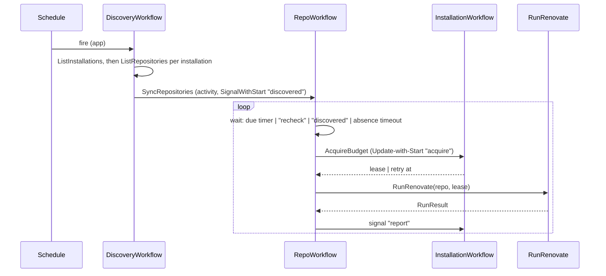

<!-- markdownlint-disable-file MD025 MD041 -->

# DESIGN-0001: boopd spike: workflows, RunRenovate activity and worker

<!--toc:start-->
- [Overview](#overview)
- [Goals and Non-Goals](#goals-and-non-goals)
  - [Goals](#goals)
  - [Non-Goals](#non-goals)
- [Background](#background)
- [Detailed Design](#detailed-design)
  - [Binary and packages](#binary-and-packages)
  - [Workflows](#workflows)
    - [DiscoveryWorkflow](#discoveryworkflow)
    - [RepoWorkflow](#repoworkflow)
    - [InstallationWorkflow](#installationworkflow)
  - [RunRenovate activity](#runrenovate-activity)
  - [Process builder](#process-builder)
  - [Convergence and stall](#convergence-and-stall)
  - [Worker image](#worker-image)
  - [Observability](#observability)
- [API / Interface Changes](#api--interface-changes)
- [Data Model](#data-model)
- [Testing Strategy](#testing-strategy)
- [Migration / Rollout Plan](#migration--rollout-plan)
- [Open Questions](#open-questions)
- [References](#references)
<!--toc:end-->

## Overview

This is the build design for the `boopd` spike: the three workflows, the
`RunRenovate` activity and its process builder, and the worker image, enough
to run INV-0001's success criteria in the homelab. It applies ADR-0001 to
ADR-0005. The store and API (ADR-0006) and the `x` extraction (ADR-0007) are
out of scope. The v1 DESIGN, written after the spike, replaces this document
where they differ.

## Goals and Non-Goals

### Goals

- `boopd worker`, which runs `RepoWorkflow`, `InstallationWorkflow` and
  `DiscoveryWorkflow` and their short activities, and `boopd renovate`,
  which runs `RunRenovate`. Both target GitHub with App auth. GitHub is the only platform (RFC-0001).
- A process builder that turns platform config and one repository into the
  Renovate environment, covered by the behaviour tests in INV-0001 § Renovate
  behaviours to reproduce *before* the activity exists.
- A `RunRenovate` activity that holds the isolation rules in ADR-0003 and
  returns a structured result: exit code, duration, report tuples, problems
  and progress.
- Convergence and stall handling for runs that outlive their token
  (INV-0001 Observation 10).
- A discovered, per-installation rate budget (REST and GraphQL) that caps
  concurrent runs, with no limit or plan in config (ADR-0008).
- A worker image and chart changes to deploy all of this next to a Temporal
  cluster and Redis.
- Enough instrumentation to evaluate every success criterion without reading
  raw logs.

### Non-Goals

- Postgres store, HTTP API, UI (ADR-0006).
- Webhook ingest (INV-0001 OQ8).
- Extracting shared code into `donaldgifford/x` (ADR-0007).
- Evals, security findings, automerge.
- Autoscaling workers. The spike runs a fixed replica count. Budget
  discovery and admission *are* in scope. The scaling mechanism (KEDA
  trigger, Deployment or Job per run) is a fast follow (ADR-0008).
- GitHub Enterprise Server. The endpoint handling stays correct per
  renovate-operator INV-0004, but GHES is not tested.

## Background

- [INV-0001](../investigation/0001-temporal-as-the-renovate-control-plane.md)
  is the founding investigation. Observations 3, 4, 5, 10 and 11 and § Spike
  drive this design.
- `internal/platform` is already copied from renovate-operator `0183661`. It
  provides `Discover`, `HasRenovateConfig`, `MintAccessToken` and the
  `ErrTransient` / `ErrPermanent` / `ErrUnauthorized` / `RateLimitedError`
  classification.
- repo-guardian `v2` @ `278c7ec` provides the Temporal plumbing
  (`internal/temporal`) and the budget entity (`internal/workflows/installation.go`:
  `acquire` Update, `report` Signal, leases, sweep, ContinueAsNew drain), plus
  option presets (`options.go`).

## Detailed Design

### Binary and packages

One binary, `boopd`, with a role subcommand. The spike ships two roles:
`worker` (workflows and short activities) and `renovate` (`RunRenovate`
only).

| Package | Contents | Origin |
| ------- | -------- | ------ |
| `cmd/boopd` | flag parsing, role dispatch, signal handling | new (replaces `cmd/boop`) |
| `internal/config` | config file types, loading, validation | new |
| `internal/platform` | platform clients | copied (renovate-operator) |
| `internal/temporal` | client config, mTLS/OIDC, dial, worker options, versioning, `EnsureSchedule`, `DescribeBacklog` | copied (repo-guardian) |
| `internal/renovate` | process builder (env, `RENOVATE_CONFIG`), process runner, report parser, log progress scanner | new |
| `internal/workflows` | `RepoWorkflow`, `InstallationWorkflow`, `DiscoveryWorkflow`, options | new + copied budget entity |
| `internal/activities` | `ListInstallations`, `ListRepositories`, `SyncRepositories`, `AcquireBudget`, `ReadRateLimit`, `RunRenovate` | new |
| `internal/observability` | slog setup, Prometheus metrics, health endpoints | new, follows renovate-operator's pattern |

### Workflows



#### DiscoveryWorkflow

- **One Temporal Schedule per configured GitHub App**, ID
  `discovery/<app name>`, created or updated at worker start from the config
  file (ADR-0004). Overlap policy `Skip`.
- **`ListInstallations` activity:** lists the App's installations
  (`GET /app/installations` with the App JWT), filtered by the optional
  `installations` allowlist in config. This is new code; the copied client is
  built per installation.
- **`ListRepositories` activity**, per installation:
  1. Run `platform.Client.Discover` with the configured filter.
  2. Run `HasRenovateConfig` for each result with bounded concurrency.
  3. Return the repositories that have the file (ADR-0005).

  Heartbeats per page. Each `Repository` gains a numeric `ID`, an addition to
  the copied package, because workflow IDs use it (ADR-0002).
- **`SyncRepositories` activity:** calls `SignalWithStart` on
  `repo/<platform>/<id>` with signal `discovered` carrying
  `{slug, defaultBranch, installationID}`, in batches, heartbeating progress.
  The fan-out happens in an activity, not the workflow, so 30,000 starts do
  not end up in workflow history. The list travels as an activity result; if
  that exceeds the payload limit, both steps fold into one activity.
- **Removal is decided by absence, not by diffing.** Each `RepoWorkflow` ends
  itself if no `discovered` signal arrives within
  `3 × discovery interval`. Discovery keeps no list of previous results.

#### RepoWorkflow

Input and ContinueAsNew state:

```go
type RepoState struct {
    Platform       string
    RepoID         int64
    Slug           string // refreshed by every "discovered" signal
    DefaultBranch  string
    InstallationID int64
    LastSeen       time.Time // last "discovered"
    LastRun        *RunSummary
    NextDue        time.Time
    StallCount     int
    Iterations     int
}
```

Loop:

1. **Wait.** Wait on a selector over:
   - a timer to `NextDue`;
   - a `recheck` signal, which runs now;
   - a `discovered` signal, which updates the slug and `LastSeen` and keeps
     waiting;
   - a timer to `LastSeen + 3 × discovery interval`, which ends the workflow.
2. **Acquire budget.** `AcquireBudget` activity, which does Update-with-Start
   on `installation/<platform>/<id>` (repo-guardian pattern). The result is a
   lease, or a `retryAt` to sleep until before re-acquiring. `RunRenovate` is
   scheduled only after a lease is granted, so the `boopd-renovate` backlog
   holds admitted work only (ADR-0008).
3. **Run.** `RunRenovate` (options below).
4. **Report.** Signal `report{leaseID, before, after}` (per-resource
   readings) to the installation.
5. **Decide the next due time** from the outcome (§ Convergence and stall).
6. **ContinueAsNew** when `Iterations` reaches 100 or the SDK suggests it.

**First due time.** `NextDue` for a new repository is `now + jitter`. Jitter
is derived deterministically from a hash of the repo ID modulo the cadence, so
the fleet spreads across the window and restarts do not cluster.
After a run, `NextDue = LastRun.Start + cadence`.

A query handler `state` returns `RepoState` for debugging in the Temporal UI.

#### InstallationWorkflow

Copied from repo-guardian, then changed so the budget is discovered and has
more than one resource (ADR-0008).

**Discovery.**

- The `ReadRateLimit` activity calls `GET /rate_limit` with the installation
  token. That endpoint does not count against the limit.
- It records `limit`, `remaining` and `reset` for the `core` (REST) and
  `graphql` resources.
- It runs when the workflow starts, at least hourly after that, and whenever
  a `report` arrives (`RunRenovate` reads the endpoint before and after each
  run).
- github.com (5,000 up to 12,500 per hour), Enterprise Cloud (15,000) and a
  GHES admin-set limit all arrive the same way. Config states neither the
  limit nor the plan.

State per resource:

```go
type ResourceBudget struct {
    Limit     int       // discovered; changes as the installation grows
    Remaining int
    Reset     time.Time
    Estimate  float64   // EWMA spend per run for this resource
}

type BudgetState struct {
    Resources map[string]*ResourceBudget // "core", "graphql"
    Leases    map[string]Lease
    MaxConcurrentRuns int // optional cap from config; 0 = budget only
    // ... repo-guardian's handled count, suspend state
}
```

**Admission.** `acquire` grants a lease only if both conditions hold:

- every resource has `Remaining − (open leases × Estimate) − Estimate ≥ reserve`,
  where reserve is `reserveFraction × Limit` (default 10%);
- open leases are fewer than `MaxConcurrentRuns`, when that cap is set.

Otherwise it returns `retryAt`: the latest `Reset` among the exhausted
resources, or the next lease expiry if only the cap was hit.
`MaxConcurrentRuns` guards against secondary rate limits and cluster
capacity, which `/rate_limit` does not show.

**Spend.**

- Spend for each resource is `before.Remaining − after.Remaining` when
  `Reset` did not change in between, and unknown otherwise.
- The EWMA ignores unknown samples. Until it has samples, the estimate is a
  configured default.
- Overlapping runs make the number noisy (INV-0001 Observation 5).

**Client-side limiter.** The copied GitHub client has a fixed client-side
limit of 4,500/hr for discovery calls (`defaultRateLimit`). That is wrong for
Enterprise Cloud, so it is set from the discovered `core` limit instead.

Lease TTL, sweep and the ContinueAsNew drain behave as in repo-guardian. Lease
TTL is the `RunRenovate` timeout plus 5 minutes.

### RunRenovate activity

Input: platform name, repo slug, repo ID, default branch, lease ID, attempt
context. Output:

```go
type RunResult struct {
    Outcome    Outcome // Succeeded, Failed, TimedOut, Skipped
    ExitCode   int
    Duration   time.Duration
    Tuples     []UpdateTuple // (branchName, depName, newVersion) + manager, packageName, currentVersion
    Problems   []Problem     // repository-level problems from the report
    Progress   Progress      // branches pushed / PRs created or updated this attempt
    RateBefore RateReadings  // per resource: limit, remaining, reset
    RateAfter  RateReadings
}
```

Steps:

1. **Fresh workspace.** Create `/work/<activity id>/{base,cache,tmp,home}` on
   the `emptyDir` with mode `0700`.
2. **Token and rate reading.** `MintAccessToken`, then read `/rate_limit`.
3. **Build the environment** with the process builder (below). It is built
   from scratch; the worker's own environment is not inherited.
4. **Start Renovate.** `exec` `renovate` in its own process group
   (`Setpgid`), streaming stdout and stderr through the log forwarder and
   progress scanner.
5. **Heartbeat** every 15 s with the progress so far.
6. **Stop.** On a soft deadline (the timeout minus 2 minutes), context
   cancellation or worker shutdown: `SIGTERM` the process group, wait 30 s,
   then `SIGKILL` the group.
7. **Read the report** file if it exists (`reportType: file`).
8. **Read `/rate_limit` again.**
9. **Clean up.** `rm -rf` the workspace in a `defer`, and sweep stale
   `/work/*` at worker start in case a previous process died.
10. **Classify:**
    - exit 0 with a report → `Succeeded`;
    - stopped at the soft deadline → `TimedOut`, returned as a result, not an
      error, so the workflow can decide using `Progress`;
    - `ErrUnauthorized` / `ErrPermanent` from minting → non-retryable
      `ApplicationError`;
    - non-zero exit → `Failed`, with problems from the report if one exists.

Activity options:

| Option | Value |
| ------ | ----- |
| `StartToCloseTimeout` | 50 min (below the ~1h token) |
| Soft deadline | timeout − 2 min |
| `HeartbeatTimeout` | 1 min |
| Retry | 3 attempts, 30 s initial, ×2; for infrastructure errors only (worker death shows up as heartbeat timeout) |
| Task queue | `boopd-renovate` (workflows and other activities use `boopd`) |
| Priority / fairness key | `TaskPriority(p, installationID)` |

Two Deployments, both fixed replicas in the spike (ADR-0008):

- **`boopd-worker`** polls `boopd` for workflow tasks and the short
  activities (`ListRepositories`, `SyncRepositories`, `AcquireBudget`).
  It uses the distroless image.
- **`boopd-renovate`** polls only `boopd-renovate`, with one activity slot
  (`MaxConcurrentActivityExecutionSize: 1`) and no workflow tasks. It uses
  the worker image below. On `SIGTERM` it stops polling and lets the run in
  flight reach its soft deadline (`terminationGracePeriodSeconds` set to
  cover it).

A separate queue keeps a later scaler pointed at Renovate runs alone, and
keeps the large image off the workflow pods.

### Process builder

`renovate.BuildEnv(platform, repo, token, workspace, globalConfig) ([]string, error)`
is a pure function. These rows are the behaviour tests, written first:

| Variable | Value | Rule / source |
| -------- | ----- | ------------- |
| `RENOVATE_PLATFORM` | `github` | RFC-0001 |
| `RENOVATE_ENDPOINT` | unset for `https://api.github.com`; set only for GHES | renovate-operator INV-0004 Obs. 5 |
| `RENOVATE_TOKEN` | minted installation token | renovate-operator INV-0003 |
| `RENOVATE_AUTODISCOVER` | `false` | renovate-operator INV-0003 |
| `RENOVATE_REPOSITORIES` | the single slug | renovate-operator INV-0003 |
| `RENOVATE_REQUIRE_CONFIG` | `required` | ADR-0005 |
| `RENOVATE_ONBOARDING` | `false` | ADR-0005 |
| `RENOVATE_BASE_DIR` / `RENOVATE_CACHE_DIR` | per-activity workspace | ADR-0003 |
| `RENOVATE_BINARY_SOURCE` | `global` | ADR-0003 |
| `RENOVATE_REDIS_URL` | from a Secret | ADR-0003 |
| `RENOVATE_REPORT_TYPE` / `RENOVATE_REPORT_PATH` | `file` / `<workspace>/report.json` | INV-0001 Obs. 11 |
| `RENOVATE_GIT_AUTHOR` | `boop-bot <…>` | naming |
| `RENOVATE_CONFIG` | JSON: shared preset prepended to `extends`, plus global config from the file (e.g. `dryRun`); never `logLevel` | v0.1.x bug list, docs/usage gotchas |
| `LOG_LEVEL` / `LOG_FORMAT` | from config / `json` | v0.1.x bug list |
| `HOME`, `TMPDIR` | per-activity workspace | ADR-0003 |
| `PATH` | the image's toolchain path | ADR-0003 |

Rules the tests also cover:

- **Validate the preset.** A GitHub-hosted shared preset must end in `.json`.
  Reject `.json5`.
- **Keep explicit `false`.** Global config is a `map[string]any`, or a struct
  of pointer fields with no `omitempty`. An explicit `false` must survive the
  round trip (renovate-operator INV-0005).
- **Never pass `exposeAllEnv`.** The builder rejects it, along with
  `allowScripts` and `allowedCommands`, in global config. Repository config
  cannot set them in self-hosted mode.

### Convergence and stall

`RepoWorkflow` decides with the `RunResult`, not with Temporal retries:

| Outcome | Next step | `StallCount` |
| ------- | --------- | ------------ |
| `Succeeded` | `NextDue = start + cadence` | reset to 0 |
| `TimedOut`, `Progress > 0` | rerun at once with a new token | unchanged |
| `TimedOut`, `Progress == 0` | rerun at once | +1 |
| `Failed` (repository problem) | `NextDue = start + cadence` | unchanged; recorded |
| `StallCount == 3` | record `stalled`, emit metric, `NextDue = start + cadence` | reset at the next due run |
| Activity error after retries (infrastructure) | back off `min(2^n × 5 min, cadence)` | unchanged |

**How progress is measured differs from INV-0001.** INV-0001 Observation 10
measures progress from Renovate's report. A Renovate process killed at the
soft deadline probably never writes its report file. So the activity
measures progress from Renovate's JSON log stream as it runs. It counts the
branch push and PR create/update events, and carries the count in heartbeat
details, so it survives worker death as well. The report is still the source
of truth for completed runs and for the comparison (Observation 11). The
event names to match are pinned in a test fixture taken from a real Renovate
v43 log. Spike criterion "Convergence" verifies the approach.

### Worker image

A new bake target `renovate` for the `boopd-renovate` Deployment. The
distroless image stays for the `worker` role and the later `api` role:

```dockerfile
FROM ghcr.io/renovatebot/renovate:43-full   # pinned by digest; Renovate-managed
COPY --from=build /out/boopd /usr/local/bin/boopd
USER 12021
ENTRYPOINT ["/usr/local/bin/boopd", "renovate"]
```

Pod spec:

- read-only root filesystem;
- `emptyDir` volumes for `/work` and `/tmp`;
- `runAsNonRoot`, `seccompProfile: RuntimeDefault`,
  `allowPrivilegeEscalation: false`, capabilities drop `ALL`;
- no service account token mounted.

The Renovate version is pinned in the image and recorded in `RunResult` so
comparisons with renovate-operator use the same version.

### Observability

- **Logs.** `boopd` logs JSON through slog. The log forwarder reads each line
  of Renovate's JSON output, adds `repo`, `workflow_id`, `run_id`, `attempt`
  and `activity_id`, and writes it to stdout. Loki labels come from those
  fields (criterion "Log correlation").
- **Metrics** (Prometheus on `METRICS_ADDR`):
  - `boopd_runs_total{platform,outcome}`;
  - `boopd_run_duration_seconds{platform}`;
  - `boopd_run_overhead_seconds` (exec start to first repository log line);
  - `boopd_repos_stalled`;
  - `boopd_budget_limit{installation,resource}` and
    `boopd_budget_remaining{installation,resource}` (discovered);
  - `boopd_rate_spend_per_run{installation,resource}` (the EWMA input);
  - `boopd_budget_admitted_runs{installation}` (open leases);
  - `boopd_renovate_desired_workers`: open leases across installations, which
    is the candidate custom scaling signal (ADR-0008);
  - `boopd_pod_start_seconds` (pod creation to first poll, including image
    pull).
- **Health.** `/healthz` and `/readyz` on `LISTEN_ADDR`. Ready means
  connected to Temporal and the worker started.

## API / Interface Changes

The commands are `boopd worker --config /etc/boopd/config.yaml` and
`boopd renovate --config /etc/boopd/config.yaml`. Temporal
connection comes from env, as in repo-guardian (`TEMPORAL_ADDRESS`,
`TEMPORAL_NAMESPACE=boopd`, TLS/OIDC variables). The chart contract in
CLAUDE.md (`LISTEN_ADDR`, `METRICS_ADDR`, `LOG_LEVEL`, `POD_NAME`) still holds.

Config file (ADR-0004), rendered from chart values:

```yaml
renovate:
  sharedPreset: github>boop-bot/renovate-config:default.json
  global:            # merged into RENOVATE_CONFIG; explicit false preserved
    dryRun: full     # spike comparison runs
  logLevel: info
  redisSecretRef: {name: boopd-redis, key: url}
apps:
  - name: boop-bot
    endpoint: https://api.github.com
    appID: 123456
    privateKeySecretRef: {name: boop-bot-app, key: private-key.pem}
    installations: []          # optional allowlist; empty = every installation
    discovery:
      schedule: "0 */6 * * *"
      skipForks: true
      skipArchived: true
    cadence: 24h
    budget:                    # limits are discovered, never configured
      reserveFraction: 0.10
      maxConcurrentRuns: 0     # optional safety cap per installation; 0 = budget only
      defaultEstimate: {core: 300, graphql: 150}   # until the EWMA has samples
```

## Data Model

There is no persistent store in the spike. All state is in Temporal:

- **`RepoState`**: `RepoWorkflow` input and ContinueAsNew carry.
- **`BudgetState`**: `InstallationWorkflow`, copied.
- **`RunResult`**: activity result. It is also logged as one structured
  `run_complete` line, which is how spike results are collected.

`UpdateTuple` already has the per-dependency fields the v1 store needs
(ADR-0006). Its shape should be kept stable.

## Testing Strategy

| Layer | What | How |
| ----- | ---- | --- |
| Process builder | every row of the env table and the rules below it | table tests, written before the activity |
| Report parser / progress scanner | real Renovate v43 report and log fixtures | golden files |
| Process runner | process-group kill, soft deadline, cleanup, heartbeat details | a fake `renovate` shell script that sleeps, writes to the workspace, ignores `SIGTERM` |
| Workflows | due-time, recheck, absence end, stall table, ContinueAsNew carry; budget admission against the tightest resource, `retryAt`, limit changes between readings | Temporal `testsuite` with mocked activities |
| Determinism | workflow code changes | replay tests against recorded histories in CI |
| Platform | already covered | copied tests |
| Spike | INV-0001 success criteria | homelab, results recorded in a new investigation |

Fixtures for the isolation criteria:

- a scratch repository whose package-manager step writes marker files into
  `cacheDir`, `baseDir` and `/tmp`, and dumps its environment;
- a second repository run next on the same pod that looks for those markers.

## Migration / Rollout Plan

1. Process builder and behaviour tests (INV-0001 step 4).
2. Copy `internal/temporal` and the budget entity (step 5).
3. Workflows and activities, with unit and workflow tests (step 6).
4. Worker image, chart changes, homelab deploy alongside Temporal (repo-guardian
   `contrib/temporal/` values, namespace `boopd`) and Redis (step 7).
5. Run the comparison with renovate-operator v0.1.x, both sides in
   `dryRun: full`, then the live criteria against scratch repositories
   (step 8).
6. Record results in INV-0002, then write the v1 DESIGN.

The baseline is renovate-operator v0.1.x as it runs in the homelab today,
unchanged. The spike does not imitate the operator's execution shape (a Job
per shard). The comparison is on Renovate's report output (INV-0001
Observation 11), which does not depend on how runs execute. The operator-like
shape, a pod per run, is the first one tried in the scaling fast follow
(ADR-0008). renovate-operator keeps running throughout, and `boopd` stays in
`dryRun` until the comparison passes.

## Open Questions

1. **Progress signal.** Does Renovate v43 log a stable, parseable event per
   branch push and PR change? If not, the fallback is listing `renovate/*`
   branches and their head SHAs through the platform API before and after
   each attempt. That costs API calls.
2. **Report on SIGTERM.** Does Renovate write its report file when
   terminated? If it does, the log scanner becomes a fallback.
3. **Cadence model.** A fixed per-repository cadence with jitter (this
   design), or a window that discovery spreads repositories across (INV-0001
   Observation 3)? The fixed cadence is simpler, and the spike's budget data
   decides whether that is enough.
4. **Redis.** One shared Redis for every installation, or one per
   installation? Does Renovate's Redis cache need eviction tuning at fleet
   size?
5. **Worker sizing.** CPU and memory per Renovate run, and whether one slot
   per pod is too costly at the measured overhead.
6. **Report schema stability.** `reportType: file` is not a documented stable
   API. Pin a fixture per Renovate minor version.
7. **Scaling mechanism.** A fast follow after the spike (ADR-0008). The spike
   records the numbers it needs: per-run duration, pod start and image pull
   time, per-run spend per resource, and admitted concurrency.
8. **Secondary rate limits.** `/rate_limit` does not report them. Is
   `maxConcurrentRuns` enough, or does `RunRenovate` need to detect secondary
   limit hits in Renovate's log and feed them back as a `retryAt`?
9. **GraphQL spend.** How much of Renovate's spend goes to GraphQL, and
   whether it, not REST, is the binding resource for typical repositories.
10. **Carried from INV-0001:** OQ2 (execution model; this design assumes A),
   OQ4 (entity workflow; assumed), OQ8 (ingest; deferred).

## References

- [INV-0001](../investigation/0001-temporal-as-the-renovate-control-plane.md)
- [RFC-0001](../rfc/0001-boopd-run-renovate-per-repository-on-temporal.md)
- ADR-0001 to ADR-0008
- repo-guardian `v2` @ `278c7ec`: `internal/temporal/`,
  `internal/workflows/installation.go`, `internal/workflows/options.go`,
  `contrib/temporal/`, DESIGN-0026
- renovate-operator `0183661`: `internal/platform/`, `internal/jobspec/env.go`;
  INV-0003, INV-0004, INV-0005
- [Renovate self-hosted configuration](https://docs.renovatebot.com/self-hosted-configuration/)
