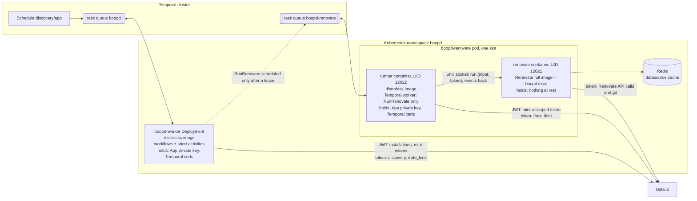
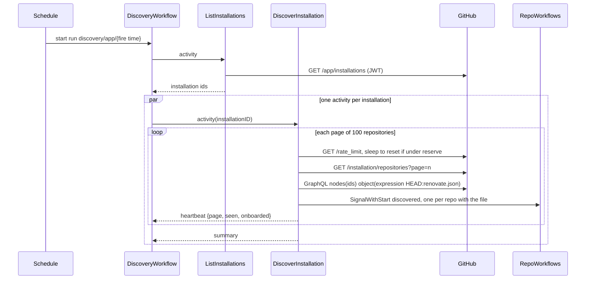
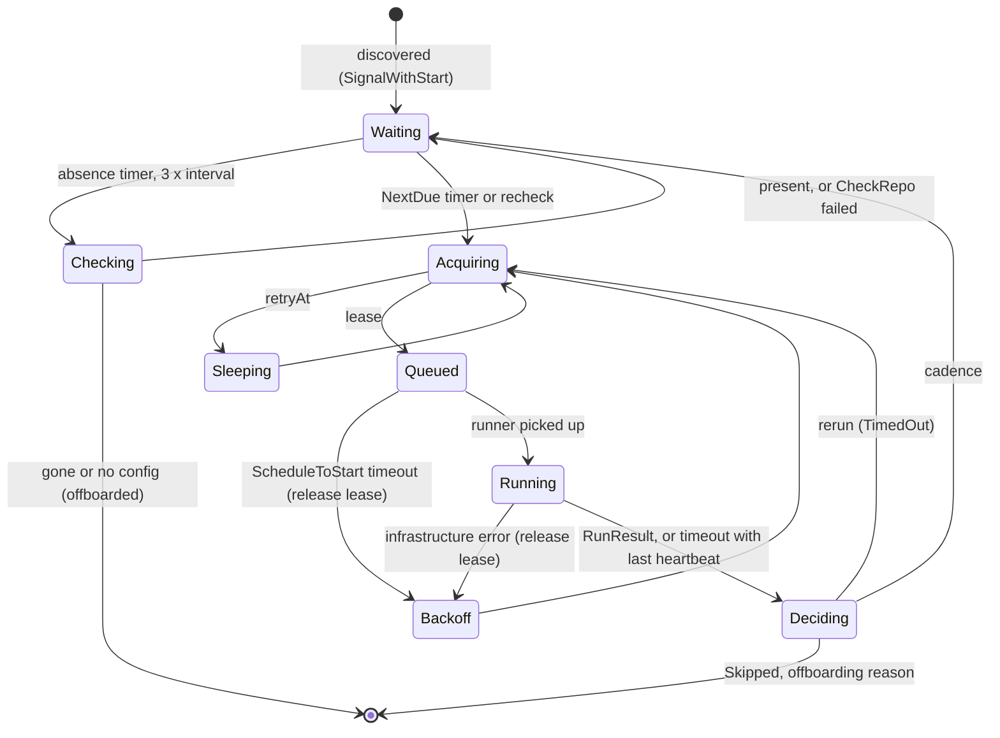
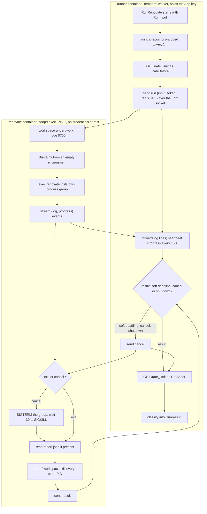

<!-- markdownlint-disable-file MD025 MD041 -->

# DESIGN-0001: boopd spike: workflows, RunRenovate activity and worker

<!--toc:start-->
- [Overview](#overview)
- [Goals and Non-Goals](#goals-and-non-goals)
  - [Goals](#goals)
  - [Non-Goals](#non-goals)
- [Background](#background)
- [Detailed Design](#detailed-design)
  - [Topology, roles and packages](#topology-roles-and-packages)
  - [Task queues and credentials](#task-queues-and-credentials)
  - [Workflows](#workflows)
    - [DiscoveryWorkflow](#discoveryworkflow)
    - [RepoWorkflow](#repoworkflow)
    - [InstallationWorkflow](#installationworkflow)
  - [RunRenovate activity](#runrenovate-activity)
  - [Process builder](#process-builder)
  - [Convergence and stall](#convergence-and-stall)
  - [Worker image and pod spec](#worker-image-and-pod-spec)
  - [Observability](#observability)
- [API / Interface Changes](#api--interface-changes)
- [Data Model](#data-model)
- [Testing Strategy](#testing-strategy)
- [Migration / Rollout Plan](#migration--rollout-plan)
- [Open Questions](#open-questions)
  - [OQ1: How does the Renovate container get its per-run token?](#oq1-how-does-the-renovate-container-get-its-per-run-token)
  - [OQ2: What scope does the per-run token have?](#oq2-what-scope-does-the-per-run-token-have)
  - [OQ3: How does discovery probe for the config file?](#oq3-how-does-discovery-probe-for-the-config-file)
  - [OQ4: What is the cadence model and its defaults?](#oq4-what-is-the-cadence-model-and-its-defaults)
  - [OQ5: How are GitHub's secondary limits handled?](#oq5-how-are-githubs-secondary-limits-handled)
  - [OQ6: What are the default spend estimates before the EWMA has samples?](#oq6-what-are-the-default-spend-estimates-before-the-ewma-has-samples)
  - [OQ7: Redis and worker sizing?](#oq7-redis-and-worker-sizing)
  - [OQ8: How is the report's schema change risk handled?](#oq8-how-is-the-reports-schema-change-risk-handled)
  - [OQ9: Which scaling mechanism is tried first in the fast follow?](#oq9-which-scaling-mechanism-is-tried-first-in-the-fast-follow)
  - [OQ10: Timeouts and limits](#oq10-timeouts-and-limits)
- [References](#references)
<!--toc:end-->

## Overview

This is the build design for the `boopd` spike: the three workflows, the
`RunRenovate` activity and its process builder, the budget entity, and the
Renovate pod, enough to run INV-0001's success criteria in the homelab. It
applies ADR-0001 to ADR-0005 and ADR-0008. The store and API (ADR-0006) and
the `x` extraction (ADR-0007) are out of scope. The v1 DESIGN, written after
the spike, replaces this document where they differ.

Facts about Renovate, GitHub and Temporal in this document were checked
against their sources on 2026-10-04: Renovate `main` @ `e0e072ec` (release
44.132.5), docs.github.com, the Temporal Go SDK (v1.49.0) and
docs.temporal.io. Where the body depends on a decision that is still open it
says so and points at the question in [Open Questions](#open-questions). The
body is written on the **a** option of each question.

## Goals and Non-Goals

### Goals

- `boopd worker`, which runs `RepoWorkflow`, `InstallationWorkflow` and
  `DiscoveryWorkflow` and their short activities; `boopd runner`, which runs
  `RunRenovate` and nothing else; and `boopd exec`, which runs the Renovate
  process. All target GitHub with App auth. GitHub is the only platform
  (RFC-0001).
- A process builder that turns platform config and one repository into the
  Renovate environment, covered by the behaviour tests in INV-0001 § Renovate
  behaviours to reproduce *before* the activity exists.
- A `RunRenovate` activity that holds the isolation rules in ADR-0003 and
  returns a structured result: outcome, Renovate's repository result, report
  tuples, problems and progress.
- Convergence and stall handling for runs that outlive their token
  (INV-0001 Observation 10).
- A discovered, per-installation rate budget (REST and GraphQL) that caps
  concurrent runs, with no limit or plan in config (ADR-0008). Discovery
  itself stays inside that budget.
- The container that runs Renovate holds no credential at rest: not the App
  private key, not the Temporal client certificate, not the Redis URL. Only
  the run's own repository-scoped token is in its reach, for the length of
  the run.
- A Renovate image, a pod spec and chart changes to deploy all of this next
  to a Temporal cluster and Redis.
- Enough instrumentation to evaluate every success criterion without reading
  raw logs.

### Non-Goals

- Postgres store, HTTP API, UI (ADR-0006).
- Webhook ingest (INV-0001 OQ8).
- Extracting shared code into `donaldgifford/x` (ADR-0007).
- Evals, security findings, automerge.
- Autoscaling workers. The spike runs a fixed replica count. Budget
  discovery and admission *are* in scope. The scaling mechanism (KEDA
  trigger, Deployment or Job per run) is a fast follow (ADR-0008, OQ9).
- GitHub Enterprise Server. The endpoint handling stays correct per
  renovate-operator INV-0004, but GHES is not tested.

## Background

- [INV-0001](../investigation/0001-temporal-as-the-renovate-control-plane.md)
  is the founding investigation. Observations 3, 4, 5, 10 and 11 and § Spike
  drive this design. Its OQ2 (execution model), OQ4 (entity workflow) and
  OQ8 (ingest) are settled by ADR-0003, ADR-0002 and the non-goals above, so
  they are not repeated under Open Questions.
- `internal/platform` is already copied from renovate-operator `0183661`. It
  provides `Discover`, `HasRenovateConfig`, `MintAccessToken` (which returns
  the token and its `expiresAt`) and the `ErrTransient` / `ErrPermanent` /
  `ErrUnauthorized` / `RateLimitedError` classification. Its client is built
  per installation and carries a fixed client-side limiter
  (`defaultRateLimit`, 4,500/hr) with a `WithRateLimit` option.
- repo-guardian `v2` @ `278c7ec` provides the Temporal plumbing
  (`internal/temporal`) and the budget entity (`internal/workflows/installation.go`:
  `acquire` Update, `report` Signal, leases, sweep, ContinueAsNew drain), plus
  option presets (`options.go`).
- **Renovate** is at major 44 (`44.132.5`). INV-0001 recorded v43; the spike
  pins 44. The facts this design relies on (report shape, log lines, exit
  codes, signal handling, `globalOnly` options) were read from the v44
  source and are cited under § References.
- **Temporal:** Server 1.31 or later (ADR-0001). Task priority is available
  by default; fairness keys need the `matching.enableFairness` dynamic
  config for the namespace or task queues `boopd` uses. Go SDK 1.36 or later
  for Update-with-Start without the experimental flag and for fairness keys;
  the copied code is on 1.49.
- **Threat model for the Renovate container.** Renovate runs package
  managers, and a package manager runs whatever a repository's manifests
  tell it to. That child process runs as the same UID as `boopd` in the same
  container, so it can read every file that UID can read, including mounted
  Secrets, and `/proc/<pid>/environ` of any process of that UID.
  `exposeAllEnv=false` filters only the environment a child *inherits*. The
  one thing a same-UID child cannot read is another process's memory: that
  needs `ptrace` attach, which YAMA scope 1 (the usual default) refuses for
  a non-descendant and which the dropped `CAP_SYS_PTRACE` does not grant.
  Two consequences shape this design:
  - any credential mounted or exported in the Renovate container is
    readable by repository content; in particular a Temporal client
    certificate there lets a child *poll the task queue as a worker* and
    receive other runs' inputs;
  - the only safe places for a credential are a different container and a
    process's memory.

## Detailed Design

### Topology, roles and packages



One binary, `boopd`, with a role subcommand. The spike ships three roles
(OQ1):

| Role | Container | Image | Holds | Does |
| ---- | --------- | ----- | ----- | ---- |
| `worker` | `boopd-worker` Deployment | distroless | App private key, Temporal certs | workflows and the short activities on task queue `boopd` |
| `runner` | sidecar in the `boopd-renovate` pod, UID 12022 | distroless | App private key, Temporal certs, Redis URL | the Temporal worker for task queue `boopd-renovate` (one slot); mints the run's token; drives the executor |
| `exec` | main container in the `boopd-renovate` pod, UID 12021, PID 1 | Renovate full image + `boopd` | nothing at rest | serves a unix socket; builds the environment; runs and supervises the Renovate process; streams events back |

| Package | Contents | Origin |
| ------- | -------- | ------ |
| `cmd/boopd` | flag parsing, role dispatch, signal handling | new (replaces `cmd/boop`) |
| `internal/config` | config file types, loading, validation | new |
| `internal/platform` | GitHub client: discovery, config probe, scoped token minting, App-level (JWT) client for installations | copied (renovate-operator) + additions |
| `internal/temporal` | client config, mTLS/OIDC, dial, worker options, versioning, `EnsureSchedule`, `DescribeBacklog` | copied (repo-guardian) |
| `internal/runner` | the runner/executor protocol over a unix socket: client (runner side) and server (exec side) | new |
| `internal/renovate` | process builder (env, `RENOVATE_CONFIG`), process supervisor, report parser, log scanner | new |
| `internal/workflows` | `RepoWorkflow`, `InstallationWorkflow`, `DiscoveryWorkflow`, options | new + copied budget entity |
| `internal/activities` | `boopd` queue: `ListInstallations`, `DiscoverInstallation`, `CheckRepo`, `ReadRateLimit`, `AcquireBudget`; `boopd-renovate` queue: `RunRenovate` | new |
| `internal/observability` | slog setup, Prometheus metrics, health endpoints | new, follows renovate-operator's pattern |

### Task queues and credentials

| | `boopd-worker` Deployment | `boopd-renovate` Deployment |
| - | ------------------------- | --------------------------- |
| Polls | `boopd`: workflow tasks and the short activities | `boopd-renovate`: `RunRenovate` only, one activity slot (`MaxConcurrentActivityExecutionSize: 1`, `DisableWorkflowWorker: true`), polled by the `runner` container |
| Containers | `boopd worker` | `boopd runner` (sidecar) and `boopd exec` (Renovate image) |
| Runs repository content | never | the `renovate` container does, through package managers |
| Credentials at rest | App key, Temporal certs | `runner` only: App key, Temporal certs, Redis URL. The `renovate` container mounts none. |

**The container that runs Renovate holds no credential at rest.** Per the
threat model in § Background, anything mounted or exported there is
readable by repository content, and a Temporal client certificate there
would let a child act as a worker. So the Temporal worker for the
`boopd-renovate` queue is the `runner` sidecar, a different image and UID
with its own filesystem and PID namespace. The `renovate` container runs
`boopd exec`, a local executor with no network credentials, behind a unix
socket on an `emptyDir` the two containers share:

- The runner receives the activity task, mints a token scoped to the run's
  repository (OQ2), and sends `{RunInput, token, redis URL}` to the executor
  over the socket. The executor keeps them in memory and in the Renovate
  process's environment only; nothing is written to disk.
- The executor streams `{log line | progress | result}` events back. The
  runner forwards logs, heartbeats progress, and reports the result to
  Temporal. A forged event from a malicious child can only misreport the
  current run, which repository content could already do by tampering with
  Renovate itself.
- `boopd exec` is PID 1 of its container. A PID-namespace init cannot be
  killed from inside the namespace, so a child cannot replace it. After
  every run the executor kills every other process in the namespace, so
  nothing from one repository survives into the next run on the same pod.
  `shareProcessNamespace` stays false for this reason.
- The socket directory is owned by the runner with mode `0711`, so the
  executor's UID can connect but cannot replace the socket file. The runner
  accepts one executor connection at a time and hands a run to it only
  after the previous run's result and kill sweep.
- Nothing secret travels through Temporal, so no payload codec is needed
  and the Temporal UI stays readable. The token is minted at activity
  start, so none of its hour is spent in the queue.

What remains in the Renovate container's reach is the run's own scoped,
one-hour token and the Redis URL, both in Renovate's environment because
Renovate needs them. That is the residual risk INV-0001 Observation 4
accepted, narrowed by scoping (OQ2) and by Redis ACLs (OQ7).

A separate queue also keeps a later scaler pointed at Renovate runs alone
(ADR-0008) and keeps the large image off the workflow pods.

### Workflows

#### DiscoveryWorkflow



- **One Temporal Schedule per configured GitHub App**, ID
  `discovery/<app name>`, created or updated at worker start from the config
  file (ADR-0004), with an interval spec from `discovery.every`. Overlap
  policy `Skip` (the SDK default). The server appends the fire time to the
  started workflow's ID, which is ADR-0002's `discovery/<platform>/<schedule
  time>`; the Schedule is a different object from that run.
- **`ListInstallations` activity:** `GET /app/installations` with the App
  JWT (`ghinstallation.NewAppsTransport`, 100 per page), filtered by the
  optional `installations` allowlist in config. New code; the copied client
  is built per installation.
- **`DiscoverInstallation` activity, one per installation**, started in
  parallel from the workflow. It does the whole pass for one installation so
  that no repository list ever travels as a workflow payload (Temporal warns
  at 512 KB per payload and rejects 2 MB):
  1. Page `GET /installation/repositories` (100 per page; `Discover`,
     renovate-operator INV-0004) and apply `skipForks` / `skipArchived`. The
     response carries each repository's numeric `id` and GraphQL `node_id`.
  2. Probe each page for the config file (below).
  3. `SignalWithStart` `repo/github/<repo id>` with signal `discovered` for
     every repository that has it, carrying
     `{slug, defaultBranch, installationID, discoveryInterval}`.
  4. Heartbeat `{page, seen, onboarded}` after each page. A retry resumes
     from the last heartbeat's page.

  `Repository` gains numeric `ID` and `NodeID` fields, additions to the
  copied package, because workflow IDs use the first and the probe the
  second (ADR-0002).
- **Config probe** (OQ3). Discovery is the one place `boopd` touches every
  repository the installation can see, so its cost is the fleet's cost:
  - Only one path is probed: `renovate.configPath` (default
    `renovate.json`), the file repo-guardian writes (ADR-0005). The copied
    `ConfigPaths` list of five becomes that single configured path, which
    cuts a non-onboarded repository from up to five REST calls to one.
  - The probe is **one GraphQL query per 100 repositories**:

    ```graphql
    query($ids: [ID!]!) {
      rateLimit { cost remaining resetAt }
      nodes(ids: $ids) {
        ... on Repository {
          id
          config: object(expression: "HEAD:renovate.json") { __typename }
        }
      }
    }
    ```

    Neither `nodes(ids:)` nor `object(expression:)` is a connection, so by
    GitHub's published formula the query costs the minimum, 1 point, for
    100 repositories; a 15,000-repository installation is about 150 points
    per pass against a 5,000-point hourly GraphQL budget (10,000 on
    Enterprise Cloud). How GitHub scores `nodes(ids:)` is not documented,
    so every query reads `rateLimit.cost` and the pass records it
    (`boopd_discovery_probe_cost`). 100 per query is a design choice, not a
    documented limit.
  - Fallback, behind `discovery.probe: rest`, is the REST contents call per
    repository for the one path.
  - Before each page, the activity reads `/rate_limit`; if either tracked
    resource is under the installation's reserve it sleeps until `reset`,
    heartbeating. Discovery takes no lease (it is not a run), but its spend
    shows in the next readings, so admission sees it.
- **Removal is decided by the repository, not by diffing.** Discovery keeps
  no list of previous results. A `RepoWorkflow` that discovery has not seen
  for `3 × discoveryInterval` runs `CheckRepo` (§ RepoWorkflow) and ends only
  if that confirms the repository is gone or has no config file. A discovery
  outage (rotated key, GitHub down, paused Schedule) therefore never ends
  the fleet.

#### RepoWorkflow



Input and ContinueAsNew state:

```go
type RepoState struct {
    Platform          string // "github"
    RepoID            int64
    Slug              string        // refreshed by every "discovered" signal
    DefaultBranch     string
    InstallationID    int64
    DiscoveryInterval time.Duration // from the "discovered" signal
    LastSeen          time.Time     // last "discovered"
    LastRun           *RunSummary
    NextDue           time.Time
    StallCount        int
    ConsecutiveReruns int
    Iterations        int
}
```

Loop:

1. **Wait.** Wait on a selector over:
   - a timer to `NextDue`;
   - a `recheck` signal, which runs now at `PriorityHigh`;
   - a `discovered` signal, which updates the slug and `LastSeen` and keeps
     waiting;
   - a timer to `LastSeen + 3 × DiscoveryInterval`, which runs the
     `CheckRepo` activity (repository visible to the installation, not
     archived, config file present on the default branch). Gone or no
     config: record `offboarded` and end the workflow. Still there: set
     `LastSeen = now`, increment `boopd_discovery_missed` and keep waiting.
     If `CheckRepo` itself fails (GitHub unreachable, bad credentials),
     keep waiting and try again after another `DiscoveryInterval`; an
     outage must never look like an offboarding.
2. **Acquire budget.** `AcquireBudget` activity, which does Update-with-Start
   on `installation/github/<id>` (repo-guardian pattern). The result is a
   lease, or a `retryAt` to sleep until before re-acquiring. `RunRenovate` is
   scheduled only after a lease is granted, so the `boopd-renovate` backlog
   holds admitted work only (ADR-0008).
3. **Run.** Schedule `RunRenovate` on `boopd-renovate` (options under
   § RunRenovate activity). Four things can come back:
   - a `RunResult`;
   - a `ScheduleToStart` timeout: no runner picked the task up within
     10 minutes. Temporal never retries this timeout, by design. Release
     the lease (a `report` with no readings), sleep
     `min(5 min × 2^n, 30 min)` and go back to step 2. This is the only way
     a lease can outlive the queue, and the lease TTL covers it;
   - a `StartToClose` or heartbeat timeout: the runner died or overran.
     The `TimeoutError` carries the last heartbeat details; read the
     progress from it and treat the attempt as `TimedOut` with that
     progress;
   - any other activity error (token mint, executor unreachable, workspace,
     Redis unreachable, a platform or temporary repository result): release
     the lease and take the infrastructure row in § Convergence and stall.
4. **Report.** Signal `report{leaseID, before, after}` with the per-resource
   readings from the result to the installation. The report *is* the
   installation's rate reading; it triggers no extra `/rate_limit` call.
   When there is no result, the `report` carries no readings and only
   closes the lease.
5. **Decide the next due time** from the outcome (§ Convergence and stall).
   A rerun goes back to step 2 for a new lease.
6. **ContinueAsNew** when `Iterations` reaches 100 or the SDK suggests it
   (the server suggests at 4 MiB or 4,096 history events).

**First due time.** `NextDue` for a new repository is `now + jitter`. Jitter
is derived deterministically from a hash of the repo ID modulo the cadence, so
the fleet spreads across the window and restarts do not cluster.
After a run, `NextDue = LastRun.Start + cadence` (OQ4).

**Priority.** Every activity and the budget `acquire` carry
`TaskPriority(p, installationID)` (copied from repo-guardian): the fairness
key is the installation, and `p` is `PriorityHigh` for a `recheck` and
`PriorityNormal` for a scheduled run.

A query handler `state` returns `RepoState` for debugging in the Temporal UI.

#### InstallationWorkflow

Copied from repo-guardian, then changed so the budget is discovered and has
more than one resource (ADR-0008).

**Discovery.**

- The `ReadRateLimit` activity calls `GET /rate_limit` with an installation
  token. That endpoint does not count against the limit. It reads the
  `resources.core` and `resources.graphql` objects (the top-level `rate`
  object is deprecated).
- It runs when the workflow starts and at least hourly after that. Between
  those, every `report` with readings refreshes the same fields, because
  `RunRenovate` reads the endpoint before and after each run.
- The limits arrive the same way for every plan, so config states neither
  the limit nor the plan. For reference, per GitHub's docs: REST for an
  installation starts at 5,000 per hour, grows by 50 per repository and 50
  per user beyond 20 of each, and caps at 12,500; Enterprise Cloud
  installations get 15,000; GHES limits are set by the site administrator
  and are off by default. GraphQL is 5,000 points per hour per installation,
  10,000 on Enterprise Cloud.

State per resource:

```go
type ResourceBudget struct {
    Limit     int       // discovered; changes as the installation grows
    Remaining int
    Reset     time.Time
    Estimate  float64   // EWMA spend per run for this resource
}

type BudgetState struct {
    Resources         map[string]*ResourceBudget // "core", "graphql"
    Leases            map[string]Lease           // holder = RepoWorkflow ID
    MaxConcurrentRuns int                        // optional cap from config; 0 = budget only
    RetryAt           time.Time                  // installation-wide pause from a secondary limit
    // ... repo-guardian's handled count, suspend state
}
```

**Admission.** `acquire` grants a lease only if all of these hold:

- every resource has `Remaining − (open leases × Estimate) − Estimate ≥ reserve`,
  where reserve is `reserveFraction × Limit` (default 10%);
- open leases are fewer than `MaxConcurrentRuns`, when that cap is set;
- `RetryAt` is in the past.

Otherwise it returns `retryAt`: the latest `Reset` among the exhausted
resources, `RetryAt` itself, or the next lease expiry if only the cap was
hit.

**Secondary limits** (OQ5). `/rate_limit` shows none of these, and all are
per installation: at most 100 concurrent requests, 900 REST points and 2,000
GraphQL points per minute, and **80 content-creating requests per minute and
500 per hour**. The hourly content cap is the one that binds a fleet: every
PR and API-side branch Renovate creates counts. `MaxConcurrentRuns` is the
guard, and a run that ends with Renovate's `rate-limit-exceeded` result, or
whose log shows a secondary-limit `403`/`429`, reports a `retryAt` of
`retry-after` seconds (or one minute when absent) that the budget applies to
the whole installation.

**Spend.**

- Spend for each resource is `before.Remaining − after.Remaining` when
  `Reset` did not change in between, and unknown otherwise.
- The EWMA ignores unknown samples. Until it has samples, the estimate is
  `budget.defaultEstimate` from config (OQ6).
- Overlapping runs make the number noisy (INV-0001 Observation 5).

**Leases.** A `report` with readings closes the lease and adds a sample; a
`report` without readings closes it and adds nothing. Lease TTL is
`ScheduleToStart + StartToClose + 5 min` = 65 minutes, which covers the
longest a task can be queued and then run; the sweep reclaims anything
older. The ContinueAsNew drain behaves as in repo-guardian.

**Client-side limiter.** When an activity builds the per-installation GitHub
client, it passes `WithRateLimit` derived from the installation's discovered
`core` limit (`limit / 3600` per second, burst 10) instead of the copied
4,500/hr default, which is wrong for Enterprise Cloud. Until the first
reading exists, the default stands.

### RunRenovate activity

The activity runs in the `runner` container. The executor does the process
work in the `renovate` container (§ Task queues and credentials).



Input:

```go
type RunInput struct {
    RepoID         int64
    Slug           string
    DefaultBranch  string
    InstallationID int64
    Endpoint       string // unset for api.github.com
    LeaseID        string
    DryRun         string // "" or "full"
}
```

Output:

```go
type Outcome string // Succeeded, Skipped, Failed, TimedOut

type RunResult struct {
    Outcome          Outcome
    RepositoryResult string        // Renovate's result, e.g. "done", "disabled-no-config", "archived"
    ExitCode         int
    Duration         time.Duration
    RenovateVersion  string
    Tuples           []UpdateTuple // from the report
    Problems         []Problem     // repository-level problems from the report
    Progress         Progress      // this attempt only
    RateBefore       RateReadings
    RateAfter        RateReadings
}

// One row per upgrade in the report's branches[].upgrades[]. Renovate's
// report drops `manager`; it is recovered by matching PackageFile against
// the report's packageFiles map, which is keyed by manager.
type UpdateTuple struct {
    BranchName     string
    BranchResult   string // e.g. "pr-created", "pending", "pr-limit-reached"
    PRNumber       int    // 0 when none
    Manager        string
    Datasource     string
    DepName        string
    PackageName    string
    PackageFile    string
    UpdateType     string
    CurrentVersion string // falls back to currentValue
    NewVersion     string // falls back to newValue
}

type Problem struct {
    Level   int    // bunyan level: 40 warn, 50 error
    Message string
}

type Progress struct {
    BranchesChanged int // "Branch created" + "Branch updated" (or the DRY-RUN "Would commit" line)
    PRsChanged      int // "PR created" + "PR updated" (or the DRY-RUN "Would create/update PR" lines)
}

type RateReading struct {
    Limit, Remaining int
    Reset            time.Time
}

type RateReadings map[string]RateReading // "core", "graphql"
```

Steps, runner side:

1. **Mint the token** with the App key held by the runner, scoped with
   `repository_ids` to the run's repository and the shared-preset repository
   (OQ2). The mint returns `expiresAt`, one hour out. An auth failure here is
   an infrastructure error. Do not assume a token length: GitHub is rolling
   out a longer stateless format.
2. **Rate reading.** `GET /rate_limit` with the token (`RateBefore`).
3. **Hand the run to the executor** over the socket: `{RunInput, token,
   redis URL, global config}`. No executor connected is an infrastructure
   error.
4. **Forward and heartbeat.** Forward every log event to stdout with the
   correlation fields (§ Observability); heartbeat every 15 s with
   `Progress` so far.
5. **Stop** at the soft deadline, `min(start + 47 min, expiresAt − 3 min)`,
   on context cancellation or on worker shutdown, by sending `cancel`. That
   leaves at least two minutes before `StartToClose` for the executor's
   shutdown and the steps below. If `StartToClose` fires anyway, the
   workflow treats it as `TimedOut` with the last heartbeat's progress
   (§ RepoWorkflow step 3), so an overrun costs nothing but the lease.
6. **Rate reading** again (`RateAfter`).
7. **Classify** the executor's result (table below).

Steps, executor side, for one run:

1. **Fresh workspace.** Create `/work/<run id>/{base,cache,tmp,home}` on the
   `emptyDir` with mode `0700`.
2. **Build the environment** with the process builder (below). It is built
   from scratch; the executor's own environment is not inherited.
3. **Start Renovate.** `exec` `renovate` in its own process group
   (`Setpgid`), streaming stdout and stderr through the log scanner, which
   emits a `log` event per line and a `progress` event when a line matches.
4. **On `cancel`,** `SIGTERM` the process group, wait 30 s, then `SIGKILL`
   it. Renovate installs no signal handler and writes its report only after
   the whole run, so a stopped process leaves no report and no `Repository
   finished` line; the scanner's counts are the only record of what it did.
5. **Read the report** file if it exists (`reportType: file`). Its shape is
   `{problems: [], repositories: {"<slug>": {problems, branches, packageFiles}}}`;
   `branches[]` carry `branchName`, `prNo`, `prTitle`, `result` and
   `upgrades[]`. Both options are marked experimental by Renovate (OQ8).
6. **Clean up.** `rm -rf` the workspace, then kill every process in the
   container other than itself. The sweep also runs at executor start, in
   case a previous executor died mid-run.
7. **Send the result:** exit code, the `Repository finished` fields, parsed
   report, problems, progress, Renovate version.

**Classification**, first matching row from the top. The repository result
is the `result` field of Renovate's `Repository finished` log line; with
`exitCodeForErrors` on, the exit code classes (3 system, 4 platform, 5
config, 6 temporary, 7 external host / lockfile / credentials, 8 unknown) are
a cross-check:

| Signal | `Outcome` | Workflow handling |
| ------ | --------- | ----------------- |
| result `disabled-no-config`, `archived`, `not-found`, `renamed`, `pending-deletion`, `mirror` | `Skipped` | end the workflow (`offboarded`) |
| other repository results: `fork`, `fork-missing`, `fork-mode-forked`, `cannot-fork`, `forbidden`, `blocked`, `disabled`, `disabled-by-config`, `disabled-closed-onboarding`, `empty`, `no-package-files`, `uninitiated` | `Skipped` | cadence; recorded |
| result `done` or `automerged` | `Succeeded` | cadence |
| result `rate-limit-exceeded` | activity error with `retryAt` | release lease; installation `retryAt` (§ Secondary limits) |
| result `config-*` or `lockfile-error` | `Failed` | cadence; problems recorded |
| result `onboarding` | `Failed` | cadence; should not occur with onboarding off, so alert |
| stopped at the soft deadline, no `Repository finished` line | `TimedOut` with `Progress` | § Convergence and stall |
| result `temporary-error`, `repository-changed`, `external-host-error`, `missing-api-credentials`, `authentication-error`, `bad-credentials`, `integration-unauthorized`, `platform-not-found`, `platform-unknown-error`, `gpg-failed`, `disk-space`, `out-of-memory`, `unknown-error`; or the process ended with no `Repository finished` line and no soft deadline; or the executor connection dropped; or Redis / GitHub unreachable before Renovate started | activity error (infrastructure) | infrastructure row in § Convergence and stall; `disk-space` and `out-of-memory` also alert, since they mean the pod is undersized (OQ7) |

Activity options:

| Option | Value |
| ------ | ----- |
| `ScheduleToStartTimeout` | 10 min (bounds how long a lease waits in the queue; never retried by Temporal) |
| `StartToCloseTimeout` | 50 min (the token is minted at activity start and lasts one hour) |
| Soft deadline | `min(start + 47 min, expiresAt − 3 min)` |
| `HeartbeatTimeout` | 1 min |
| `MaximumAttempts` | 1; the workflow decides every retry (§ Convergence and stall) |
| Task queue | `boopd-renovate` |
| Priority / fairness key | `TaskPriority(p, installationID)` |

The `runner` role sets `WorkerStopTimeout` to the `StartToClose` value and
the pod's `terminationGracePeriodSeconds` is a little more. The SDK's default
stop timeout is zero, which would cancel the run in flight the moment the
pod gets `SIGTERM`; with the timeout set, the worker stops polling and lets
the run reach its soft deadline.

### Process builder

`renovate.BuildEnv(app, repo, token, workspace, globalConfig) ([]string, error)`
is a pure function in the executor. These rows are the behaviour tests,
written first:

| Variable | Value | Rule / source |
| -------- | ----- | ------------- |
| `RENOVATE_PLATFORM` | `github` | RFC-0001 |
| `RENOVATE_ENDPOINT` | unset for `https://api.github.com`; set only for GHES | renovate-operator INV-0004 Obs. 5 |
| `RENOVATE_TOKEN` | the scoped installation token from the runner | renovate-operator INV-0003 |
| `RENOVATE_AUTODISCOVER` | `false` | renovate-operator INV-0003 |
| `RENOVATE_REPOSITORIES` | the single slug (Renovate coerces a plain string into a one-element list) | renovate-operator INV-0003 |
| `RENOVATE_REQUIRE_CONFIG` | `required` | ADR-0005 |
| `RENOVATE_ONBOARDING` | `false` | ADR-0005 |
| `RENOVATE_BASE_DIR` / `RENOVATE_CACHE_DIR` | per-run workspace | ADR-0003 |
| `RENOVATE_BINARY_SOURCE` | `global` | ADR-0003 |
| `RENOVATE_REDIS_URL` | from the runner, per run | ADR-0003 |
| `RENOVATE_REPORT_TYPE` / `RENOVATE_REPORT_PATH` | `file` / `<workspace>/report.json` | INV-0001 Obs. 11 |
| `RENOVATE_EXIT_CODE_FOR_ERRORS` | `true` | class-specific exit codes for the classification cross-check |
| `RENOVATE_GIT_AUTHOR` | `boop-bot <…>` | naming |
| `RENOVATE_CONFIG` | JSON: shared preset prepended to `extends`, plus global config from the file (e.g. `dryRun`); never `logLevel` | v0.1.x bug list, docs/usage gotchas |
| `LOG_LEVEL` / `LOG_FORMAT` | from config / `json` | v0.1.x bug list |
| `HOME`, `TMPDIR` | per-run workspace | ADR-0003 |
| `PATH` | the image's toolchain path | ADR-0003 |

Rules the tests also cover:

- **Validate the preset.** A GitHub-hosted shared preset must end in `.json`.
  Reject `.json5`.
- **Keep explicit `false`.** Global config is a `map[string]any`, or a struct
  of pointer fields with no `omitempty`. An explicit `false` must survive the
  round trip (renovate-operator INV-0005).
- **Never pass `exposeAllEnv`.** The builder rejects it, along with
  `allowScripts` and `allowedCommands`, in global config. Renovate marks all
  three `globalOnly`, as it does `binarySource`, `redisUrl`, `baseDir`,
  `cacheDir`, `reportType`, `reportPath`, `requireConfig` and `onboarding`,
  so repository config cannot change them. Whether `exposeAllEnv=false`
  keeps the token and Redis URL out of child processes is what the spike's
  environment-isolation criterion verifies.
- **Nothing from the executor's environment leaks.** The builder starts from
  an empty environment, so `POD_NAME` and anything the chart sets on the
  container never reach Renovate.

Because `cacheDir` is fresh for every run, Renovate's on-disk package cache
and its repository cache (off by default anyway) are always cold; only the
lookup cache in Redis is warm. The overhead criterion measures the cost of
that.

**Log scanner.** Every Renovate log line carries `repository`, and lines
emitted while a branch is processed carry `branch`. The scanner matches
`msg` exactly:

| Progress | Live run | `dryRun: full` |
| -------- | -------- | -------------- |
| branch | `Branch created`, `Branch updated` (field `commitSha`) | `DRY-RUN: Would commit files to branch <name>` |
| PR | `PR created`, `PR updated` (fields `pr`, `prTitle`) | `DRY-RUN: Would create PR: <title>`, `DRY-RUN: Would update PR #<n>` |
| end | `Repository finished` (fields `result`, `status`, `exitCode`, `durationMs`, `cloned`) | same |

The strings are pinned by a fixture from a real Renovate 44 run; a mismatch
fails the parser's test, not the run.

### Convergence and stall

`RepoWorkflow` decides every retry; Temporal retries nothing (`MaximumAttempts`
1):

| Outcome | Next step | `StallCount` | `ConsecutiveReruns` |
| ------- | --------- | ------------ | ------------------- |
| `Succeeded` | `NextDue = start + cadence` | 0 | 0 |
| `TimedOut`, `Progress > 0`, `ConsecutiveReruns < 5` | rerun at once (new lease, new token) | unchanged | +1 |
| `TimedOut`, `Progress > 0`, `ConsecutiveReruns == 5` | record `incomplete`, `NextDue = start + cadence` | unchanged | 0 |
| `TimedOut`, `Progress == 0`, `StallCount < 3` | rerun at once | +1 | +1 |
| `TimedOut`, `Progress == 0`, `StallCount == 3` | record `stalled`, emit metric, `NextDue = start + cadence` | stays 3: one attempt per cadence until a run succeeds | 0 |
| `Skipped` (offboarding reason) | end the workflow | — | — |
| `Skipped` (other) or `Failed` | `NextDue = start + cadence`; recorded | unchanged | 0 |
| infrastructure error | release lease; back off `min(5 min × 2^n, cadence)`; re-acquire | unchanged | unchanged |
| infrastructure error with `retryAt` | release lease; sleep to `retryAt`; re-acquire | unchanged | unchanged |

`StallCount` resets only on `Succeeded`. A stalled repository gets one
attempt per cadence, with no reruns, until one succeeds. The constants are
OQ10.

**How progress is measured differs from INV-0001.** INV-0001 Observation 10
measures progress from Renovate's report. That report does not exist for a
stopped run (§ RunRenovate, executor step 4), so the executor counts the
branch and PR events in Renovate's log as it runs and the runner carries the
counts in heartbeat details, which the workflow still receives when the
runner dies. The report is the source of truth for completed runs and for
the comparison (Observation 11).

### Worker image and pod spec

A new bake target `renovate` for the `renovate` container. The existing
distroless image serves the `worker` and `runner` roles and, later, `api`:

```dockerfile
# Floating tag here for readability; the bake file pins the digest and
# Renovate keeps it current.
FROM ghcr.io/renovatebot/renovate:44-full
COPY --from=build /out/boopd /usr/local/bin/boopd
USER 12021
ENTRYPOINT ["/usr/local/bin/boopd", "exec"]
```

The Renovate image already runs as UID 12021 (its `ubuntu` user) and
pre-creates `/tmp/renovate`; `boopd` points `baseDir` and `cacheDir` at the
workspace instead.

Pod spec for `boopd-renovate`:

- containers `renovate` (UID 12021, `boopd exec` as PID 1) and `runner`
  (UID 12022), both with a read-only root filesystem, `runAsNonRoot`,
  `seccompProfile: RuntimeDefault`, `allowPrivilegeEscalation: false`,
  capabilities drop `ALL`; `shareProcessNamespace: false`;
- `emptyDir` volumes: `/work` and `/tmp` (renovate only), `/run/boopd`
  (shared; the runner creates the socket directory under it with mode
  `0711`);
- Secrets (App key, Temporal client certificate, Redis URL) mounted in
  `runner` only; the config file ConfigMap in `runner` only, which passes
  the executor what it needs per run;
- no service account token mounted in either container;
- `terminationGracePeriodSeconds` above `StartToClose`.

The Renovate version is pinned in the image and recorded in
`RunResult.RenovateVersion` so comparisons with renovate-operator use the
same version.

### Observability

- **Logs.** `boopd` logs JSON through slog. The runner reads each `log`
  event, which is one line of Renovate's JSON output, adds `repo`,
  `workflow_id`, `run_id`, `attempt` and `activity_id`, and writes it to its
  own stdout. Loki labels come from those fields (criterion "Log
  correlation"). The `renovate` container's own stdout carries only the
  executor's lifecycle lines.
- **Metrics** (Prometheus on `METRICS_ADDR`, served by `worker` and
  `runner`):
  - `boopd_runs_total{outcome,result}`;
  - `boopd_run_duration_seconds`;
  - `boopd_run_overhead_seconds` (exec start to first repository log line);
  - `boopd_repos_stalled`, `boopd_repos_incomplete`;
  - `boopd_discovery_missed` (absence timer fired but `CheckRepo` found the
    repository);
  - `boopd_discovery_probe_cost{installation,resource}` (spend of one pass,
    from `rateLimit.cost`);
  - `boopd_budget_limit{installation,resource}` and
    `boopd_budget_remaining{installation,resource}` (discovered);
  - `boopd_rate_spend_per_run{installation,resource}` (the EWMA input);
  - `boopd_budget_admitted_runs{installation}` (open leases);
  - `boopd_renovate_desired_workers`: the sum of `boopd_budget_admitted_runs`
    over installations, published as one series because that is the shape a
    scaler reads (ADR-0008);
  - `boopd_token_mints_total{role,outcome}`;
  - `boopd_worker_ready_seconds` (process start to first poll). Pod creation
    time is not visible to the process; the spike takes it from
    kube-state-metrics (`kube_pod_start_time`, container readiness).
- **Health.** `/healthz` and `/readyz` on `LISTEN_ADDR`. Ready means
  connected to Temporal and the worker started; for the `runner` role it
  also means an executor is connected. The `renovate` container has no
  probes of its own; the runner's readiness covers it.

## API / Interface Changes

The commands are `boopd worker`, `boopd runner` and `boopd exec`. The first
two take `--config /etc/boopd/config.yaml` and the Temporal connection from
env, as in repo-guardian (`TEMPORAL_ADDRESS`, `TEMPORAL_NAMESPACE=boopd`,
TLS/OIDC variables). `boopd exec` takes only the socket path. The chart
contract in CLAUDE.md (`LISTEN_ADDR`, `METRICS_ADDR`, `LOG_LEVEL`,
`POD_NAME`) still holds for `worker` and `runner`.

Config file (ADR-0004), rendered from chart values:

```yaml
renovate:
  configPath: renovate.json  # the one path discovery probes; what repo-guardian writes
  sharedPreset: github>boop-bot/renovate-config:default.json
  global:                    # merged into RENOVATE_CONFIG; explicit false preserved
    dryRun: full             # spike comparison runs
  logLevel: info
  redisSecretRef: {name: boopd-redis, key: url}   # read by the runner, passed per run
apps:
  - name: boop-bot
    endpoint: https://api.github.com
    appID: 123456
    privateKeySecretRef: {name: boop-bot-app, key: private-key.pem}  # worker and runner only
    installations: []        # optional allowlist; empty = every installation
    discovery:
      every: 6h              # Schedule interval; also the RepoWorkflow absence base
      probe: graphql         # or "rest"
      skipForks: true
      skipArchived: true
    cadence: 24h
    budget:                  # limits are discovered, never configured
      reserveFraction: 0.10
      maxConcurrentRuns: 10  # safety cap per installation for secondary limits; 0 = budget only
      defaultEstimate: {core: 300, graphql: 150}   # until the EWMA has samples
```

Chart changes for the spike:

- two Deployments: `boopd-worker` (one container) and `boopd-renovate`
  (`renovate` plus `runner`), with the role, image, task queue, slot count
  and `terminationGracePeriodSeconds` set per role;
- a ConfigMap for the config file, mounted read-only in `worker` and
  `runner`;
- Secrets: App private key, Redis URL and Temporal client certificates,
  mounted in `worker` and `runner` only; a chart unit test asserts the
  `renovate` container mounts no Secret;
- the Temporal connection values from repo-guardian's chart;
- Redis as a chart dependency or an external reference (OQ7).

## Data Model

There is no persistent store in the spike. All state is in Temporal:

- **`RepoState`**: `RepoWorkflow` input and ContinueAsNew carry.
- **`BudgetState`**: `InstallationWorkflow`.
- **`RunResult`**: activity result. It is also logged as one structured
  `run_complete` line, which is how spike results are collected.

`UpdateTuple` already has the per-dependency fields the v1 store needs
(ADR-0006). Its shape should be kept stable.

## Testing Strategy

| Layer | What | How |
| ----- | ---- | --- |
| Process builder | every row of the env table and the rules below it; empty starting environment | table tests, written before the activity |
| Report parser / log scanner | real Renovate 44 report and log fixtures: tuples with manager recovered from `packageFiles`, problems, progress events live and dry-run, `Repository finished` fields | golden files |
| Executor | process-group kill, cancel handling, cleanup, the kill sweep, the no-report classifications | a fake `renovate` shell script that sleeps, writes to the workspace, forks a daemon, ignores `SIGTERM`, exits with chosen codes |
| Runner/executor protocol | run, stream, cancel, result; executor restart mid-run is an infrastructure error; one connection at a time; socket directory permissions | unit, socket in a temp dir |
| Platform additions | `Repository.ID`/`NodeID`, `ListInstallations`, GraphQL probe batching and its REST fallback, scoped minting, limiter from the discovered limit | `httptest` servers, as in the copied tests |
| Workflows | due-time, recheck, absence → `CheckRepo` → end or continue, the full convergence table, `ScheduleToStart` release and re-acquire, heartbeat-timeout progress, ContinueAsNew carry; budget admission against the tightest resource, `retryAt`, limit changes between readings, lease close with and without readings | Temporal `testsuite` with mocked activities |
| Determinism | workflow code changes | replay tests against recorded histories in CI |
| Chart | the `renovate` container mounts no Secret and no service account token; `shareProcessNamespace` is false | helm-unittest |
| Platform (copied) | already covered | copied tests |
| Spike | INV-0001 success criteria plus the three below | homelab, results recorded in a new investigation |

Spike criteria added by this design:

- **Credential isolation.** The isolation fixture's environment dump,
  filesystem scan and `/proc/<ppid>/environ` read from inside a Renovate
  child find no App key, no Temporal certificate and no socket it can
  obtain a second token from. The scoped token and the Redis URL are
  expected to be found, and recorded.
- **Discovery cost.** `boopd_discovery_probe_cost` for a full pass stays
  under 5% of the installation's hourly `graphql` limit.
- **Scoped token.** A run whose token is scoped to its repository and the
  preset repository completes with the shared preset applied (OQ2).

Fixtures for the isolation criteria:

- a scratch repository whose package-manager step writes marker files into
  `cacheDir`, `baseDir` and `/tmp`, dumps its environment, reads
  `/proc/<ppid>/environ`, and forks a background process;
- a second repository run next on the same pod that looks for those markers
  and for the background process.

## Migration / Rollout Plan

1. Process builder and behaviour tests (INV-0001 step 4).
2. Copy `internal/temporal` and the budget entity; write the runner/executor
   protocol (step 5).
3. Workflows and activities, with unit and workflow tests (step 6).
4. Renovate image, chart changes, homelab deploy alongside Temporal
   (repo-guardian `contrib/temporal/` values, namespace `boopd`, fairness
   enabled) and Redis (step 7).
5. Run the comparison with renovate-operator v0.1.x, both sides in
   `dryRun: full`, then the live criteria against scratch repositories
   (step 8).
6. Record results in INV-0002, then write the v1 DESIGN.

The baseline is renovate-operator v0.1.x as it runs in the homelab today,
unchanged. The spike does not imitate the operator's execution shape (a Job
per shard). The comparison is on Renovate's report output (INV-0001
Observation 11), which does not depend on how runs execute. The operator-like
shape, a pod per run, is the first one tried in the scaling fast follow
(ADR-0008, OQ9); the two-container pod carries over to it unchanged.
renovate-operator keeps running throughout, and `boopd` stays in `dryRun`
until the comparison passes.

## Open Questions

Each question lists **a**, my recommendation, then alternatives. The body of
this document assumes **a** everywhere. Mark your choice, or fill in
*other*.

### OQ1: How does the Renovate container get its per-run token?

The constraint is that the App private key must never be readable by the
process that runs Renovate (ADR-0003). Per the threat model in
§ Background, a same-UID child can read any mounted Secret and any process
environment, so a credential is safe only in another container or in a
process's memory. A Temporal client certificate in the Renovate container
is itself a credential: with it a child can poll `boopd-renovate` as a
worker and receive other runs' inputs.

- **a (recommended): runner sidecar is the Temporal worker; the Renovate
  container runs a credential-free executor.** The sidecar (different
  image, different UID) holds the App key and the Temporal certificate,
  mints the scoped token at activity start, and drives `boopd exec` over a
  unix socket. The Renovate container mounts nothing. Nothing secret
  travels through Temporal, the UI stays readable, and the token's full
  hour is available to the run. The same pod shape carries over to a Job
  per run. Cost: a third role and a small local protocol (run, events,
  cancel, result), about 300 lines, plus the PID 1 kill sweep.
- **b: token-agent sidecar; the Temporal worker stays in the Renovate
  container.** The sidecar only mints, against single-use grants the
  workflow signs with a key shared by `worker` and the sidecar. Less
  protocol than a. Cost: the Temporal certificate is still in the Renovate
  container, so a child can poll the queue, receive another run's grant and
  redeem it at the local sidecar. Weaker than a for the same number of
  containers.
- **c: mint in the worker role, pass the token as activity input, encrypt
  payloads with a codec.** One container. Cost: the codec key and the
  Temporal certificate are both in the Renovate container, so a child can
  harvest every run's token; the token spends queue time out of its hour
  (`StartToClose` drops to 45 min); and the Temporal UI and CLI show
  encrypted blobs for everything until a codec server is also deployed.
- **d: mount the key in the Renovate container and rely on
  `exposeAllEnv=false`.** Rejected: that option filters only the inherited
  environment; the key stays readable.
- **other:**

### OQ2: What scope does the per-run token have?

GitHub lets the mint call restrict a token with `repository_ids` (up to 500)
and `permissions`.

- **a (recommended): scope to the run's repository plus the shared-preset
  repository.** A leaked token reaches one repository and a presets repo.
  The preset repository ID is resolved once at runner start. The spike
  verifies that preset fetching works with the scoped token.
- **b: scope to the run's repository only, with the preset in a public
  repository.** Smaller scope; depends on scoped tokens being able to read
  public repositories, which is unverified.
- **c: unscoped installation token.** What renovate-operator does today.
  Simplest; a leak reaches every repository the installation can see.
- **other:**

### OQ3: How does discovery probe for the config file?

Discovery is the one place `boopd` touches every repository the installation
can see, so this is the fleet's dominant cost.

- **a (recommended): one GraphQL query per 100 repositories**, probing the
  single configured path, reading `rateLimit.cost` on every query, with the
  REST contents call as a config-switched fallback. By GitHub's formula the
  query costs 1 point, so a 15,000-repository installation is ~150 points
  per pass against 5,000 per hour. The scoring of `nodes(ids:)` is not
  documented, so the spike measures it.
- **b: REST contents call per repository** for the one path. Documented and
  simple; 15,000 calls per pass against a 12,500-per-hour REST limit, which
  only works with discovery every 6 h or slower and competes with runs.
- **c: incremental probing** of repositories whose `pushed_at` changed since
  the last pass. Cheapest at steady state, but needs a per-installation
  record of the last pass (state the design otherwise avoids). Worth
  adding later if a's measured cost is high.
- **other:**

### OQ4: What is the cadence model and its defaults?

- **a (recommended): fixed per-repository cadence with deterministic
  jitter**, `cadence: 24h`, `discovery.every: 6h`, absence after three
  missed passes (18 h). Simple, predictable, and the budget data from the
  spike says whether 24 h is right.
- **b: a window that discovery spreads repositories across** (INV-0001
  Observation 3). Evens load better when the fleet is much larger than the
  budget, at the cost of discovery owning due times.
- **c: run often (every 6 h) and let Renovate's in-repository `schedule`
  decide.** Puts cadence in the repository's hands. Each pass still costs a
  run's overhead and a lease even when Renovate does nothing.
- **other:**

### OQ5: How are GitHub's secondary limits handled?

`/rate_limit` shows none of them. The binding one for a fleet is 500
content-creating requests per hour per installation (and 80 per minute).

- **a (recommended): `maxConcurrentRuns` as the guard, default 10, plus
  feedback.** A run that ends with `rate-limit-exceeded` or logs a
  secondary-limit `403`/`429` sets an installation-wide `retryAt` from
  `retry-after` (or one minute). Renovate's own `prHourlyLimit` keeps each
  run's content requests small.
- **b: no cap; rely on Renovate's own backoff.** Fewest moving parts; the
  installation can still be driven into the content cap by many concurrent
  runs, and every run then slows.
- **c: meter content-creating requests** from the log scanner's PR and
  branch events and admit against a 500-per-hour budget like the primary
  ones. Most precise; more code, and API-side branch creation is not
  visible in the log.
- **other:**

### OQ6: What are the default spend estimates before the EWMA has samples?

Renovate's GitHub lookups use GraphQL heavily and GraphQL's budget is the
smaller one, so it may bind first.

- **a (recommended): track `core` and `graphql`, defaults 300 and 150 per
  run, admit on the tightest.** The spike replaces both with measured
  values.
- **b: track `core` only** until the spike shows GraphQL spend. Less code;
  risks admitting runs the GraphQL budget cannot cover.
- **other:**

### OQ7: Redis and worker sizing?

- **a (recommended): one Redis per `boopd` install, shared by all
  installations**, with `AUTH`, `maxmemory` and `allkeys-lru`, and a Redis
  ACL user for Renovate limited to its key prefix; Renovate pods request
  1 CPU / 2 GiB and limit 2 CPU / 4 GiB with one slot each. The spike
  records `out-of-memory` and `disk-space` results and the measured per-run
  peak to resize.
- **b: one Redis per installation.** Isolates cache poisoning between
  installations at the cost of one more instance per installation.
- **c: no Redis in the spike.** Measures the fully cold case first; the
  warm-versus-cold overhead criterion then needs a second deployment.
- **other:**

### OQ8: How is the report's schema change risk handled?

`reportType` and `reportPath` are marked experimental by Renovate, and the
report drops `manager` from upgrades already.

- **a (recommended): pin a fixture per Renovate minor, parse defensively,
  and fall back to the log stream** for tuples when the file is missing or
  fails to parse. The Renovate version is in the image and in every
  `RunResult`, so a parser mismatch is attributable.
- **b: vendor Renovate's `Report` TypeScript types** into Go and fail the
  run on schema mismatch. Strict; turns a Renovate release into an outage.
- **c: `reportType: logging`** and parse the report from the `Printing
  report` log line instead of a file. Same timing and shape, one less file,
  but the line can be large.
- **other:**

### OQ9: Which scaling mechanism is tried first in the fast follow?

Deferred by ADR-0008; recorded here so the spike collects the right numbers.

- **a (recommended): KEDA `ScaledJob`, one Job per run**, the runner as a
  native sidecar container. Pod per repository, no scale-down kills, no
  Temporal auth for KEDA if it reads `boopd`'s metric.
- **b: KEDA `ScaledObject` on the `boopd-renovate` Deployment with the
  `temporal` trigger.** Closest to repo-guardian; needs mTLS or an API key
  for the trigger and a long grace period.
- **c: KEDA `ScaledObject` with a `prometheus` trigger on
  `boopd_renovate_desired_workers`.** No Temporal auth; same grace-period
  problem as b.
- **other:**

### OQ10: Timeouts and limits

All of these are starting points for the spike to adjust.

- **a (recommended):** `ScheduleToStart` 10 min, `StartToClose` 50 min, soft
  deadline `min(start + 47 min, expiresAt − 3 min)`, heartbeat timeout
  1 min, lease TTL 65 min, stall limit 3, rerun cap 5, `CheckRepo` after
  3 missed discovery passes, ContinueAsNew at 100 iterations.
- **b: shorter runs** (`StartToClose` 30 min, rerun cap 8) so that a slow
  repository converges in more, smaller steps and holds a worker for less
  time at once.
- **other:**

## References

- [INV-0001](../investigation/0001-temporal-as-the-renovate-control-plane.md)
- [RFC-0001](../rfc/0001-boopd-run-renovate-per-repository-on-temporal.md)
- ADR-0001 to ADR-0008
- repo-guardian `v2` @ `278c7ec`: `internal/temporal/`,
  `internal/workflows/installation.go`, `internal/workflows/options.go`,
  `contrib/temporal/`, DESIGN-0026
- renovate-operator `0183661`: `internal/platform/`, `internal/jobspec/env.go`;
  INV-0003, INV-0004, INV-0005
- Renovate `main` @ `e0e072ec`: `lib/instrumentation/reporting.ts`,
  `lib/instrumentation/types.ts`, `lib/workers/repository/result.ts`,
  `lib/workers/repository/index.ts`, `lib/workers/global/index.ts`,
  `lib/workers/repository/update/branch/index.ts`,
  `lib/workers/repository/update/pr/index.ts`, `lib/config/options/index.ts`,
  `tools/docker/Dockerfile`;
  [self-hosted configuration](https://docs.renovatebot.com/self-hosted-configuration/)
- GitHub: [REST rate limits](https://docs.github.com/en/rest/using-the-rest-api/rate-limits-for-the-rest-api),
  [rate limit endpoint](https://docs.github.com/en/rest/rate-limit/rate-limit),
  [GraphQL rate and node limits](https://docs.github.com/en/graphql/overview/rate-limits-and-node-limits-for-the-graphql-api),
  [installation access tokens](https://docs.github.com/en/rest/apps/apps),
  [REST best practices](https://docs.github.com/en/rest/using-the-rest-api/best-practices-for-using-the-rest-api)
- Temporal: [detecting activity failures](https://docs.temporal.io/encyclopedia/detecting-activity-failures),
  [server defaults](https://docs.temporal.io/self-hosted-guide/defaults),
  [schedules](https://docs.temporal.io/develop/go/schedules),
  [priority and fairness](https://docs.temporal.io/develop/task-queue-priority-fairness),
  [data encryption](https://docs.temporal.io/develop/go/data-handling/data-encryption),
  `go.temporal.io/sdk/temporal.TimeoutError`, `go.temporal.io/sdk/worker.Options`
- Linux: `pid_namespaces(7)` (signals to the namespace init),
  `ptrace(2)` and `Documentation/admin-guide/LSM/Yama.rst` (ptrace scope)
