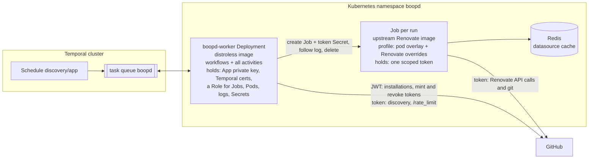
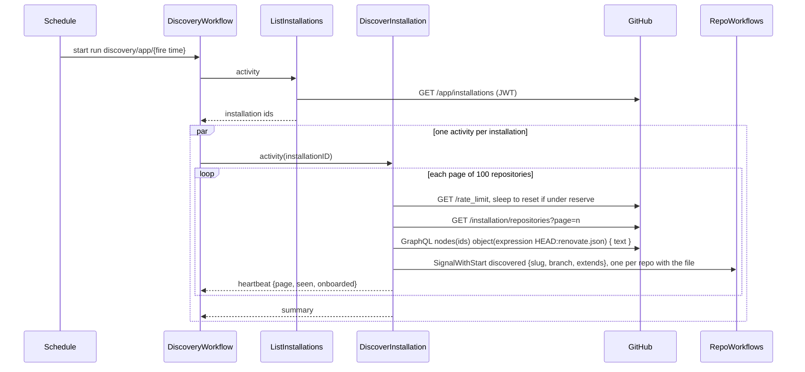
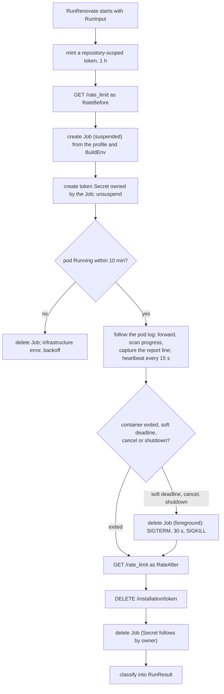

<!-- markdownlint-disable-file MD025 MD041 -->

# DESIGN-0001: boopd spike: workflows, RunRenovate activity and worker

<!--toc:start-->
- [Overview](#overview)
- [Goals and Non-Goals](#goals-and-non-goals)
  - [Goals](#goals)
  - [Non-Goals](#non-goals)
- [Background](#background)
- [Detailed Design](#detailed-design)
  - [Topology and packages](#topology-and-packages)
  - [Credentials and the Job pod](#credentials-and-the-job-pod)
  - [Ecosystem profiles](#ecosystem-profiles)
  - [Workflows](#workflows)
    - [DiscoveryWorkflow](#discoveryworkflow)
    - [RepoWorkflow](#repoworkflow)
    - [InstallationWorkflow](#installationworkflow)
  - [RunRenovate activity](#runrenovate-activity)
  - [Process builder](#process-builder)
  - [Convergence and stall](#convergence-and-stall)
  - [Job spec](#job-spec)
  - [Observability](#observability)
- [API / Interface Changes](#api--interface-changes)
- [Data Model](#data-model)
- [Testing Strategy](#testing-strategy)
- [Migration / Rollout Plan](#migration--rollout-plan)
- [Open Questions](#open-questions)
  - [OQ1: How does a repository's ecosystem set get learned?](#oq1-how-does-a-repositorys-ecosystem-set-get-learned)
  - [OQ2: What scope does the per-run token have?](#oq2-what-scope-does-the-per-run-token-have)
  - [OQ3: How does discovery probe for the config file?](#oq3-how-does-discovery-probe-for-the-config-file)
  - [OQ4: What is the cadence model and its defaults?](#oq4-what-is-the-cadence-model-and-its-defaults)
  - [OQ5: How are GitHub's secondary limits handled?](#oq5-how-are-githubs-secondary-limits-handled)
  - [OQ6: What are the default spend estimates before the EWMA has samples?](#oq6-what-are-the-default-spend-estimates-before-the-ewma-has-samples)
  - [OQ7: Redis and pod sizing?](#oq7-redis-and-pod-sizing)
  - [OQ8: How does the report leave the pod?](#oq8-how-does-the-report-leave-the-pod)
  - [OQ9: What does the Python profile enforce?](#oq9-what-does-the-python-profile-enforce)
  - [OQ10: Timeouts and limits](#oq10-timeouts-and-limits)
  - [OQ11: Where does the App private key live?](#oq11-where-does-the-app-private-key-live)
  - [OQ12: How is cluster capacity capped?](#oq12-how-is-cluster-capacity-capped)
- [References](#references)
<!--toc:end-->

## Overview

This is the build design for the `boopd` spike: the three workflows, the
`RunRenovate` activity that runs each Renovate run as a Kubernetes Job, the
process builder, the ecosystem profiles, the budget entity and the chart
changes, enough to run INV-0001's success criteria in the homelab. It applies
ADR-0001, ADR-0002, ADR-0004, ADR-0005, ADR-0008 and ADR-0009. The store and
API (ADR-0006) and the `x` extraction (ADR-0007) are out of scope. The v1
DESIGN, written after the spike, replaces this document where they differ.

Facts about Renovate, GitHub, Kubernetes and Temporal in this document were
checked against their sources on 2026-10-04 and 2026-10-07: Renovate `main`
@ `e0e072ec` (release 44.132.5), docs.github.com, kubernetes.io, the Temporal
Go SDK (v1.49.0) and docs.temporal.io. Where the body depends on a decision
that is still open it says so and points at the question in
[Open Questions](#open-questions). The body is written on the **a** option of
each question.

## Goals and Non-Goals

### Goals

- `boopd worker`, one role, which runs `RepoWorkflow`,
  `InstallationWorkflow`, `DiscoveryWorkflow` and every activity, including
  `RunRenovate`. GitHub only, App auth (RFC-0001).
- A process builder that turns platform config, a profile and one
  repository into the Renovate environment, covered by the behaviour tests
  in INV-0001 § Renovate behaviours to reproduce *before* the activity
  exists.
- A `RunRenovate` activity that creates, follows and deletes one Job per run
  (ADR-0009) and returns a structured result: outcome, Renovate's repository
  result, report tuples, problems and progress.
- Ecosystem profiles: a pod overlay and Renovate overrides per ecosystem,
  with Python on the strictest one.
- Convergence and stall handling for runs that outlive their token
  (INV-0001 Observation 10).
- A discovered, per-installation rate budget (REST and GraphQL) that caps
  concurrent runs, with no limit or plan in config (ADR-0008). Discovery
  itself stays inside that budget.
- The Job pod holds one repository-scoped token and nothing else, and the
  token is revoked when the run ends.
- Chart changes to deploy all of this next to a Temporal cluster and Redis.
- Enough instrumentation to evaluate every success criterion without reading
  raw logs.

### Non-Goals

- Postgres store, HTTP API, UI (ADR-0006).
- Webhook ingest (INV-0001 OQ8).
- Extracting shared code into `donaldgifford/x` (ADR-0007).
- Evals, security findings, automerge, and the post-run steps (Wiz,
  Dependabot alerts, ranking). The workflow is shaped so they slot in after
  `RunRenovate`; none is built in the spike.
- Any scaler. Admitted runs are Jobs (ADR-0009); the `boopd` worker runs a
  fixed, small replica count.
- OpenBao, or any external holder of the App key. The spike mounts the key
  in the worker behind a `Minter` seam (OQ11).
- A custom Renovate image. Jobs run the upstream image.
- GitHub Enterprise Server. The endpoint handling stays correct per
  renovate-operator INV-0004, but GHES is not tested.

## Background

- [INV-0001](../investigation/0001-temporal-as-the-renovate-control-plane.md)
  is the founding investigation. Observations 3, 4, 5, 10 and 11 and § Spike
  drive this design. Its OQ2 (execution model), OQ4 (entity workflow) and
  OQ8 (ingest) are settled by ADR-0009, ADR-0002 and the non-goals above, so
  they are not repeated under Open Questions.
- `internal/platform` is already copied from renovate-operator `0183661`. It
  provides `Discover`, `HasRenovateConfig`, `MintAccessToken` (which returns
  the token and its `expiresAt`) and the `ErrTransient` / `ErrPermanent` /
  `ErrUnauthorized` / `RateLimitedError` classification. Its client is built
  per installation and carries a fixed client-side limiter
  (`defaultRateLimit`, 4,500/hr) with a `WithRateLimit` option.
- renovate-operator `internal/jobspec` (`job_builder.go`, `env.go`) builds a
  Job with a PodSecurity "restricted" pod spec and the Renovate environment
  from a platform and scan spec. It is copied and adapted the same way
  `internal/platform` was: CRD types out, config types and a profile in, one
  repository per Job instead of an indexed shard.
- repo-guardian `v2` @ `278c7ec` provides the Temporal plumbing
  (`internal/temporal`) and the budget entity (`internal/workflows/installation.go`:
  `acquire` Update, `report` Signal, leases, sweep, ContinueAsNew drain), plus
  option presets (`options.go`).
- **Renovate** is at major 44 (`44.132.5`). INV-0001 recorded v43; the spike
  pins 44 by digest. The facts this design relies on (report shape, log
  lines, exit codes, signal handling, `globalOnly` options) were read from
  the v44 source and are cited under § References.
- **Temporal:** Server 1.31 or later (ADR-0001). Task priority is available
  by default; fairness keys need the `matching.enableFairness` dynamic
  config for the namespace or task queue. Go SDK 1.36 or later for
  Update-with-Start without the experimental flag and for fairness keys; the
  copied code is on 1.49.
- **What runs inside a Renovate run.** Renovate runs package managers to
  refresh lockfiles, and some of those execute code from the dependency
  graph, at the new version nobody has run yet. For the fleet's presets
  (ADR-0009 § Context): Python lockfile tools build sdists and so run
  third-party `setup.py` and build backends on every update; npm and bun
  run lockfile-only with scripts ignored; Go, Cargo, Helm and Terraform
  download and resolve; everything else edits files. A child process runs
  as the same UID as whatever started Renovate and can read any mounted
  Secret and any process environment, so the boundary is the pod, and the
  pod holds one token. The posture inside the pod differs by ecosystem
  (§ Ecosystem profiles).

## Detailed Design

### Topology and packages



One binary, `boopd`, one role in the spike, `worker`; `api` comes later
(ADR-0006). One task queue, `boopd`. Jobs are created in the worker's own
namespace.

| Package | Contents | Origin |
| ------- | -------- | ------ |
| `cmd/boopd` | flag parsing, role dispatch, signal handling | new (replaces `cmd/boop`) |
| `internal/config` | config file types incl. profiles, loading, validation | new |
| `internal/platform` | GitHub client: discovery, config probe (with file text), App-level (JWT) client for installations; `Minter` interface (scoped mint, revoke) with the in-memory key implementation | copied (renovate-operator) + additions |
| `internal/jobspec` | process builder (env, `RENOVATE_CONFIG`), Job and pod spec builder, profile overlay | copied (renovate-operator) + adapted |
| `internal/profiles` | profile resolution: ecosystems → strictest profile | new |
| `internal/kube` | client, Job lifecycle (create suspended, Secret, unsuspend, watch, delete), log follower with reconnect | new |
| `internal/renovate` | report parser, log scanner | new |
| `internal/temporal` | client config, mTLS/OIDC, dial, worker options, versioning, `EnsureSchedule` | copied (repo-guardian) |
| `internal/workflows` | `RepoWorkflow`, `InstallationWorkflow`, `DiscoveryWorkflow`, options | new + copied budget entity |
| `internal/activities` | `ListInstallations`, `DiscoverInstallation`, `CheckRepo`, `ReadRateLimit`, `AcquireBudget`, `RunRenovate` | new |
| `internal/observability` | slog setup, Prometheus metrics, health endpoints | new, follows renovate-operator's pattern |

### Credentials and the Job pod

| Holder | Credentials | Runs repository content |
| ------ | ----------- | ----------------------- |
| `boopd-worker` Deployment | App private key (behind `Minter`, OQ11), Temporal client certificate, Redis URL, a namespaced Role | never |
| Job pod | one installation token scoped to the run's repository (OQ2), the Redis URL | yes, through package managers |

**The Job pod holds one token and nothing else.** The worker mints the
token at activity start and puts it in a per-run Secret owned by the Job;
the pod reads it through a `secretKeyRef` into `RENOVATE_TOKEN`. No service
account token is mounted, no service links are injected, and the only
volumes are `emptyDir`s for the workspace and `/tmp`. When the run ends the
worker revokes the token (`DELETE /installation/token`) and deletes the Job,
which takes the Secret with it. GitHub fixes installation tokens at one
hour; revocation is the only way to end one early, so the token is live for
the run's length rather than the hour.

What remains within reach of repository code is that token and the Redis
URL, both in Renovate's environment because Renovate needs them. That is the
residual INV-0001 Observation 4 accepted, narrowed by scoping and revocation
(OQ2) and by Redis ACLs (OQ7). The posture against what the token and the
pod can be used *for* is the profile's job.

**Role for the worker** (namespaced; the chart renders it):

| Resource | Verbs | Why |
| -------- | ----- | --- |
| `batch/jobs` | create, get, list, watch, delete | the run |
| `pods` | get, list, watch | find the Job's pod, read its phase and exit code |
| `pods/log` | get | progress and the report |
| `secrets` | create, get, delete | the per-run token Secret; no `list`, so the worker cannot enumerate other Secrets |

### Ecosystem profiles

A profile is the posture a run gets: a pod overlay and a set of Renovate
global overrides. Profiles are config (ADR-0004), ordered by strictness. A
repository's run uses the strictest profile that any of its ecosystems maps
to; a repository whose ecosystems are not known yet gets `unknownProfile`.

```yaml
profiles:
  baseline:
    pod:
      labels: {boopd.dev/egress: baseline}      # selects a NetworkPolicy, if the chart renders them
      resources:
        requests: {cpu: "1", memory: 2Gi}
        limits: {cpu: "2", memory: 4Gi}
    renovate: {}                                 # global options merged into RENOVATE_CONFIG
  node:
    inherit: baseline
    renovate: {}                                 # scripts are already ignored by default
  python:
    inherit: baseline
    pod:
      runtimeClassName: gvisor                   # omit if the cluster has no sandboxing runtime
      labels: {boopd.dev/egress: python}
      resources:
        limits: {memory: 6Gi}
    renovate:
      customEnvVariables:                        # passed to child processes by Renovate
        PIP_ONLY_BINARY: ":all:"                 # pip, pip-compile, pipenv: never build an sdist
        UV_NO_BUILD: "1"                         # uv: never build an sdist
  strict:
    inherit: python                              # the posture for an ecosystem we have not classified
order: [baseline, node, python, strict]          # ascending strictness
defaultProfile: baseline
unknownProfile: strict
profileRules:                                    # every matching rule contributes; the strictest wins
  - extends: ["github>boop-bot/renovate-config:python"]
    managers: [pip_requirements, pip_setup, pipenv, poetry, pep621, pip-compile, pyenv]
    profile: python
  - extends: ["github>boop-bot/renovate-config:node"]
    managers: [npm, bun]
    profile: node
```

**What a profile can set.** On the pod: `runtimeClassName`, `resources`,
`labels` and `annotations`, `nodeSelector`, `tolerations`,
`terminationGracePeriodSeconds`, and the `emptyDir` size limits. The security
context is not configurable; every Job gets the restricted one (§ Job
spec). On Renovate: any `globalOnly` option the process builder allows
(§ Process builder), of which `customEnvVariables` is the lever that reaches
the package managers, because with `exposeAllEnv=false` Renovate passes a
child only a short fixed list of variables plus these.

**What the Python profile buys.** `PIP_ONLY_BINARY=:all:` makes pip and the
tools built on it refuse to build an sdist, so a dependency without a wheel
becomes a resolution error in the report instead of code execution.
`UV_NO_BUILD=1` does the same for uv. Poetry has no equivalent, so it still
builds sdists for metadata when the index offers none; the sandboxing
runtime class and the egress policy are what contain it, and that is the
reason the profile has both levers (OQ9). A repository that genuinely needs
an sdist build opts out by `profileRules`, knowingly.

**How ecosystems are learned** (OQ1):

- **From the config file at discovery.** The probe already asks GitHub for
  the `renovate.json` object; asking for its `text` as well costs no extra
  GraphQL points. `DiscoverInstallation` parses `extends` and sends it in
  the `discovered` signal. repo-guardian writes that file, so the preset
  list is reliable and present before the first run.
- **From the last report.** `RunResult` carries the managers Renovate found
  (the keys of the report's `packageFiles`). `RepoWorkflow` stores them in
  `RepoState.Managers`, and the next run's profile is the strictest of both
  sources. Managers can only tighten a profile, never loosen it.

### Workflows

#### DiscoveryWorkflow



- **One Temporal Schedule per configured GitHub App**, ID
  `discovery/<app name>`, created or updated at worker start from the config
  file (ADR-0004), with an interval spec from `discovery.every`. Overlap
  policy `Skip` (the SDK default). The server appends the fire time to the
  started workflow's ID, which is ADR-0002's `discovery/<platform>/<schedule
  time>`; the Schedule is a different object from that run.
- **`ListInstallations` activity:** `GET /app/installations` with the App
  JWT (`ghinstallation.NewAppsTransport`, 100 per page), filtered by the
  optional `installations` allowlist in config. New code; the copied client
  is built per installation.
- **`DiscoverInstallation` activity, one per installation**, started in
  parallel from the workflow. It does the whole pass for one installation so
  that no repository list ever travels as a workflow payload (Temporal warns
  at 512 KB per payload and rejects 2 MB):
  1. Page `GET /installation/repositories` (100 per page; `Discover`,
     renovate-operator INV-0004) and apply `skipForks` / `skipArchived`. The
     response carries each repository's numeric `id` and GraphQL `node_id`.
  2. Probe each page for the config file (below) and read its `extends`.
  3. `SignalWithStart` `repo/github/<repo id>` with signal `discovered` for
     every repository that has the file, carrying
     `{slug, defaultBranch, installationID, discoveryInterval, extends}`.
  4. Heartbeat `{page, seen, onboarded}` after each page. A retry resumes
     from the last heartbeat's page.

  `Repository` gains numeric `ID` and `NodeID` fields, additions to the
  copied package, because workflow IDs use the first and the probe the
  second (ADR-0002).
- **Config probe** (OQ3). Discovery is the one place `boopd` touches every
  repository the installation can see, so its cost is the fleet's cost:
  - Only one path is probed: `renovate.configPath` (default
    `renovate.json`), the file repo-guardian writes (ADR-0005). The copied
    `ConfigPaths` list of five becomes that single configured path, which
    cuts a non-onboarded repository from up to five REST calls to one.
  - The probe is **one GraphQL query per 100 repositories**:

    ```graphql
    query($ids: [ID!]!) {
      rateLimit { cost remaining resetAt }
      nodes(ids: $ids) {
        ... on Repository {
          id
          config: object(expression: "HEAD:renovate.json") {
            ... on Blob { byteSize text }
          }
        }
      }
    }
    ```

    Neither `nodes(ids:)` nor `object(expression:)` is a connection, so by
    GitHub's published formula the query costs the minimum, 1 point, for
    100 repositories; a 15,000-repository installation is about 150 points
    per pass against a 5,000-point hourly GraphQL budget (10,000 on
    Enterprise Cloud). How GitHub scores `nodes(ids:)` is not documented,
    so every query reads `rateLimit.cost` and the pass records it
    (`boopd_discovery_probe_cost`). 100 per query is a design choice, not a
    documented limit. `text` is parsed for `extends` only; a file above
    64 KB or that fails to parse yields an empty list, and the profile then
    comes from the report alone.
  - Fallback, behind `discovery.probe: rest`, is the REST contents call per
    repository for the one path.
  - Before each page, the activity reads `/rate_limit`; if either tracked
    resource is under the installation's reserve it sleeps until `reset`,
    heartbeating. Discovery takes no lease (it is not a run), but its spend
    shows in the next readings, so admission sees it.
- **Removal is decided by the repository, not by diffing.** Discovery keeps
  no list of previous results. A `RepoWorkflow` that discovery has not seen
  for `3 × discoveryInterval` runs `CheckRepo` (§ RepoWorkflow) and ends only
  if that confirms the repository is gone or has no config file. A discovery
  outage (rotated key, GitHub down, paused Schedule) therefore never ends
  the fleet.

#### RepoWorkflow

```mermaid
stateDiagram-v2
  [*] --> Waiting: discovered (SignalWithStart)
  Waiting --> Checking: absence timer, 3 x interval
  Checking --> Waiting: present, or CheckRepo failed
  Checking --> [*]: gone or no config (offboarded)
  Waiting --> Acquiring: NextDue timer or recheck
  Acquiring --> Sleeping: retryAt
  Sleeping --> Acquiring
  Acquiring --> Pending: lease; Job created
  Pending --> Backoff: pod not running in 10 min (release lease)
  Pending --> Running: pod running
  Running --> Backoff: infrastructure error (release lease)
  Backoff --> Acquiring
  Running --> Deciding: RunResult, or timeout with last heartbeat
  Deciding --> Acquiring: rerun (TimedOut)
  Deciding --> Waiting: cadence
  Deciding --> [*]: Skipped, offboarding reason
```



Input and ContinueAsNew state:

```go
type RepoState struct {
    Platform          string // "github"
    RepoID            int64
    Slug              string        // refreshed by every "discovered" signal
    DefaultBranch     string
    InstallationID    int64
    DiscoveryInterval time.Duration // from the "discovered" signal
    Extends           []string      // from the "discovered" signal
    Managers          []string      // from the last report; only ever grows
    Profile           string        // resolved before each run
    LastSeen          time.Time     // last "discovered"
    LastRun           *RunSummary
    NextDue           time.Time
    StallCount        int
    ConsecutiveReruns int
    Iterations        int
}
```

Loop:

1. **Wait.** Wait on a selector over:
   - a timer to `NextDue`;
   - a `recheck` signal, which runs now at `PriorityHigh`;
   - a `discovered` signal, which updates the slug, `Extends` and
     `LastSeen` and keeps waiting;
   - a timer to `LastSeen + 3 × DiscoveryInterval`, which runs the
     `CheckRepo` activity (repository visible to the installation, not
     archived, config file present on the default branch). Gone or no
     config: record `offboarded` and end the workflow. Still there: set
     `LastSeen = now`, increment `boopd_discovery_missed` and keep waiting.
     If `CheckRepo` itself fails (GitHub unreachable, bad credentials),
     keep waiting and try again after another `DiscoveryInterval`; an
     outage must never look like an offboarding.
2. **Acquire budget.** `AcquireBudget` activity, which does Update-with-Start
   on `installation/github/<id>` (repo-guardian pattern). The result is a
   lease, or a `retryAt` to sleep until before re-acquiring. A Job is
   created only after a lease is granted, so the Jobs in the namespace are
   admitted work only (ADR-0008).
3. **Run.** Resolve the profile from `Extends` and `Managers`, then schedule
   `RunRenovate` (options under § RunRenovate activity). Four things can
   come back:
   - a `RunResult`;
   - an infrastructure error marked `pending`: the pod did not reach
     `Running` within 10 minutes (no capacity, image pull, quota). The
     activity has deleted the Job. Release the lease (a `report` with no
     readings), sleep `min(5 min × 2^n, 30 min)` and go back to step 2;
   - a `StartToClose` or heartbeat timeout: the worker died or overran.
     The `TimeoutError` carries the last heartbeat details; read the
     progress from it and treat the attempt as `TimedOut` with that
     progress. The Job's `activeDeadlineSeconds` and `ttlSecondsAfterFinished`
     clean up what the dead worker left;
   - any other activity error (token mint, API server, Redis unreachable, a
     platform or temporary repository result): release the lease and take
     the infrastructure row in § Convergence and stall.
4. **Report.** Signal `report{leaseID, before, after}` with the per-resource
   readings from the result to the installation. The report *is* the
   installation's rate reading; it triggers no extra `/rate_limit` call.
   When there is no result, the `report` carries no readings and only
   closes the lease.
5. **Record.** Merge the result's managers into `Managers`. This is where
   the post-run steps (Wiz, Dependabot alerts, ranking) will go after the
   spike; the `RunResult` is in hand and the workflow continues.
6. **Decide the next due time** from the outcome (§ Convergence and stall).
   A rerun goes back to step 2 for a new lease.
7. **ContinueAsNew** when `Iterations` reaches 100 or the SDK suggests it
   (the server suggests at 4 MiB or 4,096 history events).

**First due time.** `NextDue` for a new repository is `now + jitter`. Jitter
is derived deterministically from a hash of the repo ID modulo the cadence, so
the fleet spreads across the window and restarts do not cluster.
After a run, `NextDue = LastRun.Start + cadence` (OQ4).

**Priority.** Every activity and the budget `acquire` carry
`TaskPriority(p, installationID)` (copied from repo-guardian): the fairness
key is the installation, and `p` is `PriorityHigh` for a `recheck` and
`PriorityNormal` for a scheduled run.

A query handler `state` returns `RepoState` for debugging in the Temporal UI.

#### InstallationWorkflow

Copied from repo-guardian, then changed so the budget is discovered and has
more than one resource (ADR-0008).

**Discovery.**

- The `ReadRateLimit` activity calls `GET /rate_limit` with an installation
  token. That endpoint does not count against the limit. It reads the
  `resources.core` and `resources.graphql` objects (the top-level `rate`
  object is deprecated).
- It runs when the workflow starts and at least hourly after that. Between
  those, every `report` with readings refreshes the same fields, because
  `RunRenovate` reads the endpoint before and after each run.
- The limits arrive the same way for every plan, so config states neither
  the limit nor the plan. For reference, per GitHub's docs: REST for an
  installation starts at 5,000 per hour, grows by 50 per repository and 50
  per user beyond 20 of each, and caps at 12,500; Enterprise Cloud
  installations get 15,000; GHES limits are set by the site administrator
  and are off by default. GraphQL is 5,000 points per hour per installation,
  10,000 on Enterprise Cloud.

State per resource:

```go
type ResourceBudget struct {
    Limit     int       // discovered; changes as the installation grows
    Remaining int
    Reset     time.Time
    Estimate  float64   // EWMA spend per run for this resource
}

type BudgetState struct {
    Resources         map[string]*ResourceBudget // "core", "graphql"
    Leases            map[string]Lease           // holder = RepoWorkflow ID
    MaxConcurrentRuns int                        // optional cap from config; 0 = budget only
    RetryAt           time.Time                  // installation-wide pause from a secondary limit
    // ... repo-guardian's handled count, suspend state
}
```

**Admission.** `acquire` grants a lease only if all of these hold:

- every resource has `Remaining − (open leases × Estimate) − Estimate ≥ reserve`,
  where reserve is `reserveFraction × Limit` (default 10%);
- open leases are fewer than `MaxConcurrentRuns`, when that cap is set;
- `RetryAt` is in the past.

Otherwise it returns `retryAt`: the latest `Reset` among the exhausted
resources, `RetryAt` itself, or the next lease expiry if only the cap was
hit.

**Secondary limits** (OQ5). `/rate_limit` shows none of these, and all are
per installation: at most 100 concurrent requests, 900 REST points and 2,000
GraphQL points per minute, and **80 content-creating requests per minute and
500 per hour**. The hourly content cap is the one that binds a fleet: every
PR and API-side branch Renovate creates counts. `MaxConcurrentRuns` is the
guard, and a run that ends with Renovate's `rate-limit-exceeded` result, or
whose log shows a secondary-limit `403`/`429`, reports a `retryAt` of
`retry-after` seconds (or one minute when absent) that the budget applies to
the whole installation.

**Spend.**

- Spend for each resource is `before.Remaining − after.Remaining` when
  `Reset` did not change in between, and unknown otherwise.
- The EWMA ignores unknown samples. Until it has samples, the estimate is
  `budget.defaultEstimate` from config (OQ6).
- Overlapping runs make the number noisy (INV-0001 Observation 5).

**Leases.** A `report` with readings closes the lease and adds a sample; a
`report` without readings closes it and adds nothing. Lease TTL is
`ScheduleToStart + StartToClose + 5 min` = 70 minutes (OQ10), which covers
the longest an activity can wait and then run; the sweep reclaims anything
older. The ContinueAsNew drain behaves as in repo-guardian.

**Client-side limiter.** When an activity builds the per-installation GitHub
client, it passes `WithRateLimit` derived from the installation's discovered
`core` limit (`limit / 3600` per second, burst 10) instead of the copied
4,500/hr default, which is wrong for Enterprise Cloud. Until the first
reading exists, the default stands.

### RunRenovate activity



Input:

```go
type RunInput struct {
    RepoID         int64
    Slug           string
    DefaultBranch  string
    InstallationID int64
    Endpoint       string // unset for api.github.com
    Profile        string // resolved by the workflow
    LeaseID        string
    Attempt        int    // part of the Job name
    DryRun         string // "" or "full"
}
```

Output:

```go
type Outcome string // Succeeded, Skipped, Failed, TimedOut

type RunResult struct {
    Outcome          Outcome
    RepositoryResult string        // Renovate's result, e.g. "done", "disabled-no-config", "archived"
    ExitCode         int           // from the container's terminated state
    Duration         time.Duration // pod Running to container exit
    PodStart         time.Duration // Job creation to pod Running
    RenovateVersion  string
    Managers         []string      // keys of the report's packageFiles
    Tuples           []UpdateTuple // from the report
    Problems         []Problem     // repository-level problems from the report
    Progress         Progress      // this attempt only
    RateBefore       RateReadings
    RateAfter        RateReadings
}

// One row per upgrade in the report's branches[].upgrades[]. Renovate's
// report drops `manager`; it is recovered by matching PackageFile against
// the report's packageFiles map, which is keyed by manager.
type UpdateTuple struct {
    BranchName     string
    BranchResult   string // e.g. "pr-created", "pending", "pr-limit-reached"
    PRNumber       int    // 0 when none
    Manager        string
    Datasource     string
    DepName        string
    PackageName    string
    PackageFile    string
    UpdateType     string
    CurrentVersion string // falls back to currentValue
    NewVersion     string // falls back to newValue
}

type Problem struct {
    Level   int    // bunyan level: 40 warn, 50 error
    Message string
}

type Progress struct {
    BranchesChanged int // "Branch created" + "Branch updated" (or the DRY-RUN "Would commit" line)
    PRsChanged      int // "PR created" + "PR updated" (or the DRY-RUN "Would create/update PR" lines)
}

type RateReading struct {
    Limit, Remaining int
    Reset            time.Time
}

type RateReadings map[string]RateReading // "core", "graphql"
```

Steps:

1. **Mint the token** through the `Minter` (OQ11; in the spike, the App key
   read into the worker's memory at start), scoped with `repository_ids` to
   the run's repository and the shared-preset repository (OQ2). The mint
   returns `expiresAt`, one hour out. An auth failure here is an
   infrastructure error. Do not assume a token length: GitHub is rolling out
   a longer stateless format.
2. **Rate reading.** `GET /rate_limit` with the token (`RateBefore`).
3. **Build the Job** (§ Job spec) from the profile's overlay and the process
   builder's environment, with `spec.suspend: true`. Create it. The name is
   `run-<repo id>-<attempt>`, a DNS label.
4. **Create the token Secret** with an `ownerReference` to the Job, then
   patch `spec.suspend: false`. The order means the pod can never start
   without its Secret, and the Secret can never outlive the Job.
5. **Wait for `Running`.** Watch the Job's pod. If no pod is `Running`
   within 10 minutes, delete the Job and return an infrastructure error
   marked `pending`; the workflow releases the lease and backs off
   (§ RepoWorkflow step 3). Pending time, unlike queue time under a pool,
   spends the token's hour, which is why it is bounded tightly. Record
   `PodStart`.
6. **Follow the log.** `GET pods/{name}/log?follow=true&timestamps=true`.
   Every line is forwarded to the worker's stdout with the correlation
   fields (§ Observability), run through the scanner for progress, and
   checked for the report line (§ Process builder). On a broken stream,
   reconnect with `sinceTime` from the last line seen and drop duplicates
   by timestamp. Heartbeat every 15 s with `Progress` so far. The kubelet
   reassembles the runtime's 16 KB partial-line splits when serving
   `pods/log`, so a large report line arrives whole.
7. **Stop** at the soft deadline, `min(start + 50 min, expiresAt − 3 min)`,
   on context cancellation or on worker shutdown, by deleting the Job with
   foreground propagation. Renovate installs no signal handler, so `SIGTERM`
   ends it at once; no report is written and no `Repository finished` line
   appears; the scanner's counts are the only record of what it did. That
   leaves time before `StartToClose` for the steps below. If `StartToClose`
   fires anyway, the workflow treats it as `TimedOut` with the last
   heartbeat's progress, so an overrun costs nothing but the lease.
8. **Read the exit** from the pod's container status
   (`state.terminated.exitCode`) once the log stream ends.
9. **Rate reading** again (`RateAfter`).
10. **Revoke the token** with `DELETE /installation/token`. A failure here
    is logged and counted, not an error; the token then expires on its own.
11. **Delete the Job** with foreground propagation. The Secret goes with it.
    Nothing is lost by deleting a failed Job: its log already went to the
    worker's stdout, and `RunResult` carries the rest.
    `ttlSecondsAfterFinished` is the safety net for a worker that died
    between steps.
12. **Classify** (table below). Each result is also logged as one
    structured `run_complete` line.

**Classification**, first matching row from the top. The repository result
is the `result` field of Renovate's `Repository finished` log line; with
`exitCodeForErrors` on, the exit code classes (3 system, 4 platform, 5
config, 6 temporary, 7 external host / lockfile / credentials, 8 unknown) are
a cross-check:

| Signal | `Outcome` | Workflow handling |
| ------ | --------- | ----------------- |
| result `disabled-no-config`, `archived`, `not-found`, `renamed`, `pending-deletion`, `mirror` | `Skipped` | end the workflow (`offboarded`) |
| other repository results: `fork`, `fork-missing`, `fork-mode-forked`, `cannot-fork`, `forbidden`, `blocked`, `disabled`, `disabled-by-config`, `disabled-closed-onboarding`, `empty`, `no-package-files`, `uninitiated` | `Skipped` | cadence; recorded |
| result `done` or `automerged` | `Succeeded` | cadence |
| result `rate-limit-exceeded` | activity error with `retryAt` | release lease; installation `retryAt` (§ Secondary limits) |
| result `config-*` or `lockfile-error` (incl. a refused sdist build under the Python profile) | `Failed` | cadence; problems recorded |
| result `onboarding` | `Failed` | cadence; should not occur with onboarding off, so alert |
| stopped at the soft deadline, no `Repository finished` line | `TimedOut` with `Progress` | § Convergence and stall |
| pod not `Running` in 10 min | activity error (`pending`) | release lease; back off; re-acquire |
| result `temporary-error`, `repository-changed`, `external-host-error`, `missing-api-credentials`, `authentication-error`, `bad-credentials`, `integration-unauthorized`, `platform-not-found`, `platform-unknown-error`, `gpg-failed`, `disk-space`, `out-of-memory`, `unknown-error`; or the container exited with no `Repository finished` line and no soft deadline (incl. `OOMKilled`, `DeadlineExceeded`); or the API server, Redis or GitHub unreachable before the pod started | activity error (infrastructure) | infrastructure row in § Convergence and stall; `disk-space`, `out-of-memory` and `OOMKilled` also alert, since they mean the profile is undersized (OQ7) |

Activity options:

| Option | Value |
| ------ | ----- |
| `ScheduleToStartTimeout` | 5 min (the activity runs in the worker itself; this only catches a worker outage) |
| `StartToCloseTimeout` | 58 min (the token is minted at activity start and lasts one hour) |
| Soft deadline | `min(start + 50 min, expiresAt − 3 min)`; the Job's `activeDeadlineSeconds` is 55 min as a safety net |
| Pending timeout | 10 min |
| `HeartbeatTimeout` | 1 min |
| `MaximumAttempts` | 1; the workflow decides every retry (§ Convergence and stall) |
| Task queue | `boopd` |
| Priority / fairness key | `TaskPriority(p, installationID)` |

The worker sets `WorkerStopTimeout` to the `StartToClose` value and the pod's
`terminationGracePeriodSeconds` a little above it. The SDK's default stop
timeout is zero, which would cancel every run in flight the moment the worker
pod gets `SIGTERM`; with the timeout set, the worker stops polling and lets
its runs reach their soft deadlines. The worker's activity slot count
(`MaxConcurrentActivityExecutionSize`) is sized to the expected concurrent
runs (OQ12).

### Process builder

`jobspec.BuildEnv(app, repo, profile, token, globalConfig) ([]corev1.EnvVar, error)`
is a pure function, adapted from renovate-operator's `env.go`. These rows are
the behaviour tests, written first:

| Variable | Value | Rule / source |
| -------- | ----- | ------------- |
| `RENOVATE_PLATFORM` | `github` | RFC-0001 |
| `RENOVATE_ENDPOINT` | unset for `https://api.github.com`; set only for GHES | renovate-operator INV-0004 Obs. 5 |
| `RENOVATE_TOKEN` | `secretKeyRef` to the per-run Secret, key `token` | renovate-operator INV-0003 |
| `RENOVATE_AUTODISCOVER` | `false` | renovate-operator INV-0003 |
| `RENOVATE_REPOSITORIES` | the single slug (Renovate coerces a plain string into a one-element list) | renovate-operator INV-0003 |
| `RENOVATE_REQUIRE_CONFIG` | `required` | ADR-0005 |
| `RENOVATE_ONBOARDING` | `false` | ADR-0005 |
| `RENOVATE_BASE_DIR` / `RENOVATE_CACHE_DIR` | `/work/base`, `/work/cache` on the `emptyDir` | ADR-0009 |
| `RENOVATE_BINARY_SOURCE` | `global` | ADR-0003 rule, carried over |
| `RENOVATE_REDIS_URL` | from the config's Secret ref, as a plain value | ADR-0003 rule, carried over |
| `RENOVATE_REPORT_TYPE` | `logging` | ADR-0009; the report is the `Printing report` log line |
| `RENOVATE_EXIT_CODE_FOR_ERRORS` | `true` | class-specific exit codes for the classification cross-check |
| `RENOVATE_GIT_AUTHOR` | `boop-bot <…>` | naming |
| `RENOVATE_CONFIG` | JSON: shared preset prepended to `extends`, global config from the file, then the profile's `renovate` overrides; never `logLevel` | v0.1.x bug list, docs/usage gotchas |
| `LOG_LEVEL` / `LOG_FORMAT` | from config / `json` | v0.1.x bug list |
| `HOME`, `TMPDIR` | `/work/home`, `/tmp` | ADR-0009 |

Rules the tests also cover:

- **Validate the preset.** A GitHub-hosted shared preset must end in `.json`.
  Reject `.json5`.
- **Keep explicit `false`.** Global config is a `map[string]any`, or a struct
  of pointer fields with no `omitempty`. An explicit `false` must survive the
  round trip (renovate-operator INV-0005).
- **Never pass `exposeAllEnv`, `allowScripts` or `allowedCommands`.** The
  builder rejects them in global config and in profiles. Renovate marks all
  three `globalOnly`, as it does `binarySource`, `redisUrl`, `baseDir`,
  `cacheDir`, `reportType`, `requireConfig`, `onboarding` and
  `customEnvVariables`, so repository config cannot change them. Whether
  `exposeAllEnv=false` keeps the token and Redis URL out of child processes
  is what the spike's environment-isolation criterion verifies.
- **Profile overrides are `globalOnly` options only**, merged last, so a
  profile can tighten but repository config cannot loosen.
- **Nothing from the worker's environment leaks.** The pod's environment is
  exactly this list; the worker's own environment is never consulted.

Because `cacheDir` is on a fresh `emptyDir` for every run, Renovate's
on-disk package cache and its repository cache (off by default anyway) are
always cold; only the lookup cache in Redis is warm. The overhead criterion
measures the cost of that.

**Log scanner.** Every Renovate log line carries `repository`, and lines
emitted while a branch is processed carry `branch`. The scanner matches
`msg` exactly:

| Event | Live run | `dryRun: full` |
| ----- | -------- | -------------- |
| branch | `Branch created`, `Branch updated` (field `commitSha`) | `DRY-RUN: Would commit files to branch <name>` |
| PR | `PR created`, `PR updated` (fields `pr`, `prTitle`) | `DRY-RUN: Would create PR: <title>`, `DRY-RUN: Would update PR #<n>` |
| end | `Repository finished` (fields `result`, `status`, `exitCode`, `durationMs`, `cloned`) | same |
| report | `Printing report` (field `report`: `{problems, repositories: {"<slug>": {problems, branches, packageFiles}}}`) | same |

The strings are pinned by a fixture from a real Renovate 44 run; a mismatch
fails the parser's test, not the run. When the report line is missing or
fails to parse, `Tuples` are reconstructed from the branch and PR events,
`Managers` stays empty, and the result is flagged `reportMissing` (OQ8).

### Convergence and stall

`RepoWorkflow` decides every retry; Temporal retries nothing (`MaximumAttempts`
1):

| Outcome | Next step | `StallCount` | `ConsecutiveReruns` |
| ------- | --------- | ------------ | ------------------- |
| `Succeeded` | `NextDue = start + cadence` | 0 | 0 |
| `TimedOut`, `Progress > 0`, `ConsecutiveReruns < 5` | rerun at once (new lease, new token, new Job) | unchanged | +1 |
| `TimedOut`, `Progress > 0`, `ConsecutiveReruns == 5` | record `incomplete`, `NextDue = start + cadence` | unchanged | 0 |
| `TimedOut`, `Progress == 0`, `StallCount < 3` | rerun at once | +1 | +1 |
| `TimedOut`, `Progress == 0`, `StallCount == 3` | record `stalled`, emit metric, `NextDue = start + cadence` | stays 3: one attempt per cadence until a run succeeds | 0 |
| `Skipped` (offboarding reason) | end the workflow | — | — |
| `Skipped` (other) or `Failed` | `NextDue = start + cadence`; recorded | unchanged | 0 |
| infrastructure error (incl. `pending`) | release lease; back off `min(5 min × 2^n, cadence)`; re-acquire | unchanged | unchanged |
| infrastructure error with `retryAt` | release lease; sleep to `retryAt`; re-acquire | unchanged | unchanged |

`StallCount` resets only on `Succeeded`. A stalled repository gets one
attempt per cadence, with no reruns, until one succeeds. The constants are
OQ10.

**How progress is measured differs from INV-0001.** INV-0001 Observation 10
measures progress from Renovate's report. That report does not exist for a
stopped run (§ RunRenovate step 7), so the activity counts the branch and PR
events in the pod log as it runs and carries the counts in heartbeat details,
which the workflow still receives when the worker dies. The report is the
source of truth for completed runs and for the comparison (Observation 11).

### Job spec

Adapted from renovate-operator's `BuildWorkerJob`: one pod, one repository,
no indexed completion, no shard ConfigMap. What a profile may change is
marked.

```yaml
apiVersion: batch/v1
kind: Job
metadata:
  name: run-<repo id>-<attempt>
  labels:
    app.kubernetes.io/name: boopd
    app.kubernetes.io/component: renovate-run
    app.kubernetes.io/managed-by: boopd
    boopd.dev/repo-id: "<repo id>"
    boopd.dev/installation-id: "<installation id>"
    boopd.dev/profile: python
    boopd.dev/egress: python              # profile label; a NetworkPolicy selects it
  annotations:
    boopd.dev/workflow-id: repo/github/<repo id>
    boopd.dev/run-id: <temporal run id>
spec:
  suspend: true                           # until the token Secret exists
  backoffLimit: 0
  activeDeadlineSeconds: 3300             # safety net; the activity stops the run earlier
  ttlSecondsAfterFinished: 3600           # safety net; the activity deletes the Job
  template:
    metadata:
      labels: {…same labels…}
    spec:
      restartPolicy: Never
      automountServiceAccountToken: false
      enableServiceLinks: false
      terminationGracePeriodSeconds: 30   # profile
      runtimeClassName: gvisor            # profile, optional
      nodeSelector: {}                    # profile, optional
      tolerations: []                     # profile, optional
      securityContext:
        runAsNonRoot: true
        runAsUser: 12021                  # the Renovate image's ubuntu user
        seccompProfile: {type: RuntimeDefault}
      containers:
        - name: renovate
          image: ghcr.io/renovatebot/renovate:44-full@sha256:<digest>
          env: […BuildEnv…]
          securityContext:
            allowPrivilegeEscalation: false
            readOnlyRootFilesystem: true
            capabilities: {drop: [ALL]}
          resources: {…profile…}
          volumeMounts:
            - {name: work, mountPath: /work}
            - {name: tmp, mountPath: /tmp}
      volumes:
        - {name: work, emptyDir: {sizeLimit: 10Gi}}   # profile
        - {name: tmp, emptyDir: {}}
```

The per-run Secret:

```yaml
apiVersion: v1
kind: Secret
metadata:
  name: run-<repo id>-<attempt>
  labels: {…same labels…}
  ownerReferences:
    - {apiVersion: batch/v1, kind: Job, name: run-<repo id>-<attempt>, uid: <job uid>, blockOwnerDeletion: true}
type: Opaque
stringData:
  token: <installation token>
```

The namespace carries the PodSecurity `restricted` labels, so a profile
that tried to loosen the security context would be rejected by admission,
not just by `boopd`'s validation. NetworkPolicies, when the chart renders
them, select on `boopd.dev/egress`: the baseline allows GitHub, the
registries the fleet uses and Redis; the Python policy allows PyPI, GitHub
and Redis.

The Renovate version is pinned by digest in config (Renovate keeps the
digest current in this repository) and recorded in
`RunResult.RenovateVersion`, so comparisons with renovate-operator use the
same version.

### Observability

- **Logs.** `boopd` logs JSON through slog. The log follower writes each
  Renovate line to the worker's stdout with `repo`, `workflow_id`, `run_id`,
  `attempt`, `job` and `profile` added. Loki labels come from those fields
  (criterion "Log correlation"). The Job pod's own log is the same stream;
  it is deleted with the Job.
- **Metrics** (Prometheus on `METRICS_ADDR`):
  - `boopd_runs_total{outcome,result,profile}`;
  - `boopd_runs_active{profile}`;
  - `boopd_run_duration_seconds{profile}`;
  - `boopd_run_pod_start_seconds` (Job creation to pod `Running`);
  - `boopd_run_overhead_seconds` (pod `Running` to first repository log
    line);
  - `boopd_run_pending_timeouts_total`;
  - `boopd_repos_stalled`, `boopd_repos_incomplete`;
  - `boopd_discovery_missed` (absence timer fired but `CheckRepo` found the
    repository);
  - `boopd_discovery_probe_cost{installation,resource}` (spend of one pass,
    from `rateLimit.cost`);
  - `boopd_budget_limit{installation,resource}` and
    `boopd_budget_remaining{installation,resource}` (discovered);
  - `boopd_rate_spend_per_run{installation,resource}` (the EWMA input);
  - `boopd_budget_admitted_runs{installation}` (open leases);
  - `boopd_token_mints_total{outcome}` and
    `boopd_token_revocations_total{outcome}`;
  - `boopd_kube_requests_total{verb,resource,code}`.
- **Runs in flight.** `RepoWorkflow` upserts search attributes
  (`InstallationID`, `Profile`, `Phase`, `LastOutcome`, `NextDue`) so the
  Temporal UI and CLI can list and filter running and due repositories
  without a `boopd` API; `kubectl get jobs -l app.kubernetes.io/name=boopd`
  shows the same runs from the cluster side. The v1 API reads these and the
  store (ADR-0006).
- **Health.** `/healthz` and `/readyz` on `LISTEN_ADDR`. Ready means
  connected to Temporal, the worker started, and the API server answered a
  `SelfSubjectAccessReview` for `create jobs` in the namespace.

## API / Interface Changes

The command is `boopd worker --config /etc/boopd/config.yaml`. The Temporal
connection comes from env, as in repo-guardian (`TEMPORAL_ADDRESS`,
`TEMPORAL_NAMESPACE=boopd`, TLS/OIDC variables); the Kubernetes connection is
in-cluster. The chart contract in CLAUDE.md (`LISTEN_ADDR`, `METRICS_ADDR`,
`LOG_LEVEL`, `POD_NAME`) still holds.

Config file (ADR-0004), rendered from chart values:

```yaml
renovate:
  image: ghcr.io/renovatebot/renovate:44-full@sha256:…   # Renovate keeps this current
  configPath: renovate.json  # the one path discovery probes; what repo-guardian writes
  sharedPreset: github>boop-bot/renovate-config:default.json
  global:                    # merged into RENOVATE_CONFIG; explicit false preserved
    dryRun: full             # spike comparison runs
  logLevel: info
  redisSecretRef: {name: boopd-redis, key: url}
runs:
  namespace: boopd           # where Jobs are created; the worker's own namespace
  pendingTimeout: 10m
  maxConcurrent: 20          # cluster-capacity cap, all installations (OQ12)
profiles: {…}                # § Ecosystem profiles
order: [baseline, node, python, strict]
defaultProfile: baseline
unknownProfile: strict
profileRules: […]
apps:
  - name: boop-bot
    endpoint: https://api.github.com
    appID: 123456
    privateKeySecretRef: {name: boop-bot-app, key: private-key.pem}
    installations: []        # optional allowlist; empty = every installation
    discovery:
      every: 6h              # Schedule interval; also the RepoWorkflow absence base
      probe: graphql         # or "rest"
      skipForks: true
      skipArchived: true
    cadence: 24h
    budget:                  # limits are discovered, never configured
      reserveFraction: 0.10
      maxConcurrentRuns: 10  # safety cap per installation for secondary limits; 0 = budget only
      defaultEstimate: {core: 300, graphql: 150}   # until the EWMA has samples
```

Chart changes for the spike:

- one Deployment, `boopd-worker`, two replicas, `terminationGracePeriodSeconds`
  above `StartToClose`;
- a ServiceAccount, Role and RoleBinding for the worker (§ Credentials and
  the Job pod);
- a ConfigMap for the config file, mounted read-only;
- Secrets: App private key, Redis URL and Temporal client certificates,
  mounted in the worker only;
- the PodSecurity `restricted` labels on the namespace;
- optional NetworkPolicies per `boopd.dev/egress` value, and an optional
  `RuntimeClass` name for the Python profile;
- the Temporal connection values from repo-guardian's chart;
- Redis as a chart dependency or an external reference (OQ7).

The Renovate Jobs themselves are not chart objects; `boopd` creates them at
run time with the labels above, so `kubectl get jobs -l app.kubernetes.io/name=boopd`
lists the runs in flight.

## Data Model

There is no persistent store in the spike. All state is in Temporal:

- **`RepoState`**: `RepoWorkflow` input and ContinueAsNew carry, including
  `Extends`, `Managers` and the resolved `Profile`.
- **`BudgetState`**: `InstallationWorkflow`.
- **`RunResult`**: activity result. It is also logged as one structured
  `run_complete` line, which is how spike results are collected.

`UpdateTuple` already has the per-dependency fields the v1 store needs
(ADR-0006). Its shape should be kept stable.

## Testing Strategy

| Layer | What | How |
| ----- | ---- | --- |
| Process builder | every row of the env table and the rules below it; profile overrides merged last; rejected options | table tests, adapted from renovate-operator's, written before the activity |
| Job spec | restricted security context, no SA token, no service links, suspend, owner-referenced Secret, profile overlay applied field by field, name length | golden Job objects |
| Profiles | rules from `extends` and from managers; strictest wins; unknown → `unknownProfile`; managers only tighten | table tests |
| Report parser / log scanner | real Renovate 44 log fixtures incl. the `Printing report` line: tuples with manager recovered from `packageFiles`, managers list, problems, progress events live and dry-run, `Repository finished` fields; missing or truncated report | golden files |
| Job lifecycle | create-suspended → Secret → unsuspend; pending timeout; log follow with reconnect and dedupe; exit code read; foreground delete; `OOMKilled` and `DeadlineExceeded` classification | `client-go` fake clientset, plus `envtest` for the watch and log paths |
| Platform additions | `Repository.ID`/`NodeID`, `ListInstallations`, GraphQL probe batching with `text`, its REST fallback, `extends` parsing, scoped minting and revocation behind `Minter`, limiter from the discovered limit | `httptest` servers, as in the copied tests |
| Workflows | due-time, recheck, absence → `CheckRepo` → end or continue, the full convergence table, `pending` release and re-acquire, heartbeat-timeout progress, managers merge, ContinueAsNew carry; budget admission against the tightest resource, `retryAt`, limit changes between readings, lease close with and without readings | Temporal `testsuite` with mocked activities |
| Determinism | workflow code changes | replay tests against recorded histories in CI |
| Chart | the Role's verbs exactly; no `list` on secrets; PodSecurity labels; NetworkPolicy selectors | helm-unittest |
| Platform (copied) | already covered | copied tests |
| Spike | INV-0001 success criteria plus the four below | homelab, results recorded in a new investigation |

Spike criteria added by this design:

- **Credential isolation.** The isolation fixture's environment dump,
  filesystem scan and `/proc` walk from inside a Renovate child find the
  scoped token and the Redis URL and nothing else: no App key, no Temporal
  certificate, no service account token.
- **Profile enforcement.** A scratch Python repository with an sdist-only
  dependency ends `Failed` with a lockfile error under the Python profile,
  and a marker its `setup.py` would write is absent.
- **Discovery cost.** `boopd_discovery_probe_cost` for a full pass stays
  under 5% of the installation's hourly `graphql` limit.
- **Scoped token.** A run whose token is scoped to its repository and the
  preset repository completes with the shared preset applied (OQ2), and a
  request with that token after `RunResult` is returned gets `401`.

Fixtures for the isolation criteria:

- a scratch repository whose package-manager step writes marker files into
  `cacheDir`, `baseDir` and `/tmp`, dumps its environment, walks `/proc` and
  the filesystem for key material, and forks a background process;
- a second repository run next, which looks for those markers (it should
  find none, since it is a new pod).

## Migration / Rollout Plan

1. Process builder: copy renovate-operator `internal/jobspec`, adapt, and
   write the behaviour tests (INV-0001 step 4).
2. Copy `internal/temporal` and the budget entity; write `internal/kube`
   and the profile resolver (step 5).
3. Workflows and activities, with unit and workflow tests (step 6).
4. Chart: Role, profiles, PodSecurity labels, optional NetworkPolicies;
   homelab deploy alongside Temporal (repo-guardian `contrib/temporal/`
   values, namespace `boopd`, fairness enabled) and Redis (step 7). No
   custom image.
5. Run the comparison with renovate-operator v0.1.x, both sides in
   `dryRun: full`, then the live criteria against scratch repositories,
   including the Python fixture (step 8).
6. Record results in INV-0002, then write the v1 DESIGN.

The baseline is renovate-operator v0.1.x as it runs in the homelab today,
unchanged. Both sides now run Renovate as a Job; what differs is the control
plane, one repository per Job instead of a shard, and the profile. The
comparison is on Renovate's report output (INV-0001 Observation 11).
renovate-operator keeps running throughout, and `boopd` stays in `dryRun`
until the comparison passes.

## Open Questions

Each question lists **a**, my recommendation, then alternatives, and records
the decision under its heading. Every question is decided, and the body of
this document is written on the decided option.

### OQ1: How does a repository's ecosystem set get learned?

**Decision (2026-10-10): a.**

The profile must be chosen before the Job exists, so the first run cannot
rely on anything Renovate reports.

- **a (recommended): `extends` from the config file at discovery, tightened
  by the managers in the last report.** The probe fetches the file's text
  in the same GraphQL query at no extra cost; repo-guardian writes that
  file, so the preset list is reliable and present before the first run.
  Managers from the report can only make the profile stricter.
- **b: managers from the last report only, `unknownProfile` for the first
  run.** No parsing of repository files. Every new repository's first run
  is on the strictest profile, which is slower and may refuse builds a
  Go-only repository would never attempt.
- **c: GitHub's `languages` API per repository.** One REST call per
  repository per pass, against the budget, and languages are not managers
  (a Go repository with a `pyproject.toml` for tooling is Python too).
- **d: repo-guardian writes a topic or label** (`boopd-profile:python`).
  Explicit and cheap to read, but puts a second thing for repo-guardian to
  keep in sync with the file it already writes.
- **other:**

### OQ2: What scope does the per-run token have?

**Decision (2026-10-10): a.**

GitHub lets the mint call restrict a token with `repository_ids` (up to 500)
and `permissions`. Lifetime is fixed at one hour; the worker revokes the
token when the run ends whichever option is chosen.

- **a (recommended): scope to the run's repository plus the shared-preset
  repository.** A leaked token reaches one repository and a presets repo.
  The preset repository ID is resolved once at worker start. The spike
  verifies that preset fetching works with the scoped token.
- **b: scope to the run's repository only, with the preset in a public
  repository.** Smaller scope; depends on scoped tokens being able to read
  public repositories, which is unverified.
- **c: unscoped installation token.** What renovate-operator does today.
  Simplest; a leak reaches every repository the installation can see.
- **other:**

### OQ3: How does discovery probe for the config file?

**Decision (2026-10-10): a.**

Discovery is the one place `boopd` touches every repository the installation
can see, so this is the fleet's dominant cost.

- **a (recommended): one GraphQL query per 100 repositories**, probing the
  single configured path and fetching its text, reading `rateLimit.cost` on
  every query, with the REST contents call as a config-switched fallback.
  By GitHub's formula the query costs 1 point, so a 15,000-repository
  installation is ~150 points per pass against 5,000 per hour. The scoring
  of `nodes(ids:)` is not documented, so the spike measures it.
- **b: REST contents call per repository** for the one path. Documented and
  simple; 15,000 calls per pass against a 12,500-per-hour REST limit, which
  only works with discovery every 6 h or slower and competes with runs.
- **c: incremental probing** of repositories whose `pushed_at` changed since
  the last pass. Cheapest at steady state, but needs a per-installation
  record of the last pass (state the design otherwise avoids). Worth
  adding later if a's measured cost is high.
- **other:**

### OQ4: What is the cadence model and its defaults?

**Decision (2026-10-10): a.**

- **a (recommended): fixed per-repository cadence with deterministic
  jitter**, `cadence: 24h`, `discovery.every: 6h`, absence after three
  missed passes (18 h). Simple, predictable, and the budget data from the
  spike says whether 24 h is right.
- **b: a window that discovery spreads repositories across** (INV-0001
  Observation 3). Evens load better when the fleet is much larger than the
  budget, at the cost of discovery owning due times.
- **c: run often (every 6 h) and let Renovate's in-repository `schedule`
  decide.** Puts cadence in the repository's hands. Each pass still costs a
  pod start and a lease even when Renovate does nothing.
- **other:**

### OQ5: How are GitHub's secondary limits handled?

**Decision (2026-10-10): a.**

`/rate_limit` shows none of them. The binding one for a fleet is 500
content-creating requests per hour per installation (and 80 per minute).

- **a (recommended): `maxConcurrentRuns` as the guard, default 10, plus
  feedback.** A run that ends with `rate-limit-exceeded` or logs a
  secondary-limit `403`/`429` sets an installation-wide `retryAt` from
  `retry-after` (or one minute). Renovate's own `prHourlyLimit` keeps each
  run's content requests small.
- **b: no cap; rely on Renovate's own backoff.** Fewest moving parts; the
  installation can still be driven into the content cap by many concurrent
  runs, and every run then slows.
- **c: meter content-creating requests** from the log scanner's PR and
  branch events and admit against a 500-per-hour budget like the primary
  ones. Most precise; more code, and API-side branch creation is not
  visible in the log.
- **other:**

### OQ6: What are the default spend estimates before the EWMA has samples?

**Decision (2026-10-10): a.**

Renovate's GitHub lookups use GraphQL heavily and GraphQL's budget is the
smaller one, so it may bind first.

- **a (recommended): track `core` and `graphql`, defaults 300 and 150 per
  run, admit on the tightest.** The spike replaces both with measured
  values.
- **b: track `core` only** until the spike shows GraphQL spend. Less code;
  risks admitting runs the GraphQL budget cannot cover.
- **other:**

### OQ7: Redis and pod sizing?

**Decision (2026-10-10): a.**

- **a (recommended): one Redis per `boopd` install, shared by all
  installations**, with `AUTH`, `maxmemory` and `allkeys-lru`, and a Redis
  ACL user for Renovate limited to its key prefix; the baseline profile
  requests 1 CPU / 2 GiB and limits 2 CPU / 4 GiB, Python 6 GiB. The spike
  records `out-of-memory`, `OOMKilled` and `disk-space` results and the
  measured per-run peak to resize each profile.
- **b: one Redis per installation.** Isolates cache poisoning between
  installations at the cost of one more instance per installation.
- **c: no Redis in the spike.** Measures the fully cold case first; the
  warm-versus-cold overhead criterion then needs a second deployment.
- **other:**

### OQ8: How does the report leave the pod?

**Decision (2026-10-10): a.**

With a Job there is no shared filesystem between the pod and the worker.
`reportType` is marked experimental by Renovate, and the report drops
`manager` from upgrades already. Two things are easy to conflate here and
should not be:

- **The report** is one JSON object Renovate emits once, at the end of a
  run. Getting it from the pod to the worker is this question.
- **Visibility of runs in flight** (which repositories are running, their
  status, progress) does not come from the pod at all. It lives in
  Temporal, in `RepoWorkflow`'s state and `RunRenovate`'s heartbeats, and
  in the Job objects' labels. The Temporal UI shows it in the spike; the v1
  API and UI read Temporal and the store (ADR-0006). The store is written
  by activities in the worker, never by Jobs, so no pod needs to call
  anything for a UI to exist.

- **a (recommended): `reportType: logging`, parsed from the pod log.**
  Renovate's log is already structured JSON, and the `Printing report` line
  *is* the report in a specific structure; the worker is reading the stream
  anyway for progress. A fixture per Renovate minor pins the shape,
  parsing is defensive, and tuples are reconstructed from the branch and
  PR events when the line is missing or truncated. No second container, no
  credential in the pod, no endpoint, nothing to deploy before the first
  run. The Renovate version is in every `RunResult`, so a parser mismatch
  is attributable. In v1 the same `RunResult` is what the worker writes to
  the store.
- **b: a results API on `boopd` that the Job calls.** Renovate cannot call
  anything itself, so this needs a sidecar in the Job pod (the distroless
  `boopd` image) that waits for `report.json` on a shared `emptyDir` and
  posts it with a per-run bearer token from the same Secret; the API then
  completes the activity asynchronously with its task token. It is the
  right shape if the log line ever proves fragile, and the change is
  contained inside `RunRenovate`. It costs the API role, auth and TLS
  before the spike can run, a second container, a credential inside the
  pod again, an egress allowance per profile, and a second path for data
  the worker already has. It buys no visibility that Temporal does not
  already provide.
- **c: a sidecar that writes the report into a ConfigMap** owned by the Job.
  No endpoint needed; needs a service account token in the sidecar
  container and is capped at 1 MiB.
- **other:**

### OQ9: What does the Python profile enforce?

**Decision (2026-10-10): a.**

Python is the one ecosystem in the fleet whose lockfile tools run
third-party code (ADR-0009 § Context).

- **a (recommended): refuse sdist builds and sandbox the pod.**
  `customEnvVariables` with `PIP_ONLY_BINARY=:all:` and `UV_NO_BUILD=1`,
  plus `runtimeClassName: gvisor` where the cluster has it and an egress
  policy limited to PyPI, GitHub and Redis. Poetry has no no-build switch,
  so the sandbox and the policy are what contain it. A repository that
  needs an sdist build opts out by rule.
- **b: sandbox and egress only; let sdists build.** Nothing fails that
  works today; third-party build code still runs, inside gVisor.
- **c: refuse sdists only, no sandbox.** Works on any cluster; Poetry's
  builds are uncontained.
- **d: a dedicated node pool** for Python runs, by `nodeSelector` and
  taints. Blast radius is a node, not a sandbox; costs nodes.
- **other:**

### OQ10: Timeouts and limits

**Decision (2026-10-10): a.**

All of these are starting points for the spike to adjust.

- **a (recommended):** `ScheduleToStart` 5 min, `StartToClose` 58 min, soft
  deadline `min(start + 50 min, expiresAt − 3 min)`, Job
  `activeDeadlineSeconds` 55 min, pending timeout 10 min, heartbeat timeout
  1 min, lease TTL 70 min, stall limit 3, rerun cap 5, `CheckRepo` after 3
  missed discovery passes, ContinueAsNew at 100 iterations.
- **b: shorter runs** (soft deadline 30 min, rerun cap 8) so that a slow
  repository converges in more, smaller steps and holds a lease for less
  time at once.
- **other:**

### OQ11: Where does the App private key live?

**Decision (2026-10-10): a.**

Today the key is a Kubernetes Secret mounted in the worker. OpenBao could
hold it instead and sign the App JWT without releasing it (Transit engine,
RS256), with the mint and `repository_ids` scoping staying in `boopd`; the
copied ghinstallation library already takes a custom signer. It cannot
shorten tokens, which GitHub fixes at one hour; only revocation does that,
and the worker does it itself.

- **a (recommended): a `Minter` seam now, local key in the spike, OpenBao
  Transit as a fast follow.** The interface is `Mint(ctx, installationID,
  repoIDs) (token, expiresAt)` and `Revoke(ctx, token)`. The spike reads the
  key into memory at start. OpenBao adds a critical-path dependency and
  homelab setup (deploy, unseal, Kubernetes auth, key import) that changes
  no spike measurement, so it waits.
- **b: OpenBao Transit in the spike.** Key custody, audit and rotation from
  day one; the same work lands before any run can happen, and an OpenBao
  outage stops the fleet unless the worker caches a signer.
- **c: the community GitHub secrets engine plugin** (Vault), with scoping
  and lease revocation in OpenBao roles. Moves the mint logic out of
  `boopd`; not verified to run under OpenBao.
- **d: no seam; the key stays a mounted Secret.** Least code; retrofitting
  OpenBao later touches every mint call site.
- **other:**

### OQ12: How is cluster capacity capped?

**Decision (2026-10-10): a.**

Per-installation admission caps GitHub spend, not cluster load. With a Job
per run, every admitted lease is a pod.

- **a (recommended): a global `runs.maxConcurrent`, enforced by a
  `ResourceQuota` on the namespace and mirrored in the worker's activity
  slot count.** The quota (`count/jobs.batch`, plus CPU and memory
  requests) makes an over-cap Job creation fail with `403`, which the
  activity treats as `pending` and backs off. No new workflow, and the cap
  is visible with `kubectl describe quota`.
- **b: a `ClusterBudgetWorkflow`** as a second lease layer in front of the
  installation budget. Precise and fair across installations; one more
  entity workflow and one more Update per run.
- **c: no cap in the spike.** The installation caps bound it indirectly;
  risky once there are several installations.
- **other:**

## References

- [INV-0001](../investigation/0001-temporal-as-the-renovate-control-plane.md)
- [RFC-0001](../rfc/0001-boopd-run-renovate-per-repository-on-temporal.md)
- ADR-0001 to ADR-0009; ADR-0003 is superseded by ADR-0009
- repo-guardian `v2` @ `278c7ec`: `internal/temporal/`,
  `internal/workflows/installation.go`, `internal/workflows/options.go`,
  `contrib/temporal/`, DESIGN-0026
- renovate-operator `0183661`: `internal/platform/`,
  `internal/jobspec/job_builder.go`, `internal/jobspec/env.go`;
  INV-0003, INV-0004, INV-0005
- `boop-bot/renovate-config` presets (ecosystem inventory)
- Renovate `main` @ `e0e072ec`: `lib/instrumentation/reporting.ts`,
  `lib/instrumentation/types.ts`, `lib/workers/repository/result.ts`,
  `lib/workers/repository/index.ts`, `lib/workers/global/index.ts`,
  `lib/workers/repository/update/branch/index.ts`,
  `lib/workers/repository/update/pr/index.ts`, `lib/config/options/index.ts`,
  `tools/docker/Dockerfile`;
  [self-hosted configuration](https://docs.renovatebot.com/self-hosted-configuration/)
  (`customEnvVariables`, `ignoreScripts`, `allowScripts`, `reportType`)
- GitHub: [REST rate limits](https://docs.github.com/en/rest/using-the-rest-api/rate-limits-for-the-rest-api),
  [rate limit endpoint](https://docs.github.com/en/rest/rate-limit/rate-limit),
  [GraphQL rate and node limits](https://docs.github.com/en/graphql/overview/rate-limits-and-node-limits-for-the-graphql-api),
  [installation access tokens](https://docs.github.com/en/rest/apps/apps),
  [REST best practices](https://docs.github.com/en/rest/using-the-rest-api/best-practices-for-using-the-rest-api)
- Kubernetes: [Jobs](https://kubernetes.io/docs/concepts/workloads/controllers/job/),
  [Pod Security Standards](https://kubernetes.io/docs/concepts/security/pod-security-standards/),
  [Resource Quotas](https://kubernetes.io/docs/concepts/policy/resource-quotas/),
  [Runtime Class](https://kubernetes.io/docs/concepts/containers/runtime-class/),
  kubelet CRI log reassembly (`pkg/kubelet/kuberuntime/logs`)
- Temporal: [detecting activity failures](https://docs.temporal.io/encyclopedia/detecting-activity-failures),
  [server defaults](https://docs.temporal.io/self-hosted-guide/defaults),
  [schedules](https://docs.temporal.io/develop/go/schedules),
  [priority and fairness](https://docs.temporal.io/develop/task-queue-priority-fairness),
  `go.temporal.io/sdk/temporal.TimeoutError`, `go.temporal.io/sdk/worker.Options`
- pip [`PIP_ONLY_BINARY`](https://pip.pypa.io/en/stable/cli/pip_install/#cmdoption-only-binary),
  uv [`UV_NO_BUILD`](https://docs.astral.sh/uv/reference/environment/)
