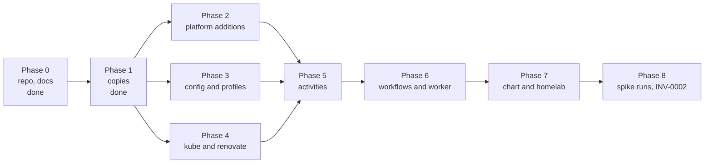

<!-- markdownlint-disable-file MD024 MD025 MD041 -->

# IMPL-0001: boopd spike: Temporal control plane, Job per run, discovery and the homelab deploy

<!--toc:start-->
- [Objective](#objective)
- [Scope](#scope)
  - [In Scope](#in-scope)
  - [Out of Scope](#out-of-scope)
- [Pre-implementation audit (2026-10-10)](#pre-implementation-audit-2026-10-10)
- [How the phases are ordered](#how-the-phases-are-ordered)
- [Implementation Phases](#implementation-phases)
  - [Phase 0: Repository, toolchain and founding documents](#phase-0-repository-toolchain-and-founding-documents)
    - [Tasks](#tasks)
    - [Success Criteria](#success-criteria)
  - [Phase 1: The copies](#phase-1-the-copies)
    - [Tasks](#tasks-1)
    - [Success Criteria](#success-criteria-1)
  - [Phase 2: Platform additions](#phase-2-platform-additions)
    - [Tasks](#tasks-2)
    - [Success Criteria](#success-criteria-2)
  - [Phase 3: Config and profiles](#phase-3-config-and-profiles)
    - [Tasks](#tasks-3)
    - [Success Criteria](#success-criteria-3)
  - [Phase 4: Kubernetes and Renovate packages](#phase-4-kubernetes-and-renovate-packages)
    - [Tasks](#tasks-4)
    - [Success Criteria](#success-criteria-4)
  - [Phase 5: Activities](#phase-5-activities)
    - [Tasks](#tasks-5)
    - [Success Criteria](#success-criteria-5)
  - [Phase 6: Workflows and the worker role](#phase-6-workflows-and-the-worker-role)
    - [Tasks](#tasks-6)
    - [Success Criteria](#success-criteria-6)
  - [Phase 7: Chart and homelab deploy](#phase-7-chart-and-homelab-deploy)
    - [Tasks](#tasks-7)
    - [Success Criteria](#success-criteria-7)
  - [Phase 8: Spike runs, INV-0002 and closing the loop](#phase-8-spike-runs-inv-0002-and-closing-the-loop)
    - [Tasks](#tasks-8)
    - [Success Criteria](#success-criteria-8)
- [File Changes](#file-changes)
- [Testing Plan](#testing-plan)
- [Dependencies](#dependencies)
- [Open Questions](#open-questions)
  - [OQ1: When does cmd/boop become cmd/boopd?](#oq1-when-does-cmdboop-become-cmdboopd)
  - [OQ2: How is the config file loaded?](#oq2-how-is-the-config-file-loaded)
  - [OQ3: How is the Job lifecycle tested below the homelab?](#oq3-how-is-the-job-lifecycle-tested-below-the-homelab)
  - [OQ4: One metrics registry or two?](#oq4-one-metrics-registry-or-two)
  - [OQ5: Branches, PRs and the first release](#oq5-branches-prs-and-the-first-release)
  - [OQ6: Which Temporal does the homelab use?](#oq6-which-temporal-does-the-homelab-use)
  - [OQ7: Redis: chart dependency or external reference?](#oq7-redis-chart-dependency-or-external-reference)
  - [OQ8: Replay tests from recorded histories](#oq8-replay-tests-from-recorded-histories)
  - [OQ9: What does /readyz mean for the worker?](#oq9-what-does-readyz-mean-for-the-worker)
  - [OQ10: Where do the scratch fixture repositories live?](#oq10-where-do-the-scratch-fixture-repositories-live)
  - [OQ11: Where does the Renovate 44 log fixture come from?](#oq11-where-does-the-renovate-44-log-fixture-come-from)
- [References](#references)
<!--toc:end-->

## Objective

Build the `boopd` spike that DESIGN-0001 specifies: one `worker` role that
runs `DiscoveryWorkflow`, `RepoWorkflow` and `InstallationWorkflow` on
Temporal, creates one Kubernetes Job per Renovate run from the upstream
image, admits runs against a per-installation budget discovered from
`/rate_limit`, and deploys to the homelab beside a Temporal cluster and a
Redis. The spike ends when every success criterion in INV-0001 § Spike and
DESIGN-0001 § Testing Strategy has been run and the results are recorded in
a new investigation, INV-0002.

**Implements:** [DESIGN-0001](../design/0001-boopd-spike-workflows-runrenovate-activity-and-worker.md)
(Approved), under [RFC-0001](../rfc/0001-boopd-run-renovate-per-repository-on-temporal.md),
[INV-0001](../investigation/0001-temporal-as-the-renovate-control-plane.md)
and ADR-0001 to ADR-0009 (ADR-0003 superseded by ADR-0009).

This document is the checklist. The design holds the why and the shapes;
each task below names the design section it implements. Tasks are checked
off as they land, with a short **Done** note when the result differs from
the plan or a later phase needs the detail.

## Scope

### In Scope

- Everything in DESIGN-0001 § Goals: the `worker` role, the process builder
  and Job spec, the `RunRenovate` activity with its classification,
  ecosystem profiles, convergence and stall handling, the discovered
  multi-resource budget, scoped and revoked tokens, chart changes, and
  enough instrumentation to evaluate the criteria without reading raw logs.
- The copies the spike owns (ADR-0007): `internal/platform` and
  `internal/jobspec` from renovate-operator, `internal/temporal` and the
  budget entity from repo-guardian.
- The homelab deployment and the spike runs themselves, including the
  comparison with renovate-operator v0.1.x and the scratch-repository
  fixtures.
- INV-0002, the results record, and the status changes that close the loop
  (DESIGN-0001 to Implemented).

### Out of Scope

Everything in DESIGN-0001 § Non-Goals:

- Postgres store, HTTP API, UI (ADR-0006).
- Webhook ingest (INV-0001 OQ8).
- Extracting shared code into `donaldgifford/x` (ADR-0007, Phase 0 of the
  real build).
- Evals, security findings, automerge and the post-run steps (Wiz,
  Dependabot alerts, ranking). The workflow is shaped so they slot in after
  `RunRenovate`.
- Any scaler (ADR-0008 as amended by ADR-0009).
- OpenBao or any external holder of the App key (DESIGN-0001 OQ11; the
  `Minter` seam is in scope, its OpenBao implementation is not).
- A custom Renovate image.
- GitHub Enterprise Server testing.
- The v1 DESIGN that follows the spike.

## Pre-implementation audit (2026-10-10)

What exists on `chore/bootstrap` (PR #1, label `dont-release`, not merged):

| Area | State | Where |
| ---- | ----- | ----- |
| Repository, toolchain, release train | Done. Go 1.27.2, golangci-lint 2.14.0, bake, goreleaser, lockstep chart release, CI with lint, unit, integration, govulncheck, CodeQL, Docker and Helm jobs. | `44c2bb2`, `13ff3c7`, `f690b9d` |
| Founding docs | Done. INV-0001, RFC-0001, ADR-0001 to ADR-0009, DESIGN-0001 Approved with every open question decided (2026-10-10). | `docs/` |
| `internal/platform` | Copied from renovate-operator `0183661` with tests; Forgejo dropped. Still the operator's shape: owner-based discovery, five config paths, one installation per client, token minting without scope or revocation. | `44c2bb2` |
| `internal/jobspec` | Ported: `BuildEnv` (the env table and rules), `BuildJob` (suspended, restricted pod, profile overlay), `BuildTokenSecret` (owner-referenced), behaviour tests. | `8573678` |
| `internal/temporal` | Ported from repo-guardian `feat/impl-0028-controls-foundations` @ `d1f20a0`: config, mTLS/OIDC, dial, worker versioning, schedules, metric views, dev-server test helper, unit and integration tests. | `f690b9d` |
| `internal/workflows` | Names and IDs, priority presets, `InstallationWorkflow` reworked to the design (discovered, two resources, cap, `retryAt`, `state` query), tests. `RepoWorkflow` and `DiscoveryWorkflow` do not exist. | `f690b9d` |
| `internal/activities` | `AcquireBudget` only. | `f690b9d` |
| `cmd/boop` | The template's placeholder `main`: prints the version and exits. No role, no Temporal, no HTTP. | — |
| Chart | The template's generic service chart: Deployment, Service, ConfigMap and Secret via `envFrom`, probes on `/healthz` and `/readyz`, ServiceMonitor, PrometheusRule. No Role, no config file, no Temporal or Redis values. | `charts/boop/` |

The gap, in order of dependency: platform additions, config and profiles,
the Kubernetes and Renovate packages, the activities, the two workflows and
the worker role, the chart and homelab deploy, then the spike runs.

## How the phases are ordered

Phases 2, 3 and 4 are independent of each other and can run in any order
or in parallel branches. Phase 5 needs all three. Each phase is one PR
unless OQ5 decides otherwise, and every phase leaves `just check`, the
integration tests and the chart tests green.

## Implementation Phases

Each phase builds on the previous one. A phase is complete when all its tasks
are checked off and its success criteria are met.

---

### Phase 0: Repository, toolchain and founding documents

Done before this plan was written. Listed so the record is in one place.

#### Tasks

- [x] 0.1 Create `donaldgifford/boop` from the service template: Go module,
  `just` recipes, `mise` pins, distroless Dockerfile and bake targets,
  goreleaser, the lockstep release train, chart skeleton with helm-unittest.
  **Done 2026-10-02** (`44c2bb2`).
- [x] 0.2 Copy INV-0001 as the founding document; write RFC-0001 and
  ADR-0001 to ADR-0008; write CLAUDE.md with the decisions and the step
  list. **Done 2026-10-02.**
- [x] 0.3 DESIGN-0001: rewrite with mermaid diagrams and lettered open
  questions; add OQ11 (App key custody); ADR-0009 (Job per run) supersedes
  ADR-0003 and amends ADR-0008; decide every OQ (`a` on all, OQ8 `a` after
  assessment); status Approved. **Done 2026-10-10** (`f638fcd` to
  `728c913`).
- [x] 0.4 Toolchain: Go 1.27.2 and golangci-lint 2.14.0 for GO-2026-6617;
  `golang.org/x/net` v0.60.0 for GO-2026-6612. **Done 2026-10-10**
  (`13ff3c7`, `5439e1b`).

#### Success Criteria

- PR #1's CI is green: lint, unit tests, govulncheck, CodeQL, Docker build,
  chart lint and unit tests. (Met.)
- `docz list` shows INV-0001 Concluded, RFC-0001, ADR-0001 to ADR-0009 and
  DESIGN-0001 Approved. (Met.)

---

### Phase 1: The copies

The three packages the spike copies rather than writes (ADR-0007,
DESIGN-0001 § Topology and packages, § Migration / Rollout Plan steps 1
and 2). Done.

#### Tasks

- [x] 1.1 `internal/platform` from renovate-operator `0183661`: the `Client`
  interface, the GitHub client with App and token auth, `Discover`,
  `HasRenovateConfig`, `MintAccessToken`, error sentinels and the copied
  tests. Forgejo client dropped; lint fixes. **Done 2026-10-02.**
- [x] 1.2 `internal/jobspec` from renovate-operator `internal/jobspec`
  (DESIGN-0001 § Process builder, § Job spec): `BuildEnv` with every row of
  the env table, the preset check, explicit `false` preserved, forbidden
  `globalOnly` options rejected in global config and profiles,
  `customEnvVariables` shape checked; `BuildJob` suspended with
  `backoffLimit` 0, the 55-minute `activeDeadlineSeconds`, one-hour
  `ttlSecondsAfterFinished`, restricted pod security, no service account
  token or service links, `emptyDir`s for `/work` and `/tmp`, the profile's
  pod overlay with the reserved labels protected; `BuildTokenSecret` owned
  by the Job; `JobName` as a DNS label. Behaviour tests written first.
  **Done 2026-10-10** (`8573678`).
- [x] 1.3 `internal/temporal` from repo-guardian
  `feat/impl-0028-controls-foundations` @ `d1f20a0`, the rc about to be
  deployed, instead of `v2` @ `278c7ec`: `TEMPORAL_*` config, mTLS or OIDC
  bearer auth, `Dial` with slog and OTel SDK metrics, the server version
  floor 1.31 read from `GetSystemInfo`, worker deployment versioning with
  `PromoteBuild` and `RequireCurrentVersion`, `EnsureSchedule` and
  `RemoveSchedule`, `MetricViews`, and `temporaltest` for the Temporal CLI
  dev server at `v1.9.1`. One namespace, task queue and deployment: `boopd`.
  **Done 2026-10-10** (`f690b9d`).
- [x] 1.4 `internal/workflows`: names and IDs per ADR-0002, `Priority` with
  `TaskPriority` (fairness key = installation), and `InstallationWorkflow`
  per DESIGN-0001 § InstallationWorkflow: the entity runs `ReadRateLimit`
  itself at start and hourly, tracks `core` and `graphql` with a
  per-resource spend EWMA, admits only when every resource covers the open
  leases plus one above the reserve, caps concurrent runs, pauses on a
  secondary-limit `retryAt`, answers a `state` query, ContinueAsNew with
  the drain. **Done 2026-10-10** (`f690b9d`). Amendment recorded in the
  design: a caller refused only by the cap waits at most five minutes.
- [x] 1.5 `internal/activities`: `AcquireBudget` via Update-with-Start with
  the `budget.*` config carried in the workflow input; a depguard rule
  keeps `internal/workflows` free of side-effecting imports.
  **Done 2026-10-10** (`f690b9d`).
- [x] 1.6 Tests: unit tests for config, TLS, OIDC token source, versioning
  decisions, metric views and twelve budget scenarios in the time-skipping
  environment; integration tests behind the `integration` build tag
  (dial, OIDC wiring, schedules, promotion, and the budget end to end
  through a promoted worker); `just test-integration` and a CI job.
  **Done 2026-10-10** (`f690b9d`).

#### Success Criteria

- `go build ./...`, `just check` and `just test-integration` pass; CI green
  including the Integration Tests job. (Met.)
- The env table in DESIGN-0001 § Process builder is the test table in
  `internal/jobspec/env_test.go`, row for row. (Met.)
- `InstallationWorkflow` admits against the tightest resource, releases
  expired leases, honours the cap and `retryAt`, and carries its state
  across ContinueAsNew, each pinned by a test. (Met.)

---

### Phase 2: Platform additions

What the copied `internal/platform` lacks for discovery, probing and
per-run tokens (DESIGN-0001 § DiscoveryWorkflow, § RunRenovate activity
steps 1, 2 and 10, § InstallationWorkflow "Client-side limiter", OQ2, OQ3,
OQ11; INV-0001 § Renovate behaviours to reproduce).

#### Tasks

- [ ] 2.1 `Repository` gains `ID int64` and `NodeID string` from the REST
  response (ADR-0002: the numeric id is the workflow ID; the probe needs
  the node id). `toRepo` fills them; the copied tests assert them.
- [ ] 2.2 An App-level client: `NewAppClient(appID, key, endpoint)` on
  `ghinstallation.NewAppsTransport`, with `ListInstallations` paging
  `GET /app/installations` at 100 per page and returning id, account
  login, `suspended_at` and the `repository_selection`. Filtered by the
  optional allowlist in the caller.
- [ ] 2.3 `Minter` interface: `Mint(ctx, installationID, repoIDs) (token,
  expiresAt, error)` and `Revoke(ctx, token) error`. The in-memory
  implementation holds the parsed key, mints with
  `POST /app/installations/{id}/access_tokens` and `repository_ids`
  (the run's repository and the shared-preset repository, OQ2), and
  revokes with `DELETE /installation/token`. Never assume a token length.
  `MintAccessToken` on the installation client stays for discovery's
  own token.
- [ ] 2.4 Installation-scoped discovery: `Discover` for an installation
  pages `GET /installation/repositories` (INV-0004: never the owner
  endpoints) with `skipForks` and `skipArchived`, 100 per page, and
  exposes paging so `DiscoverInstallation` can probe and signal per page
  and heartbeat the page number.
- [ ] 2.5 Config probe (OQ3 `a`): `ProbeConfig(ctx, nodeIDs, path)` sends
  the GraphQL query from the design, one query per 100 repositories,
  reads `rateLimit.cost` and returns, per repository, whether the file
  exists and its `extends` list parsed from `text` (JSON and JSON5-free
  JSON only; above 64 KB or unparseable yields an empty list). The REST
  fallback `GET /repos/{slug}/contents/{path}` behind `discovery.probe:
  rest`. `ConfigPaths` collapses to the configured path.
- [ ] 2.6 `ReadRateLimit(ctx) (*workflows.Readings, error)` on the
  installation client: `GET /rate_limit`, reading `resources.core` and
  `resources.graphql` only, with `ObservedAt` from the response `Date`.
- [ ] 2.7 Limiter from the discovered limit: a `WithRateLimit` value derived
  as `limit / 3600` per second, burst 10, replacing the copied 4,500/hr
  default once a reading exists.
- [ ] 2.8 `CheckRepo(ctx, repoID)`: repository visible to the installation,
  not archived, config file present on the default branch; distinguishes
  gone, no config, present and error (an outage must never look like an
  offboarding).
- [ ] 2.9 Tests with `httptest` servers as in the copied tests: paging,
  the GraphQL batch and its cost, `extends` parsing edge cases, scoped
  mint and revoke request bodies, the REST fallback, the limiter value,
  `CheckRepo`'s four answers.

#### Success Criteria

- `go test ./internal/platform/...` passes with the new behaviours
  table-tested; no network access in tests.
- A probe of 100 node ids is one GraphQL request in the test server's
  log, and its recorded cost is read from the response.
- A mint request body carries exactly the two repository ids; a revoke
  sends `DELETE /installation/token` with the minted token.

---

### Phase 3: Config and profiles

The config file (ADR-0004, DESIGN-0001 § API / Interface Changes) and the
profile resolver (DESIGN-0001 § Ecosystem profiles, OQ1, OQ9).

#### Tasks

- [ ] 3.1 `internal/config`: typed structs for `renovate`, `runs`,
  `profiles`, `order`, `defaultProfile`, `unknownProfile`, `profileRules`
  and `apps[]` (with `discovery`, `cadence`, `budget`), loaded from YAML
  (OQ2), unknown fields rejected, durations parsed, defaults applied
  (`pendingTimeout` 10m, `cadence` 24h, `discovery.every` 6h,
  `budget.reserveFraction` 0.10, `maxConcurrentRuns` 10,
  `defaultEstimate` {core 300, graphql 150}).
- [ ] 3.2 Validation: the image is pinned by digest; `configPath` is a
  relative file path; `sharedPreset` passes `jobspec`'s preset check; every
  profile named in `order`, `defaultProfile`, `unknownProfile` and
  `profileRules` exists; `order` lists every profile exactly once;
  profile `renovate` overrides contain no forbidden option (reuse the
  `jobspec` validator); `reserveFraction` in [0, 0.5]; Secret refs have
  name and key; App ids and keys present; installations allowlist entries
  are positive ints.
- [ ] 3.3 Secret-backed values: the App private key and the Redis URL are
  read from the mounted files named by the refs at start, never from env;
  a missing file fails startup with the path in the error.
- [ ] 3.4 `internal/profiles`: `Resolve(extends []string, managers
  []string) string` applies `profileRules` (preset substrings and manager
  names), takes the strictest match by `order`, falls back to
  `defaultProfile` when `extends` is known but matches nothing and to
  `unknownProfile` when `extends` is empty; managers only ever tighten.
- [ ] 3.5 `jobspec.Profile` and `jobspec.App` are built from the config
  types by one constructor, so the chart's config file is the only
  source.
- [ ] 3.6 Tests: a golden config matching the design's example; every
  validation rule with a failing case; the resolver's table including the
  Python tightening and the unknown case.

#### Success Criteria

- The design's example config loads unchanged and renders the same
  `BuildInput` the `jobspec` tests use.
- Every validation rule has a test that fails without it.
- `Resolve` is a pure function with a table test; `python` from either
  `extends` or `managers` yields the Python profile.

---

### Phase 4: Kubernetes and Renovate packages

The Job lifecycle (DESIGN-0001 § RunRenovate activity steps 3 to 11,
§ Job spec) and the report parser and log scanner (§ Process builder,
OQ8).

#### Tasks

- [ ] 4.1 `internal/kube`: in-cluster client (OQ3) with the namespace from
  config; a `Runner` with `CreateSuspended(job)`, `CreateSecret(secret)`,
  `Unsuspend(name)`, `WaitRunning(name, timeout)` by watching the Job's
  pod, `FollowLog(name, since)` streaming `pods/{pod}/log` with
  `follow=true&timestamps=true`, `ExitCode(name)` from the container's
  terminated state (incl. `OOMKilled` and `DeadlineExceeded` reasons),
  `Delete(name)` with foreground propagation and a bounded wait.
- [ ] 4.2 Log follower resilience: on a broken stream, reconnect with
  `sinceTime` from the last line's timestamp and drop lines at or before
  it; bounded retries; a line callback that receives the raw line and its
  timestamp.
- [ ] 4.3 `boopd_kube_requests_total{verb,resource,code}` through a
  client-go transport wrapper (the metric registry arrives in Phase 6;
  the wrapper takes an interface).
- [ ] 4.4 `internal/renovate`: the log scanner matching `msg` exactly for
  the branch, PR, end and report events, live and `dryRun: full`,
  carrying `repository` and `branch`; `Progress` counters; the
  `Repository finished` fields (`result`, `status`, `exitCode`,
  `durationMs`, `cloned`); the `Printing report` line parsed into the
  design's `UpdateTuple` rows with `Manager` recovered from
  `packageFiles`, `Managers`, `Problems`; `reportMissing` when the line is
  absent or fails to parse, with tuples reconstructed from branch and PR
  events.
- [ ] 4.5 Fixtures: a real Renovate 44 log from a scratch repository run
  in `dryRun: full` and one live, sanitized, under
  `internal/renovate/testdata` (OQ11); the exact `msg` strings are pinned
  by them, so a Renovate change fails the parser's test, not a run.
- [ ] 4.6 Tests: `kube` against the client-go fake clientset for the
  create-suspended → Secret → unsuspend order, the pending timeout, the
  foreground delete and the exit-code reasons; the follower against an
  `httptest` server that drops the stream mid-line and replays (OQ3);
  `renovate` golden tests over the fixtures, including a truncated report
  line.

#### Success Criteria

- The fake-clientset tests prove the Secret exists before the Job is
  unsuspended and that deleting the Job is the only delete the package
  issues.
- The follower test reconnects once and yields every line exactly once.
- The parser turns the live fixture into tuples whose count equals the
  report's `branches[].upgrades[]` total, each with a non-empty `Manager`.

---

### Phase 5: Activities

Every side effect, registered by name (DESIGN-0001 § Topology and
packages, § DiscoveryWorkflow, § RunRenovate activity, § Convergence and
stall).

#### Tasks

- [ ] 5.1 `ListInstallations`: the App client's list, filtered by the
  config allowlist, returning ids and `suspended` flags; the workflow
  signals `suspend` to each installation's budget accordingly.
- [ ] 5.2 `DiscoverInstallation`: one installation per activity; pages
  repositories, probes each page (GraphQL or REST), `SignalWithStart`s
  `repo/github/<id>` with `discovered {slug, defaultBranch,
  installationID, discoveryInterval, extends}` for every repository with
  the file, heartbeats `{page, seen, onboarded}` and resumes from the
  heartbeat's page on retry; reads `/rate_limit` before each page and
  sleeps to the reset while heartbeating if a tracked resource is under
  the reserve; records `boopd_discovery_probe_cost`; returns a summary.
- [ ] 5.3 `CheckRepo` and `ReadRateLimit`: thin wrappers over Phase 2, the
  latter already named by `InstallationWorkflow`.
- [ ] 5.4 `RunRenovate`: the twelve steps of the design's flowchart with
  the `RunInput` and `RunResult` types as specified: mint (scoped to the
  run's and the preset repository), `RateBefore`, build and create the
  suspended Job from the profile, Secret then unsuspend, wait `Running`
  within `runs.pendingTimeout` or delete and fail `pending`, follow the
  log forwarding every line to stdout with the correlation fields and
  scanning it, heartbeat every 15 s with `Progress`, stop at the soft
  deadline `min(start + 50 min, expiresAt − 3 min)` or on cancellation by
  foreground delete, read the exit code, `RateAfter`, revoke (logged and
  counted on failure), delete the Job, classify.
- [ ] 5.5 Classification: the design's table as one function with a table
  test per row, including the exit-code cross-check and the `OOMKilled`
  and `DeadlineExceeded` reasons; `rate-limit-exceeded` and a
  secondary-limit `403`/`429` in the log yield an activity error carrying
  `retryAt` from `retry-after` or one minute.
- [ ] 5.6 One structured `run_complete` log line per result and the run
  metrics (`boopd_runs_total`, `boopd_run_duration_seconds`,
  `boopd_run_pod_start_seconds`, `boopd_run_overhead_seconds`,
  `boopd_run_pending_timeouts_total`, `boopd_token_mints_total`,
  `boopd_token_revocations_total`).
- [ ] 5.7 `Activities` struct wiring the clients, the `Minter`, the config
  and the registry; `Register` under the `workflows` names.
- [ ] 5.8 Tests: each activity against fakes (`kube` fake, `httptest`
  GitHub, a scripted log stream) through the SDK's
  `TestActivityEnvironment`; `RunRenovate` scenarios for the happy path,
  pending timeout, soft deadline, broken log stream, missing report,
  revoke failure, and cancellation mid-run.

#### Success Criteria

- `RunRenovate` against the fakes returns a `RunResult` whose `Tuples`,
  `Managers`, `Problems`, `Progress`, `RateBefore` and `RateAfter` match
  the fixture, and the fake API server saw create Job, create Secret,
  patch suspend, watch, log, delete Job, in that order, and no other
  write.
- Every row of the classification table has a passing test.
- Cancelling the activity context deletes the Job with foreground
  propagation before the activity returns.

---

### Phase 6: Workflows and the worker role

`RepoWorkflow`, `DiscoveryWorkflow`, the `boopd worker` command and
observability (DESIGN-0001 § Workflows, § Convergence and stall,
§ Observability, § API / Interface Changes; CLAUDE.md configuration
contract).

#### Tasks

- [ ] 6.1 `DiscoveryWorkflow`: `ListInstallations`, then one
  `DiscoverInstallation` per installation in parallel with the design's
  heartbeat timeout; suspend signals to budgets; a summary result.
  `EnsureSchedule` per configured App (`discovery/<app>`, interval
  `discovery.every`, overlap skip) at worker start.
- [ ] 6.2 `RepoWorkflow` with `RepoState` and the loop: the selector over
  `NextDue`, `recheck` (runs now at `PriorityHigh`), `discovered`
  (refreshes slug, `Extends`, `LastSeen`) and the absence timer at
  `LastSeen + 3 × DiscoveryInterval` → `CheckRepo` → end on gone or no
  config, else keep waiting; `AcquireBudget` with `retryAt` sleeps;
  profile resolution before each run; `RunRenovate` with the activity
  options table (ScheduleToStart 5m, StartToClose 58m, heartbeat 1m,
  `MaximumAttempts` 1, `TaskPriority`); the four return cases (result,
  `pending`, timeout with last-heartbeat progress, other error); the
  `report` signal with `Before`/`After` readings or none; managers merge;
  the convergence table; first due time by hash jitter; ContinueAsNew at
  100 iterations or the SDK's suggestion; the `state` query; search
  attributes `InstallationID`, `Profile`, `Phase`, `LastOutcome`,
  `NextDue`.
- [ ] 6.3 `internal/observability`: slog JSON with level from `LOG_LEVEL`;
  an OTel meter provider with the Prometheus exporter on `METRICS_ADDR`
  carrying `temporal.MetricViews()` (OQ4); the boopd metric set from the
  design registered once and pinned by a names test; `/healthz` and
  `/readyz` on `LISTEN_ADDR` (OQ9).
- [ ] 6.4 `cmd/boopd worker --config <file>`: load config, build the
  clients and the `Minter`, dial Temporal from `TEMPORAL_*`, check the
  server version floor, register workflows and activities, start the
  worker with `WorkerStopTimeout` = StartToClose, `PromoteBuild`, ensure
  the discovery schedules, serve health and metrics, and on `SIGTERM`
  stop polling and let runs reach their soft deadlines. Rename `cmd/boop`
  to `cmd/boopd` with the binary, image, goreleaser, bake and justfile
  names (OQ1).
- [ ] 6.5 Search attributes registered on the namespace at start
  (idempotent), with a clear error when the namespace lacks the
  permission.
- [ ] 6.6 Tests: `RepoWorkflow` in the `testsuite` with fakes for every
  row of the convergence table, `pending` release and re-acquire,
  heartbeat-timeout progress, absence → `CheckRepo` → end or continue,
  managers merge, ContinueAsNew carry; `DiscoveryWorkflow` fan-out and
  suspend signalling; a replay test scaffold (OQ8); an integration test
  on the dev server that starts the worker role with fake activities and
  sees a `discovered` signal start a `RepoWorkflow` that acquires a lease.

#### Success Criteria

- Every row of the convergence table has a passing workflow test.
- `boopd worker` against the dev server and a stub Kubernetes API starts,
  promotes its build, ensures the schedule and reports ready; `SIGTERM`
  with a run in flight stops polling and keeps the activity until its
  soft deadline.
- `go test -race ./...` and the integration tag pass; the metric names
  test pins the set from DESIGN-0001 § Observability.

---

### Phase 7: Chart and homelab deploy

The deployment contract (DESIGN-0001 § API / Interface Changes "Chart
changes", § Credentials and the Job pod, OQ7, OQ12; CLAUDE.md § Releases)
and the first real environment.

#### Tasks

- [ ] 7.1 Chart rename and shape: `boopd` as the chart, image and binary
  name (OQ1); the Deployment becomes the worker with two replicas,
  `terminationGracePeriodSeconds` above StartToClose, the `worker`
  subcommand and `--config`.
- [ ] 7.2 Config file: a ConfigMap rendered from values matching
  `internal/config`, mounted read-only; a JSON schema in
  `values.schema.json` that mirrors the validation rules so `helm lint`
  catches what `boopd` would reject.
- [ ] 7.3 RBAC: ServiceAccount, Role and RoleBinding with exactly the
  design's verbs (`jobs` create/get/list/watch/delete; `pods`
  get/list/watch; `pods/log` get; `secrets` create/get/delete, no `list`).
- [ ] 7.4 Secrets: App private key, Redis URL and Temporal client
  certificate or OIDC client secret mounted as files in the worker only;
  `existingSecret` for each; the Temporal values block copied from
  repo-guardian's chart (`temporal.address`, `namespace`, `taskQueue`,
  `tls.*`, `auth.oidc.*`).
- [ ] 7.5 Namespace posture: the PodSecurity `restricted` labels on the
  namespace (documented for the operator or rendered when
  `namespace.create`); an optional `ResourceQuota` on Job pods sized from
  `runs.maxConcurrent` (OQ12); optional NetworkPolicies keyed on
  `boopd.dev/egress`; an optional `RuntimeClass` name for the Python
  profile.
- [ ] 7.6 Redis: a chart dependency with `AUTH`, `maxmemory`,
  `allkeys-lru` and an ACL user limited to Renovate's key prefix, or an
  external reference through the Secret (OQ7).
- [ ] 7.7 helm-unittest: the Role's verbs exactly and no `list` on
  secrets; the config file renders the golden example; env collisions
  still fail; ServiceMonitor and PrometheusRule carry the run and budget
  alerts (`disk-space`, `OOMKilled`, `onboarding` result, stalled
  repositories).
- [ ] 7.8 `just k3d-install` brings up the chart against the Temporal dev
  server or a k3d-hosted Temporal and a Redis; a smoke run against one
  scratch repository completes in `dryRun: full`.
- [ ] 7.9 Homelab: the `boopd` Temporal namespace with fairness enabled
  (OQ6), a `boop-bot` GitHub App installed on the homelab organisation
  with the private key in a Secret, Redis per OQ7, Loki labels from the
  correlation fields; the first release `0.1.0` cut by the release train
  (OQ5) and deployed.

#### Success Criteria

- `just helm-test` passes; the Role test fails if any verb is added.
- `just k3d-install` followed by one `recheck` signal produces a Job, a
  pod log forwarded with correlation fields, a `run_complete` line and a
  deleted Job, with no Secret left behind.
- The homelab worker is ready, its build is the deployment's current
  version, the discovery schedule exists, and one full discovery pass
  starts a `RepoWorkflow` for every repository that has the config file
  and none for those that lack it.

---

### Phase 8: Spike runs, INV-0002 and closing the loop

The success criteria from INV-0001 § Spike and DESIGN-0001 § Testing
Strategy, run in the homelab, with the fixtures the design describes
(DESIGN-0001 § Migration / Rollout Plan steps 5 and 6).

#### Tasks

- [ ] 8.1 Fixtures (OQ10): the isolation repository whose package-manager
  step writes markers into `cacheDir`, `baseDir` and `/tmp`, dumps its
  environment, walks `/proc` and the filesystem for key material and
  forks a background process; a second repository that looks for the
  markers; the Python repository with an sdist-only dependency whose
  `setup.py` would write a marker; a many-updates repository for the
  convergence run.
- [ ] 8.2 Comparison with renovate-operator v0.1.x, both in `dryRun: full`,
  over the homelab's repositories: report tuple sets equal, or every
  difference explained by a release or age boundary (INV-0001
  Observation 11).
- [ ] 8.3 Overhead: seconds per repository with a warm Redis versus a cold
  one, and `boopd_run_pod_start_seconds` and `boopd_run_overhead_seconds`
  distributions.
- [ ] 8.4 Worker death: kill a worker pod mid-run; the Job finishes or is
  reaped by `activeDeadlineSeconds` and `ttlSecondsAfterFinished`, the
  activity times out on heartbeat, and the workflow treats it as
  `TimedOut` with the last progress.
- [ ] 8.5 Token lifetime and scope: no `401` across a full pass; a run
  scoped to its repository and the preset repository applies the shared
  preset; the token answers `401` after `RunResult` is returned.
- [ ] 8.6 Convergence and stall: with the soft deadline forced to two
  minutes, the many-updates repository reaches the same report as an
  uninterrupted run within the rerun cap with no duplicate or broken
  branches; a hung package manager is marked `stalled` after three
  attempts and stops until its next due time.
- [ ] 8.7 Budget signal: with four concurrent runs on one installation,
  `boopd_rate_spend_per_run` is stable enough to drive the EWMA, and
  admission never dips under the reserve.
- [ ] 8.8 Isolation and profile enforcement: the isolation fixture finds
  the scoped token and the Redis URL and nothing else; the second
  repository finds no markers; the Python fixture ends `Failed` with a
  lockfile error and its marker is absent.
- [ ] 8.9 Discovery cost: `boopd_discovery_probe_cost` for a full pass is
  under 5% of the installation's hourly `graphql` limit.
- [ ] 8.10 Result capture and log correlation: `run_complete` plus the
  report answers what each run did; Renovate lines in Loki carry
  repository and workflow ID labels.
- [ ] 8.11 INV-0002: one section per criterion with the measurement, the
  pass or fail, and the profile and timeout adjustments the numbers
  justify (DESIGN-0001 OQ7, OQ10 are "starting points for the spike to
  adjust").
- [ ] 8.12 Close the loop: DESIGN-0001 to Implemented with a results
  pointer; ADR-0001 to ADR-0009 from Proposed to Accepted where still
  Proposed; this document to Completed; CLAUDE.md step 8 done.

#### Success Criteria

- Every criterion in INV-0001's table and the four added by DESIGN-0001
  has a recorded result in INV-0002, pass or fail, with the number or
  evidence that decided it.
- A failed criterion has either a fix merged and a re-run recorded, or a
  written reason it is accepted for v1.
- `docz list` shows DESIGN-0001 Implemented, INV-0002 Concluded and
  IMPL-0001 Completed.

---

## File Changes

| File | Action | Description |
| ---- | ------ | ----------- |
| `internal/platform/platform.go`, `github/*.go` | Modify | `ID`/`NodeID`, App client, `ListInstallations`, installation-scoped `Discover`, GraphQL probe, `ReadRateLimit`, `CheckRepo`, `Minter` (Phase 2) |
| `internal/config/` | Create | config types, loading, validation, Secret-backed values (Phase 3) |
| `internal/profiles/` | Create | profile resolution (Phase 3) |
| `internal/kube/` | Create | Job lifecycle, log follower, request metrics (Phase 4) |
| `internal/renovate/` | Create | log scanner, report parser, fixtures (Phase 4) |
| `internal/activities/` | Modify | `ListInstallations`, `DiscoverInstallation`, `CheckRepo`, `ReadRateLimit`, `RunRenovate`, wiring (Phase 5) |
| `internal/workflows/` | Modify | `RepoWorkflow`, `DiscoveryWorkflow`, run options, search attributes (Phase 6) |
| `internal/observability/` | Create | slog, meter provider and Prometheus exporter, health endpoints (Phase 6) |
| `cmd/boopd/` | Create (rename) | `worker` subcommand; `cmd/boop` removed (Phase 6, OQ1) |
| `Dockerfile`, `docker-bake.hcl`, `.goreleaser.yaml`, `justfile` | Modify | binary and image name `boopd` (Phase 6) |
| `charts/boopd/` | Create (rename) | worker Deployment, config ConfigMap, RBAC, Secrets, Temporal and Redis values, posture objects, tests (Phase 7) |
| `.golangci.yml` | Modify | depguard entries for `internal/kube` once it exists (Phase 4) |
| `docs/investigation/0002-*.md` | Create | spike results (Phase 8) |
| `CLAUDE.md` | Modify | step status per phase; layout entries for the new packages |

## Testing Plan

Per DESIGN-0001 § Testing Strategy, by layer:

- [ ] Process builder and Job spec: table and golden tests (Phase 1, done).
- [ ] Platform additions: `httptest` servers, no network (Phase 2).
- [ ] Config and profiles: golden config, one failing case per rule, resolver
  table (Phase 3).
- [ ] Job lifecycle: client-go fake clientset for ordering, timeouts and
  deletes; an `httptest` log server for follow, reconnect and dedupe
  (Phase 4, OQ3).
- [ ] Report parser and scanner: golden files from real Renovate 44 logs
  (Phase 4, OQ11).
- [ ] Activities: `TestActivityEnvironment` over fakes; the classification
  table row by row (Phase 5).
- [ ] Workflows: `testsuite` with fakes for the convergence table and the
  budget interplay; determinism by replay once histories exist (Phase 6,
  OQ8).
- [ ] Integration (build tag `integration`): the dev server for the
  Temporal paths, already in CI (Phase 1, done); the worker role end to end
  with fake activities (Phase 6).
- [ ] Chart: helm-unittest for the Role's verbs, the config render, the
  posture objects and the alerts (Phase 7).
- [ ] Spike: the criteria in the homelab, recorded in INV-0002 (Phase 8).

## Dependencies

- A Temporal server at 1.31 or later with fairness enabled: the Temporal CLI
  dev server `v1.9.1` for tests, repo-guardian's `contrib/temporal`
  reference cluster for the homelab (OQ6).
- A Redis reachable from the Job pods (OQ7).
- The `boop-bot` GitHub App: id, private key, and an installation on the
  homelab organisation that includes the `renovate-config` preset
  repository (DESIGN-0001 OQ2).
- The Renovate 44 image digest, kept current by Renovate in this repository.
- Scratch repositories for the fixtures (OQ10) and a renovate-operator
  v0.1.x deployment for the comparison run.
- Loki for the log-correlation criterion.
- Sibling checkouts: `~/code/renovate-operator`, `~/code/repo-guardian`
  (`feat/impl-0028-controls-foundations`).

## Open Questions

Implementation choices DESIGN-0001 leaves open. Each is numbered, with
lettered options; **a** is the recommendation and the phases above are
written on it.

### OQ1: When does `cmd/boop` become `cmd/boopd`?

CLAUDE.md fixes the service name as `boopd` for the binary, image, chart
and Temporal namespace, but the template left `cmd/boop`, goreleaser's
`binary: boop`, the Dockerfile's `/usr/local/bin/boop` and `charts/boop`.
Renaming touches the Dockerfile, bake, goreleaser, the justfile's
`project_name`, the chart directory and the release workflow's artifact
names.

- **a (recommended): in Phase 6, with the `worker` subcommand.** The
  command, the image entrypoint and the chart's `command` change in the
  same PR, so the rename is tested by the first thing that runs it, and
  no phase before it ships a binary anyone runs.
- **b: now, before Phase 2.** A small PR with nothing else; the release
  train is exercised once with `dont-release` and the rename never mixes
  with feature work.
- **c: in Phase 7, with the chart.** One rename PR for everything
  deployment-shaped; Phase 6's worker ships briefly as `boop worker`.
- **other:**

### OQ2: How is the config file loaded?

ADR-0004 fixes a file shipped with the chart; the design shows YAML. The
loader needs typed structs, durations, unknown-field rejection and clear
errors with paths.

- **a (recommended): `sigs.k8s.io/yaml` into typed structs with
  `UnmarshalStrict`, durations as strings parsed by hand, validation in
  one `Validate()` that returns every error joined.** Already an indirect
  dependency through `k8s.io/apimachinery`; no new framework; the chart's
  `values.schema.json` mirrors the same rules (task 7.2).
- **b: koanf with a YAML provider and `BOOPD_*` env overrides.** Useful
  if operators want to override one value without re-rendering the
  ConfigMap; one more dependency and a second place a value can come
  from.
- **c: HCL, as repo-guardian.** Consistent with the sibling and its
  `removedEnvVars` pattern; the chart would then template HCL, which
  helm-unittest handles less well than YAML.
- **other:**

### OQ3: How is the Job lifecycle tested below the homelab?

The design names the client-go fake clientset and `envtest`. `envtest`
runs a real `kube-apiserver` but no kubelet, so `pods/log` and pod phase
transitions never happen there; only create, patch, watch and delete can
be exercised.

- **a (recommended): fake clientset for ordering, timeouts and deletes;
  an `httptest` server speaking the `pods/log` follow protocol for the
  follower's reconnect and dedupe; `just k3d-install` plus one smoke run
  for the real path (task 7.8), not in CI.** No `envtest` binaries to
  download; the watch path is covered by the fake's watch reactor.
- **b: add `envtest` for the watch and patch paths as the design says**,
  with `setup-envtest` in CI. Catches server-side validation (e.g. a
  malformed owner reference) that the fake accepts; adds a binary
  download to every CI run.
- **c: k3d in CI for the whole lifecycle**, with a stub "renovate" image
  that prints a canned log. The most faithful; the slowest, and a
  cluster per CI run.
- **other:**

### OQ4: One metrics registry or two?

`temporal.Dial` reports SDK metrics on an OTel meter and `MetricViews()`
fixes the SDK's histogram buckets; `boopd`'s own metrics are listed in
DESIGN-0001 § Observability.

- **a (recommended): one OTel SDK meter provider with the Prometheus
  exporter on `METRICS_ADDR`; `boopd`'s metrics are OTel instruments on
  it.** One registry, one scrape, the SDK views apply, and this is what
  repo-guardian does, so its dashboards carry over.
- **b: `client_golang` for `boopd`'s metrics and the OTel exporter
  registered on the same `prometheus.Registry`.** Familiar API for the
  app metrics; two instrumentation libraries in one binary.
- **c: `client_golang` only and no SDK metrics.** Fewest dependencies;
  loses schedule-to-start latency and the other SDK series the alerts
  need.
- **other:**

### OQ5: Branches, PRs and the first release

PR #1 (`chore/bootstrap`, `dont-release`) holds Phases 0 and 1 and is not
to be merged until you say so. The release train cuts a version on every
merge to `main` with a semver label.

- **a (recommended): merge PR #1 as it stands when Phase 2 starts, then
  one PR per phase from `main`, labelled `dont-release` through Phase 6;
  Phase 7's PR is `minor` and cuts `0.1.0`, the first version the homelab
  runs.** Small reviewable diffs, `main` always green, and no release
  before anything is deployable.
- **b: keep stacking phases on `chore/bootstrap` and merge once at the
  end of Phase 7.** One review; the branch grows past comfortable review
  size and the release train is never exercised until it matters.
- **c: one PR per phase, each `patch`.** A version per phase from `0.0.1`;
  images and charts published for code that cannot run yet.
- **other:**

### OQ6: Which Temporal does the homelab use?

- **a (recommended): repo-guardian's reference cluster
  (`contrib/temporal`, server 1.32, fairness on), with a new `boopd`
  namespace created by its namespace job and its own client identity (an
  OIDC client under DESIGN-0028's model, or a certificate from the same
  CA).** One cluster to run, and the OIDC path the port already supports
  gets exercised.
- **b: a second Temporal install for `boopd`.** Full isolation between
  the two services' namespaces and upgrades; twice the cluster to run.
- **c: Temporal Cloud for the spike.** Nothing to run; API-key auth is
  the `OIDC`-shaped path with a static key, and costs money.
- **other:**

### OQ7: Redis: chart dependency or external reference?

DESIGN-0001 OQ7 decided one Redis per `boopd` install with `AUTH`,
`maxmemory`, `allkeys-lru` and an ACL user; the chart section leaves the
packaging open.

- **a (recommended): an optional Valkey subchart (`redis.enabled`,
  default off) that renders the ACL user and the Secret with the URL,
  plus `redisSecretRef` for an external instance.** `just k3d-install`
  is self-contained, and the homelab can point at an existing instance.
- **b: external reference only.** Smallest chart; every environment,
  including k3d, has to provide a Redis first.
- **c: subchart only, always on.** Simplest values; a production install
  with a managed Redis has to run a second one or fork the chart.
- **other:**

### OQ8: Replay tests from recorded histories

DESIGN-0001 § Testing Strategy lists replay tests against recorded
histories in CI. No histories exist until a worker has run.

- **a (recommended): add the replay scaffold in Phase 6 and the first
  histories in Phase 8, captured from the homelab after the criteria
  runs (one `RepoWorkflow` across a ContinueAsNew, one
  `InstallationWorkflow`, one `DiscoveryWorkflow`), committed under
  `internal/workflows/testdata/histories`; CI replays them from then on.**
  Real histories, real coverage, no synthetic fixtures to maintain.
- **b: synthesise histories from the test environment in Phase 6.** CI
  protection a phase earlier; the test environment's histories lack the
  server-side events a real replay would see.
- **c: skip replay tests for the spike.** Workflow code is still changing;
  revisit for v1.
- **other:**

### OQ9: What does `/readyz` mean for the worker?

- **a (recommended): Temporal health check passes, the build is the
  deployment's current version (`RequireCurrentVersion`), and the
  Kubernetes API answers a `SelfSubjectAccessReview` for creating Jobs
  in the run namespace.** A pod that cannot be dispatched tasks or cannot
  create Jobs is not ready, which is what rollouts should see.
- **b: Temporal health check only.** Simpler; a mis-bound Role or a
  stuck promotion shows up as failed runs instead of a failed rollout.
- **c: liveness only, no readiness.** The worker serves no traffic; but
  the chart's probe contract expects both endpoints.
- **other:**

### OQ10: Where do the scratch fixture repositories live?

Phase 8 needs an isolation repository, a marker-checking repository, a
Python sdist repository and a many-updates repository, each a real GitHub
repository the `boop-bot` installation can see.

- **a (recommended): their contents under `testdata/fixtures/<name>/` in
  this repository with a README that says how to push each into a
  scratch organisation the homelab installation covers; INV-0002 names
  the organisation.** Reproducible from the repository; the GitHub side
  is a documented manual step.
- **b: a `boopd fixtures push` developer command** that creates the
  repositories through the API. Automated; more code in the binary for a
  one-time setup.
- **c: hand-made repositories, documented only in INV-0002.** Fastest
  now; not reproducible later.
- **other:**

### OQ11: Where does the Renovate 44 log fixture come from?

The scanner and parser pin exact `msg` strings and the report shape from
a real run, and Phase 4 lands before the homelab exists.

- **a (recommended): run the upstream image locally with Docker against
  one scratch repository, once in `dryRun: full` and once live, with
  `RENOVATE_REPORT_TYPE=logging`, and commit the sanitized logs (token
  and account names scrubbed) under `internal/renovate/testdata`.**
  Available now; the same command is documented so the fixture can be
  refreshed on a Renovate major.
- **b: take the fixture from the first homelab run in Phase 7** and land
  the parser against a hand-written approximation until then. Parser
  tests would be weak for two phases.
- **c: build the fixture from Renovate's own test fixtures in its
  repository.** Upstream-maintained; they are unit fixtures, not whole
  run logs, so the end-to-end shape would still be guessed.
- **other:**

## References

- [DESIGN-0001](../design/0001-boopd-spike-workflows-runrenovate-activity-and-worker.md)
- [RFC-0001](../rfc/0001-boopd-run-renovate-per-repository-on-temporal.md)
- [INV-0001](../investigation/0001-temporal-as-the-renovate-control-plane.md)
  § Spike, § Handoff: starting `boop`
- ADR-0001 to ADR-0009
- repo-guardian `feat/impl-0028-controls-foundations` @ `d1f20a0`:
  `internal/temporal/`, `internal/workflows/installation.go`,
  `internal/activities/budget.go`, `contrib/temporal/`, DESIGN-0026,
  DESIGN-0028, IMPL-0028
- renovate-operator `0183661`: `internal/platform/`, `internal/jobspec/`;
  INV-0003, INV-0004, INV-0005
- [Temporal Go SDK: testing](https://docs.temporal.io/develop/go/testing-suite)
- [client-go fake clientset](https://pkg.go.dev/k8s.io/client-go/kubernetes/fake)
