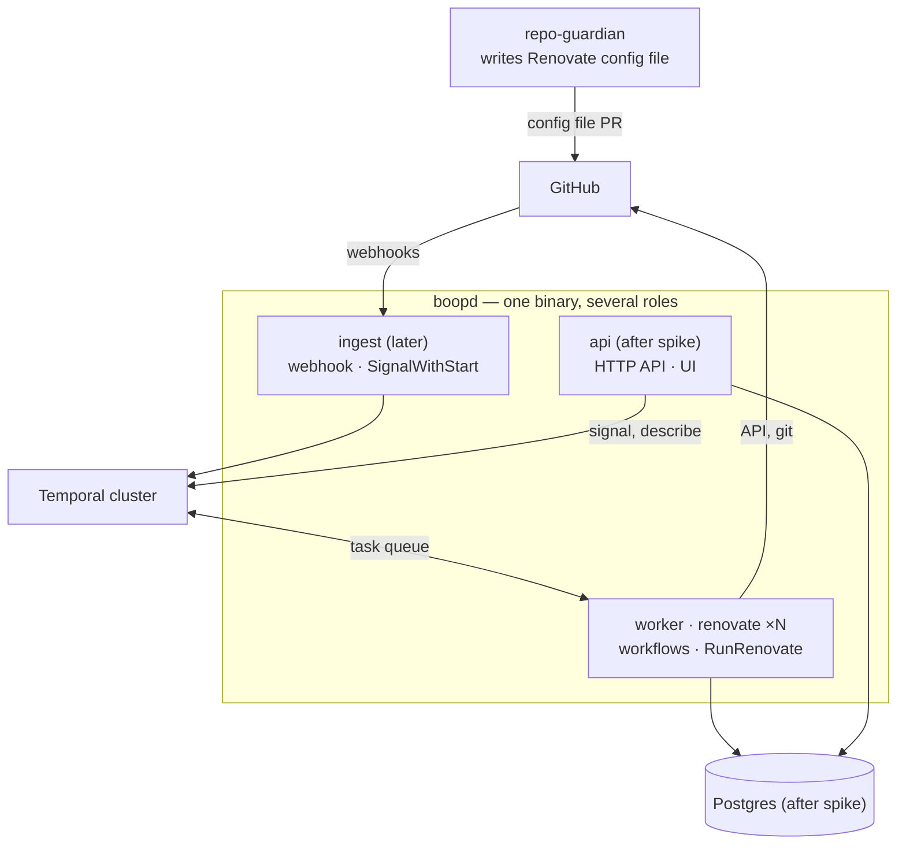

<!-- markdownlint-disable-file MD025 MD041 -->

# RFC-0001: boopd: run Renovate per repository on Temporal

<!--toc:start-->
- [Summary](#summary)
- [Problem Statement](#problem-statement)
  - [Supporting Data](#supporting-data)
- [Proposed Solution](#proposed-solution)
- [Alternatives Considered](#alternatives-considered)
- [Risks and Mitigations](#risks-and-mitigations)
- [Success Criteria](#success-criteria)
- [References](#references)
<!--toc:end-->

## Summary

Build `boopd`, a service that runs Renovate one repository at a time, with
Temporal as its control plane and a worker pool that execs the Renovate CLI.
It is a second way to run Renovate next to `renovate-operator`, not its next
version. The later goal is a product: a store of repositories, runs and
proposed updates that automerge confidence and security prioritisation build
on.

## Problem Statement

`renovate-operator` v0.1 runs Renovate as one Kubernetes Indexed Job per Run,
sharding the repository list across pods. The homelab cutover surfaced limits
that come from that shape, not from bugs:

- **Token lifetime.** The GitHub installation token is minted once per Run and
  lasts about an hour, so a shard running past about 50 minutes gets 401s
  mid-scan (renovate-operator INV-0003).
- **Shard storage.** Every shard's repository list lives in one ConfigMap,
  against etcd's 1 MiB cap.
- **All-or-nothing completion.** Any failed shard fails the Run. One bad
  repository marks thousands of good ones failed.
- **Rate budget per Run.** Concurrent Runs and Scans on one installation do
  not share a budget.
- **Fixed workers.** Worker count is fixed when the Job is created.
- **No event triggers.** Webhook-triggered runs were planned for v0.2.0 and do
  not exist.

renovate-operator DESIGN-0001 planned to fix these with an operator-owned
Postgres and a hand-built scheduler: rate-budget admission, time-spreading,
failure-aware completion and replay. That is a workflow engine.
repo-guardian v1 built the same thing one post-mortem at a time, and
repo-guardian v2 replaced it with Temporal.

### Supporting Data

INV-0001 (this repository's founding investigation) maps every v0.1 limit to a
Temporal primitive (Observation 2) and estimates the load. 30,000 repositories
on a 24h cadence come to about 0.35 workflow wake-ups per second and roughly
16 Renovate processes running continuously, at 30 to 60 s per repository. The
per-repository time is borrowed from repo-guardian DESIGN-0009, and the spike
replaces it with a measured number.

## Proposed Solution

A new service in its own repository (`donaldgifford/boop`), named `boopd`:

- **GitHub only.** `boopd` runs against github.com with GitHub App auth.
  Forgejo, which renovate-operator supports, is out of scope; renovate-operator
  remains the option for it.
- **Temporal is the control plane** ([ADR-0001](../adr/0001-use-temporal-as-the-control-plane.md)).
- **The unit of work is a repository.** Each repository gets a long-lived
  `RepoWorkflow`, each installation an `InstallationWorkflow` that gates on the
  rate budget, and a `DiscoveryWorkflow` runs on a Schedule
  ([ADR-0002](../adr/0002-one-entity-workflow-per-repository.md)).
- **A worker pool execs Renovate.** Each worker pod runs one activity at a
  time. The workflow mints a token for the run, the activity runs Renovate
  for exactly one repository in fresh directories, and returns the parsed
  report
  ([ADR-0003](../adr/0003-worker-pool-execs-the-renovate-cli.md)).
- **Configuration is a file shipped with the chart**, with no CRDs
  ([ADR-0004](../adr/0004-no-crds-configuration-from-a-chart-shipped-file.md)).
- **Onboarding belongs to repo-guardian.** A repository takes part when it
  contains the Renovate config file. Renovate's own onboarding is off
  ([ADR-0005](../adr/0005-onboard-only-repositories-that-contain-a-renovate-config-file.md)).
- **A Postgres store** holds repositories, runs and proposed updates for an
  HTTP API and UI. Activities write it. It never drives scheduling
  ([ADR-0006](../adr/0006-postgres-product-store-written-by-activities.md)).
  It is not part of the spike.
- **Shared code goes to `donaldgifford/x`** after the spike; the spike copies
  ([ADR-0007](../adr/0007-share-code-through-x-after-the-spike.md)).
- **Scaling follows the budget.** Workflows scale with the number of
  repositories. Concurrent Renovate runs are capped by each installation's
  rate budget, which is discovered from `/rate_limit` (REST and GraphQL), not
  configured. Workers follow the runs the budget admits. The spike runs
  workers at a fixed replica count. The scaling mechanism (KEDA trigger,
  Deployment or Job per run) is a fast follow
  ([ADR-0008](../adr/0008-scale-runs-within-the-installation-budget.md)).

Naming: `boop` is the repository; `boopd` is the binary, image, chart and
Temporal namespace; `boop-bot` is the GitHub App that opens PRs. `boop-bot` is used by `boopd` alone, so the installation's
`/rate_limit` readings reflect only its spend.

Delivery happens in two stages:

1. **Spike** ([DESIGN-0001](../design/0001-boopd-spike-workflows-runrenovate-activity-and-worker.md)):
   workers, workflows and the `RunRenovate` activity in the homelab, run
   against INV-0001's success criteria. No store, API, UI or ingest.
2. **v1 DESIGN**, written after the spike. It covers the store schema, API,
   the `x` extraction (Phase 0), and whatever the spike changes.

Later work (automerge confidence from evals, a security-findings priority
report) is out of scope here. v1 has to record the data it needs (INV-0001
§ Beyond v1).

## Alternatives Considered

| Alternative | Why not |
| ----------- | ------- |
| Keep renovate-operator v0.1 as built | Leaves every limit in the problem statement in place. It stays available as the Kubernetes-native option. |
| renovate-operator plus the state DB (its DESIGN-0001 plan) | Builds a scheduler by hand, which is the system repo-guardian v1 built and v2 deleted. |
| Temporal as a cron replacement that still launches today's Indexed Job (execution option C) | Fixes almost nothing: token lifetime, ConfigMap cap and all-or-nothing completion all remain. |
| Per-repository GitHub Actions managed by repo-guardian (repo-guardian DESIGN-0009) | No central worker or visibility; not the production path (INV-0001 OQ1). |
| A new major version inside renovate-operator | Nothing in the kubebuilder layout suits a Temporal service with a store, API and UI (INV-0001 OQ7). |
| `mogenius/renovate-operator` or Mend's hosted offering | Same Job-shaped model, or not self-hosted. |

## Risks and Mitigations

| Risk | Impact | Likelihood | Mitigation |
| ---- | ------ | ---------- | ---------- |
| A repository's package-manager step leaves state that a later repository on the same worker reads | High | Medium | Fresh `baseDir`/`cacheDir` per activity, read-only root filesystem, toolchains baked in, `exposeAllEnv=false`. Spike isolation criteria gate it, with Job-per-repository as the fallback (ADR-0003). |
| A single repository needs longer than a token lives | Medium | Medium | Activity timeout below token lifetime. Progress-aware retries, and a stall limit that parks the repository instead of retrying forever (DESIGN-0001). |
| The rate budget is approximate because Renovate's calls are invisible to Go | Medium | High | Admission control from `/rate_limit` before and after each run. `boop-bot` must not be shared with other consumers. |
| Operating a Temporal cluster is a new dependency | Medium | High | Reuse repo-guardian v2's deployment reference (`contrib/temporal/`) and its server version floor of 1.31. |
| Fixed worker count cannot follow load; scale-down would kill runs in flight | Medium | High (after the spike) | Fixed replicas in the spike; scaling mechanism chosen in a fast follow on measured numbers (ADR-0008). |
| Secondary rate limits are invisible to `/rate_limit` | Medium | Medium | `maxConcurrentRuns` safety cap per installation; Renovate backs off on its own (ADR-0008). |
| Workflow determinism and versioning mistakes | Medium | Medium | Worker deployment versioning copied from repo-guardian; replay tests in CI. |
| Store and Temporal drift apart | Medium | Medium | One owner per kind of data, decided in the v1 DESIGN. Temporal owns execution state, and the store only records results. |

## Success Criteria

- The spike passes INV-0001's success-criteria table: same report tuples as
  the operator, no 401s, convergence under a forced short timeout, stall
  detection, disk and environment isolation, usable budget signal, result
  capture and log correlation.
- The measured per-repository overhead replaces INV-0001's borrowed estimate,
  and the worker count sized from it is acceptable for production.
- A v1 DESIGN exists that resolves the remaining INV-0001 open questions and
  defines the store schema.

## References

- [INV-0001 — Temporal as the Renovate control plane](../investigation/0001-temporal-as-the-renovate-control-plane.md)
- [DESIGN-0001 — boopd spike](../design/0001-boopd-spike-workflows-runrenovate-activity-and-worker.md)
- ADR-0001 to ADR-0008 (this repository)
- renovate-operator DESIGN-0001 § Future architecture: state DB; INV-0003;
  INV-0004
- repo-guardian INV-0019, DESIGN-0026, DESIGN-0009
